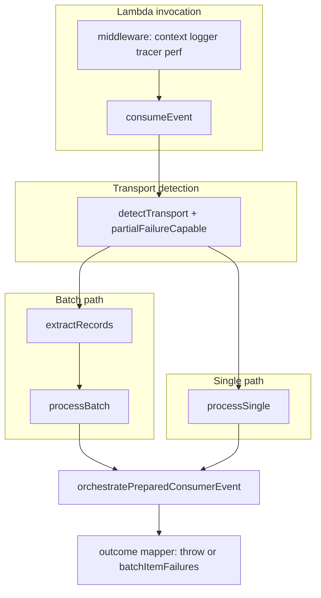

# Event platform, middleware, and observability — architecture review

**Scope:** `libs/event-platform`, async paths in `libs/middleware`, and `libs/observability` integration with the consumer/publisher pipeline.  
**Prompt:** [docs/prompt/event-platform/review.md](../prompt/event-platform/review.md)  
**Date:** 2026-05-13  

---

## 1. Executive summary

The repository ships a **solid core** for canonical domain events (`BaseEvent`), Zod-backed schemas, idempotency hooks, delivery policy (retry / DLQ disposition), and a **unified orchestration layer** (`orchestratePreparedConsumerEvent`) that drives observability metrics and tracing hooks. **SQS Lambda batch** consumers get **partial batch failure** aggregation via `processBatch` + `batchItemFailures`.

That strength is **not yet uniform** across transports. **First-class adapters** exist only for **EventBridge publish** and **SQS poll/subscribe**; **SNS** is **publish-oriented** (`createSnsTopicAdapter` / `createSnsPublishEvent`) with **inbound unwrap** only inside `normalizeTransportToPayloadCandidate`. **DynamoDB Streams** are handled by **`createStreamHandler`**, which **reuses** `EventConsumer` per record but **does not** expose the same **multi-event registry + `defineEvent` schemas** pattern as `createEventHandler`.

**Middleware** (`buildEventExecutionPipeline`) wraps the **entire Lambda invocation** once: context, logger, tracer, performance metrics. **Per-record** work (batch concurrency, idempotency, handler execution) sits **below** that boundary. **`standard-event-context`** labels **any** `event.Records[0]` batch as `eventType: 'aws:sqs'`, which is **wrong** for DynamoDB Streams, Kinesis, and other `Records`-shaped events—polluting logs and metrics dimensions.

**Observability** combines Powertools-style middleware metrics (`publishMiddlewarePipelineMetrics`) with consumer counters (`recordConsumerEventProcessed`, `recordConsumerDuplicateEvent`, `recordConsumerFailure`, etc.). Dimensions are **light** (e.g. `eventType`, optional `Error`)—there is **no first-class `transport` dimension** on the consumer metrics path.

**Reliability gap (non-`Records` invocations):** `consumeEvent` uses `extractRecords` to decide batch vs single. For payloads **without** `Records` (typical **EventBridge** Lambda event shape), **`processSingle`** returns a **`ProcessSingleResult`** including `needs_transport_retry`. That value is **returned**, not **thrown**, while `createEventHandler` is typed as `Promise<void>`. Unless the outer wrapper maps outcomes to **Lambda failures** or **partial batch responses**, **transport redelivery may not occur** for those shapes—behavior is **inconsistent** with the SQS batch path.

**Public API:** `createEventHandler` is documented in [libs/event-platform/README.md](../../libs/event-platform/README.md) and imported from `@api-hub/event-platform` in multiple apps, but **`libs/event-platform/src/index.ts` does not export `createEventHandler`** as of this review. That is a **packaging / developer-experience defect** (and likely a **TypeScript resolution** problem unless builds use stale artifacts).

---

## 2. Current strengths

| Area | What works well |
|------|-----------------|
| **Canonical model** | `BaseEvent` + `EventMeta` in [libs/event-platform/src/typings/base-event.types.ts](../../libs/event-platform/src/typings/base-event.types.ts) give a clear wire contract. |
| **Inbound parsing** | `normalizeTransportToPayloadCandidate` + `parseInboundEvent` support SQS body, SNS → SQS `Sns.Message`, EventBridge `detail` ([transport-normalize.ts](../../libs/event-platform/src/sdk/consumer/transport-normalize.ts), [parse-inbound-event.ts](../../libs/event-platform/src/sdk/consumer/parse-inbound-event.ts)). |
| **Orchestration** | Single place for idempotency `before`/`afterSuccess`, handler dispatch, retry vs DLQ vs discard ([orchestrate-consumer-message.ts](../../libs/event-platform/src/engine/processor/orchestrate-consumer-message.ts)). |
| **SQS receive count** | `approximateReceiveCount` / `computeEffectiveDeliveryAttempt` align attempts with visibility into policy ([transport-attempt.ts](../../libs/event-platform/src/utils/transport-attempt.ts)). |
| **Batch partial failure** | `processBatch` + `isAckedWithoutBatchFailure` produce `batchItemFailures` for failed / retry-needed records ([process-batch.ts](../../libs/event-platform/src/engine/processor/process-batch.ts), [process-outcomes.ts](../../libs/event-platform/src/engine/processor/process-outcomes.ts)). |
| **Poll-based SQS worker** | `SqsAdapter.subscribe` deletes on success, extends visibility on parse/handler failure with backoff ([sqs-adapter.ts](../../libs/event-platform/src/adapters/sqs/sqs-adapter.ts)). |
| **Middleware stack** | Async pipeline documents separation of concerns ([http-pipeline.ts](../../libs/middleware/src/lib/http-pipeline.ts)); `asyncErrorMiddleware` + `performanceMiddleware` integrate logger + metrics ([error.middleware.ts](../../libs/middleware/src/lib/error.middleware.ts), [performance.middleware.ts](../../libs/middleware/src/lib/performance.middleware.ts)). |
| **Tracing hooks** | `EventTracingHooks` + `createEventTracingHooks` for structured logs ([event-tracing-hooks.ts](../../libs/event-platform/src/core/tracing/event-tracing-hooks.ts)). |
| **Infra helpers** | `recommendedSqsRedriveMaxReceiveCount`, Dynamo-backed idempotency store, etc. |

---

## 3. Critical gaps

Each item follows: **Why it matters → Impact → Risk → Suggested fix → Module → API sketch.**

### G3.1 Transport adapter asymmetry

- **Why it matters:** Uniform DX requires symmetric **publish + consume + config** per transport.
- **Impact:** Teams reimplement SNS subscription and DDB stream mapping differently; guarantees diverge.
- **Risk:** **High** (operational drift, duplicated bugs).
- **Suggested fix:** Introduce `adapters/sns/`, `adapters/dynamodb-streams/` (or `transports/<name>/`) mirroring `EventBridgeAdapter` / `SqsAdapter` surface; register in a **transport registry**.
- **Module:** [libs/event-platform/src/adapters/index.ts](../../libs/event-platform/src/adapters/index.ts) (today: EventBridge + SQS only).
- **Example API:**

```ts
// transports/registry.ts
export interface TransportConsumer<TOptions> {
  normalize(raw: unknown): BaseEvent[];
  extractBatchMeta(raw: unknown): { partialFailureSupported: boolean };
}
```

### G3.2 `standard-event-context` mis-tags non-SQS `Records` batches

- **Why it matters:** `__context.eventType` drives logs, metrics, and tracer span naming.
- **Impact:** DynamoDB Streams Lambdas see `eventType: 'aws:sqs'` ([standard-event-context.ts](../../libs/middleware/src/lib/standard-event-context.ts) lines 79–88).
- **Risk:** **Medium** (mis-attribution, bad dashboards, harder incident triage).
- **Suggested fix:** Branch on `records[0].eventSource` (`aws:sqs`, `aws:dynamodb`, `aws:kinesis`, …); default to `unknown` or ARN-derived label.
- **Module:** `libs/middleware/src/lib/standard-event-context.ts`.
- **Example API:** internal `inferBatchTransport(event): AsyncTransportKind`.

### G3.3 Single-event / non-`Records` retry surface inconsistent

- **Why it matters:** `needs_transport_retry` must become **Lambda failure** (or explicit redrive) when the transport cannot return partial batch JSON.
- **Impact:** EventBridge-shaped events may **complete successfully** while the platform returned a retry disposition object.
- **Risk:** **High** (silent message loss or stuck poison without DLQ).
- **Suggested fix:** In `consumeEvent` (or a thin Lambda wrapper), map outcomes: throw `RETRY_EVENT` / typed error when `partialFailureSupported === false` and outcome is `needs_transport_retry`; document contract.
- **Module:** [consume-event.ts](../../libs/event-platform/src/engine/executor/consume-event.ts), [create-event-handler.ts](../../libs/event-platform/src/lib/create-event-handler.ts).
- **Example API:**

```ts
export type ConsumeEventOptions = {
  onTransportRetry?: 'throw' | 'return';
};
```

### G3.4 `createEventHandler` missing from public `index` export

- **Why it matters:** Documented primary DX path must resolve from `@api-hub/event-platform`.
- **Impact:** Broken or inconsistent imports; tree-shaking / IDE confusion.
- **Risk:** **High** for onboarding; severity depends on whether CI catches it.
- **Suggested fix:** `export { createEventHandler, type CreateEventHandlerOptions } from './lib/create-event-handler'`.
- **Module:** [libs/event-platform/src/index.ts](../../libs/event-platform/src/index.ts).

### G3.5 DynamoDB Streams not aligned with `createEventHandler` / schema registry

- **Why it matters:** Same reliability and schema story as SQS/EventBridge consumers.
- **Impact:** `createStreamHandler` uses ad-hoc `mapRecordToBaseEvent` + `business(payload, meta)` ([create-stream-handler.ts](../../libs/event-platform/src/lib/create-stream-handler.ts)).
- **Risk:** **Medium** (schema drift, weaker typing, duplicate mapping logic).
- **Suggested fix:** `createStreamEventHandler({ events: [...], mapRecordToBaseEvent })` reusing registry + `consumeEvent` per normalized `BaseEvent`.
- **Module:** new `libs/event-platform/src/lib/create-stream-event-handler.ts`.

### G3.6 Outer middleware metrics = one span per invocation, not per record

- **Why it matters:** SQS batches need per-message latency and failure attribution for SLOs.
- **Impact:** `performanceMiddleware` measures full `next()` once ([performance.middleware.ts](../../libs/middleware/src/lib/performance.middleware.ts)).
- **Risk:** **Medium** (blind spots for slow single records in large batches).
- **Suggested fix:** Optional `perRecordMetrics: true` on event-platform batch path emitting sub-metrics with `messageId` / `eventId` cardinality caps.

---

## 4. Transport-by-transport gap analysis

### 4.1 EventBridge

| Dimension | Status | Notes |
|-----------|--------|------|
| Producer | **Good** | `EventBridgeAdapter.publish` + `toPutEventsEntry` ([eventbridge-adapter.ts](../../libs/event-platform/src/adapters/eventbridge/eventbridge-adapter.ts)). |
| Consumer | **Partial** | Parsing via `detail` in `normalizeTransportToPayloadCandidate`; no dedicated `EventBridgeConsumerAdapter`. |
| Batch | **N/A / custom** | Native event is single object; no built-in partial failure response. |
| Partial failure | **Gap** | No mapping to DLQ disposition at transport layer; relies on orchestration + Lambda retry configuration. |
| Retry / DLQ | **Policy-level** | `evaluateDeliveryPolicy` + `handleDlq` ([delivery-policy.ts](../../libs/event-platform/src/core/policy/delivery-policy.ts), [dlq.executor.ts](../../libs/event-platform/src/core/dlq/dlq.executor.ts)). |
| Correlation / trace | **Partial** | `correlationIdFromEventBridge`; trace from `_X_AMZN_TRACE_ID` in middleware context. |
| Idempotency | **Good** | Same as other transports via strategies. |
| Ordering | **AWS-defined** | Not abstracted in-platform. |
| FIFO | **N/A** | EventBridge semantics. |
| Schema / payload | **Good** | `parseInboundEvent` + Zod registry. |
| Observability | **Partial** | No `transport:eventbridge` dimension on consumer metrics. |

### 4.2 SQS

| Dimension | Status | Notes |
|-----------|--------|------|
| Producer | **Good** | `SqsAdapter.publish` with `eventType` attribute ([sqs-adapter.ts](../../libs/event-platform/src/adapters/sqs/sqs-adapter.ts)). |
| Consumer (Lambda) | **Good** | `extractRecords` → `processBatch` → `batchItemFailures`. |
| Consumer (poll worker) | **Separate** | `subscribe` loop; not the same code path as Lambda (visibility extend vs partial batch). |
| Partial failure | **Good** | `process-outcomes` excludes `needs_transport_retry` from ack-without-failure set. |
| Visibility extension | **Poll path** | `extendVisibilityForFailure` with receive count scaling. **Lambda path:** relies on not deleting + partial batch / failure—not the same heartbeat extension API. |
| ApproximateReceiveCount | **Good** | Used in adapter + `transport-attempt` (attribute name casing: `attributes` map—verify against Lambda record shape in integration tests). |
| FIFO | **Gap** | Publish does not set `MessageGroupId` / `MessageDeduplicationId`. |
| SNS unwrap | **Good** | In `normalizeTransportToPayloadCandidate` + correlation helper in middleware. |
| Large payload / S3 | **Gap** | No built-in extended client / S3 pointer convention. |
| Lambda batch window | **Ops** | Not encoded in library; document recommended serverless.yml patterns. |

**Issue template — FIFO publish**

- **Why it matters:** FIFO queues require group + dedupe IDs.
- **Impact:** Cannot use library publish helper for FIFO without forking.
- **Risk:** Medium.
- **Suggested fix:** Extend `SqsAdapter.publish` / config with optional `fifo: { messageGroupId, deduplicationId }`.
- **Module:** `sqs-adapter.ts`, `sqs-adapter-config.ts`.

### 4.3 SNS

| Dimension | Status | Notes |
|-----------|--------|------|
| Producer | **Good** | `createSnsTopicAdapter` sets `eventType` / `source` attributes ([sns-topic-adapter.ts](../../libs/event-platform/src/sdk/publisher/sns-topic-adapter.ts)). |
| Consumer | **Gap** | Unwrap only; no `SnsAdapter` or subscription fan-out normalization beyond JSON parse. |
| Raw delivery | **Gap** | No explicit raw vs JSON envelope strategy. |
| FIFO topic | **Gap** | Not modeled. |
| Cross-account | **Gap** | Not in adapter options. |
| Filters | **Gap** | Subscription filter policy is AWS config only. |

### 4.4 DynamoDB Streams

| Dimension | Status | Notes |
|-----------|--------|------|
| INSERT/MODIFY/REMOVE | **Userland** | `mapRecordToBaseEvent` must map `dynamodb.Keys`, `NewImage`, `OldImage`. |
| Sequence / shard | **Partial** | `itemIdentifierFromStreamRecord` prefers `eventID` / `sequenceNumber` ([create-stream-handler.ts](../../libs/event-platform/src/lib/create-stream-handler.ts)). |
| Partial failure | **Good** | Returns `batchItemFailures`. |
| Ordering / concurrency | **Gap** | No shard iterator or parallelization policy in library. |
| Same DX as EventBridge | **Gap** | Different handler signature; no `onEvent` / multi-schema registry. |

### 4.5 Issue catalog (full template)

Each row: **Why it matters | Impact | Risk | Suggested implementation | Suggested module | Example API (sketch)**.

#### SQS (additional checklist from review prompt)

| Issue | Why it matters | Impact | Risk | Suggested implementation | Module | Example API |
|-------|----------------|--------|------|---------------------------|--------|-------------|
| Partial batch failure | Correctness for Lambda SQS | Wrong acks without it | Low (implemented) | Keep; add contract tests for mixed outcomes | `process-batch.ts` | N/A |
| Visibility timeout extension (Lambda) | Long handlers need heartbeat | Timeouts mid-work | Medium | Document Lambda `functionResponseType` + consider separate utility using `ChangeMessageVisibility` in async worker | new `sqs/lambda-heartbeat.ts` | `extendVisibilityWhileRunning(task)` |
| ApproximateReceiveCount | Aligns redelivery with policy | Drift vs queue maxReceiveCount | Low | Integration test Lambda record shape vs `transport-attempt.ts` | `transport-attempt.ts` | N/A |
| FIFO queue support | Ordering + dedupe | Cannot use FIFO safely | Medium | Add FIFO fields to publish + consumer docs for group id | `sqs-adapter.ts` | see §3 template |
| Delay queue | Scheduled visibility | Manual workarounds | Low | Optional `delaySeconds` on publish | `sqs-adapter.ts` | `publish(event, { delaySeconds })` |
| Message attributes normalization | Filtering + tracing | Inconsistent attr names | Low | Central map `eventType`, `correlationId`, `traceId` to String attrs | `sqs-adapter.ts` | `buildStandardMessageAttributes(meta)` |
| SNS→SQS unwrapping | Fan-out payloads | Parse failures | Low | Already in `transport-normalize`; add golden tests | `transport-normalize.ts` | N/A |
| Batch checkpointing | Resume semantics | N/A for SQS | Low | Out of scope; use Dynamo checkpoint pattern in app | app layer | N/A |
| DLQ integration | Poison isolation | Depends on AWS | Medium | Library already calls `handleDlq`; align metrics with queue DLQ | `dlq.executor.ts` | N/A |
| Poison pill handling | Stop hot loops | Extended visibility in poll path | Low | Document + link `recommendedSqsRedriveMaxReceiveCount` | `infra/` | N/A |
| Duplicate prevention | At-least-once | Double side effects | High | Idempotency strategies (existing) | `core/idempotency/` | N/A |
| Large payload / S3 offload | 256KB limit | Publish failures | Medium | Integrate payload-offload helper | new `sqs/large-payload.ts` | `publishWithS3Pointer(body)` |
| Long polling awareness | Cost + latency | Tuned in adapter | Low | Document defaults (`waitTimeSeconds` 20) | `sqs-adapter.ts` | N/A |
| Lambda batch window compatibility | Fewer invokes | Infra tuning | Low | Document serverless batching next to library | docs | N/A |

#### SNS

| Issue | Why it matters | Impact | Risk | Suggested implementation | Module | Example API |
|-------|----------------|--------|------|---------------------------|--------|-------------|
| Raw delivery support | Non-JSON payloads | Consumer crashes | Medium | Branch in `normalizeTransportToPayloadCandidate` + optional Buffer decode | `transport-normalize.ts` | `rawDelivery: 'json' \| 'bytes'` |
| Envelope normalization | Consistent `BaseEvent` | Mapping sprawl | Medium | `SnsInboundAdapter.normalize(record)` | `adapters/sns/` | `normalizeSnsRecord(raw): BaseEvent` |
| Fanout consistency | Same DX as SQS | Per-subscriber drift | Medium | Single helper for SNS→SQS Lambda | `sdk/consumer/` | `createSnsToSqsHandler(...)` |
| Message attributes propagation | Routing | Lost metadata | Low | Copy SNS attrs into `meta.attributes` | `prepare-inbound-base-event.ts` | N/A |
| FIFO topic | Ordering | Unsupported | Low | Extend publisher options when needed | `sns-topic-adapter.ts` | `MessageGroupId` |
| Cross-account publish | Enterprise topologies | Manual ARNs | Low | Document IAM + optional `roleArn` in adapter | `sns-topic-adapter.ts` | `assumeRoleArn?: string` |
| Mobile push | Different payload shape | Out of scope | Low | Exclude or stub adapter | — | N/A |
| Delivery retry consistency | At-least-once | AWS-defined | Low | Document SNS retry vs SQS | docs | N/A |
| Subscription filter support | Policy | AWS console | Low | Document only | docs | N/A |

#### DynamoDB Streams

| Issue | Why it matters | Impact | Risk | Suggested implementation | Module | Example API |
|-------|----------------|--------|------|---------------------------|--------|-------------|
| INSERT/MODIFY/REMOVE normalization | Uniform events | Duplicated unmarshalling | Medium | Provide `unmarshallStreamRecord(record)` helpers | `transports/dynamodb/map-record.ts` | `streamRecordToDomainEvent(record): Partial<BaseEvent>` |
| OldImage/NewImage abstraction | Domain deletes vs updates | Wrong business logic | High | Typed helpers + tests | same | `imagesFromRecord(r)` |
| Sequence number handling | Idempotency keys | Replays | Medium | Expose `sequenceNumber` on synthetic `meta` | `create-stream-handler.ts` | attach to `meta.attributes.ddbSequenceNumber` |
| Replay / idempotency | Duplicates | Double writes | High | Same store-backed idempotency as SQS | existing | N/A |
| Stream batch checkpointing | Resume | App concern | Low | Document KCL vs Lambda | docs | N/A |
| Event ordering | Per-shard order | Mis-assumption cross-shard | Medium | Document shard boundary | docs | N/A |
| Shard concurrency | Hot keys | Throttling | Medium | Guidance on `batchConcurrency` default 1 for streams | `process-batch.ts` docs | N/A |
| Partial failure behavior | Lambda batchItemFailures | Implemented | Low | Align identifiers with AWS docs | `create-stream-handler.ts` | N/A |
| Event source mapping compatibility | Pipes / filters | Config drift | Low | Document supported event versions | docs | N/A |

---

## 5. Middleware gap analysis

### 5.1 Execution order

Order in `buildEventExecutionPipeline`: `asyncErrorMiddleware` → `contextMiddleware` → `invocationContextMiddleware` → `loggerMiddleware` → `tracerMiddleware` → `performanceMiddleware` ([http-pipeline.ts](../../libs/middleware/src/lib/http-pipeline.ts)). **Outermost** is error middleware (first in array with `runMiddlewares` nesting)—consistent with comment on HTTP stack.

**Gap:** No dedicated **post-handler** hook for flushing metrics idempotently per record (Powertools `flush` patterns).

### 5.2 Error propagation

`asyncErrorMiddleware` normalizes, logs, **rethrows**—good for Lambda failure detection. **Caveat:** if inner handler **returns** retry disposition instead of throwing (see §3.3), error middleware never runs.

### 5.3 AsyncLocalStorage / invocation context

`invocationContextMiddleware` runs once per invocation. **Risk:** If code assumes per-record context inside concurrent `processBatch` workers, **context bleed** is possible depending on implementation (needs audit of `@api-hub/observability` `getContext()` with concurrent batch).

### 5.4 Batch / stream / transport awareness

| Concern | Supported? |
|---------|------------|
| Event-aware | **Partial** (context hints; no `eventType` from payload in middleware for EventBridge detail-only without Records). |
| Transport-aware | **Weak** (`aws:sqs` for any `Records`). |
| Batch-aware | **No** (single `performanceMiddleware` timing). |
| Stream-aware | **No** |

### 5.5 Missing lifecycle hooks (suggested)

- `onBatchStart({ recordCount, transport })`
- `onRecordStart({ messageId, eventId })`
- `onRecordComplete({ outcome })`
- `onBatchComplete({ batchItemFailures })`

**Implementation:** optional second middleware stack inside `consumeEvent` **after** `extractRecords`, or hooks on `EventConsumerDeps`.

### 5.6 Performance

`processBatch` concurrency pool ([process-batch.ts](../../libs/event-platform/src/engine/processor/process-batch.ts)) can amplify concurrent downstream I/O—**document** safe `batchConcurrency` defaults per queue partition / FIFO group.

---

## 6. Reliability risks

1. **Silent ack on retry disposition** for non-`Records` payloads (§3.3).
2. **FIFO / ordering** not enforced at publish layer for SQS/SNS.
3. **Poison messages:** policy + DLQ strategy exist, but **operator alignment** (`recommendedSqsRedriveMaxReceiveCount`) must match queue redrive—still easy to misconfigure.
4. **Concurrent batch + mutable shared state** in handlers without clear guidance.
5. **Idempotency `afterSuccess` errors swallowed** with `console.error` only ([orchestrate-consumer-message.ts](../../libs/event-platform/src/engine/processor/orchestrate-consumer-message.ts))—risk of **ack without durable idempotency commit**.

---

## 7. Missing runtime components

- Unified **transport detector** (SQS vs EventBridge vs SNS vs DDB) feeding policy + metrics.
- **Lambda response mapper** that always returns correct partial batch / throws for retry based on transport.
- **SNS inbound adapter** (subscription protocols, raw delivery).
- **DynamoDB stream record → BaseEvent** built-ins (optional module, not forced).
- **SQS extended payload** (S3) helper.

---

## 8. Missing middleware

- Per-record **tracer** segments (linked trace id from `BaseEvent.meta.traceId`).
- **Batch-scoped** performance metrics.
- **Transport-scoped** dimension on `publishMiddlewarePipelineMetrics`.
- Optional **idempotency middleware** (currently only in event-platform orchestration).

---

## 9. Missing abstractions

- `TransportAdapter` in [base-event.types.ts](../../libs/event-platform/src/typings/base-event.types.ts) exposes `normalize` returning `BaseEvent[]` but **concrete adapters** do not all implement it uniformly (SQS adapter is poll/subscribe, not Lambda normalize).
- **Publish + subscribe** symmetric interface per transport.
- **Envelope metadata** for partition / ordering keys (see §11).

---

## 10. Missing SDK APIs

- `createEventHandler` **export** from package root ([index.ts](../../libs/event-platform/src/index.ts)).
- **`SqsAdapter` export** from package root (currently only `EventBridgeAdapter` is exported from [index.ts](../../libs/event-platform/src/index.ts); SQS lives under `adapters/sqs/` without a public barrel entry).
- **`createSqsLambdaHandler` / `createEventBridgeLambdaHandler`** thin wrappers that fix return type + retry mapping.
- **Stream handler** with same `events[]` registry as `createEventHandler`.
- **SNS fan-out consumer** helper returning consistent `batchItemFailures` for Lambdas subscribed to SNS behind SQS.

---

## 11. Missing type definitions

`BaseEvent` / `EventMeta` vs desired unified model:

| Field | Present |
|-------|---------|
| eventId, eventType, eventVersion, source, timestamp, payload, meta | **Yes** |
| retryCount (in meta) | **Yes** |
| traceId, correlationId, causationId, tenantId | **Yes** (optional meta) |
| **partitionKey** | **No** (derive manually for Kafka/SQS FIFO later) |
| **orderingKey** | **No** |
| **transport** | **No** on wire (only in `defineEvent` schema meta as `EventTransport` — **excludes** `dynamodb`) |

Extend `EventTransport` in [define-event.ts](../../libs/event-platform/src/core/schema/define-event.ts): `'dynamodb-streams' | 'kinesis' | ...` or move transport to runtime `meta.attributes.transport`.

---

## 12. Missing observability

- **Transport dimension** on `recordConsumer*` metrics ([consumer-metrics.ts](../../libs/observability/src/metrics/consumer-metrics.ts)).
- **DLQ disposition** metrics vs actual DLQ send success/failure correlation.
- **Per-record latency histograms** for batch consumers.
- **Structured linkage** from middleware `operation` to `eventType` (today separate dimensions).

---

## 13. Missing AWS best practices (selected)

- **Partial batch failure reporting** for all Lambda-integrated poll-based sources that support it (SQS ✅, self-managed Kafka MSK—not present).
- **Visibility heartbeat** for long-running SQS handlers (not in Lambda consumer path).
- **EventBridge replay** / archive discovery tooling (out of library scope but should be **documented**).
- **SNS message size / attributes** limits documented next to publisher.
- **Least-privilege IAM** examples per adapter in README.

---

## 14. Recommended folder structure

```text
libs/event-platform/src/
  transports/
    common/                 # types, TransportContext, outcome mappers
    eventbridge/
      publish-adapter.ts
      normalize-inbound.ts
    sqs/
      lambda-batch.ts       # partial failure + return type
      poll-worker.ts        # current SqsAdapter.subscribe
      publish-adapter.ts
    sns/
      publish-adapter.ts
      normalize-inbound.ts  # raw vs JSON
    dynamodb/
      map-record.ts         # optional NewImage/OldImage helpers
      create-handler.ts     # stream-specific factory
  engine/                   # keep orchestration, process-batch, process-single
  middleware-hooks/         # optional hooks invoked from engine (or keep in engine)
```

Keep `libs/middleware` **generic**; put transport-specific context fixes beside **either** middleware (`standard-event-context`) **or** `transports/common` used by both.

---

## 15. Recommended architecture refactor



**Principles:**

1. **Detect transport once** per invocation.
2. **Map outcomes** at the boundary closest to Lambda (after orchestration).
3. Keep **domain policy** in `orchestratePreparedConsumerEvent`; keep **wire semantics** in transport layer.

---

## 16. Recommended unified transport model

```ts
export type InboundTransport =
  | 'sqs-lambda'
  | 'sqs-poll'
  | 'eventbridge-lambda'
  | 'sns-lambda'
  | 'dynamodb-streams';

export type NormalizedInbound = {
  transport: InboundTransport;
  records: Array<{ raw: unknown; messageId?: string; eventId?: string; sequenceNumber?: string }>;
  partialFailureSupported: boolean;
};
```

Normalize all transports to `NormalizedInbound` before `processBatch` / `processSingle`.

---

## 17. Recommended execution pipeline

1. **Middleware (invocation):** identity, logging, tracer root span, coarse timing.
2. **Transport normalize:** raw → `NormalizedInbound`.
3. **For each record:** optional **child span** + `EventConsumer` / registry dispatch (existing orchestration).
4. **Outcome aggregation:** `batchItemFailures` or throw.
5. **Middleware `onAfter` hook (optional):** if added to engine, flush metrics.

---

## 18. Recommended batch processing model

- Default **`batchConcurrency`:** conservative (e.g. `5`) with override; document **FIFO single-group risk**.
- **Deterministic ordering:** when `orderingKey` present, **force concurrency 1** for that key (future).
- **Failed record list:** always return **AWS identifiers** (`itemIdentifier`) as today; add **integration tests** for SNS→SQS envelope.

---

## 19. Recommended retry / DLQ architecture

- **Single policy object** shared by SQS redrive, in-process retry, and `transportRetry` republish.
- **Explicit table** in docs: who is source of truth for attempt count (SQS attribute vs `meta.retryCount` vs framework republish).
- **DLQ strategy plugins** already exist—ensure **metrics** emitted on successful `handleDlq` vs fallback `recordConsumerFailure` paths ([orchestrate-consumer-message.ts](../../libs/event-platform/src/engine/processor/orchestrate-consumer-message.ts)).

---

## 20. Recommended future-proofing

- Add **Kafka / MSK** placeholder in `EventTransport` enum to avoid another breaking rename later.
- **Versioned** `NormalizedInbound` schema for internal telemetry.
- **Plugin registry** for `mapRawToBaseEvent` presets (`sqsBodyIsBaseEvent`, `eventBridgeDetail`, `snsMessage`, `ddbStreamRecord`).
- **Conformance tests** (golden files) per AWS event sample JSON.

---

## 21. Priority-based action plan

| Priority | ID | Action | Owner module |
|----------|-----|--------|----------------|
| **P0** | P0-1 | Export `createEventHandler` (+ types) from `libs/event-platform/src/index.ts`. | `event-platform` |
| **P0** | P0-2 | Map `consumeEvent` outcomes to **throw / Lambda response** for transports without partial batch support; add tests for EventBridge-shaped event. | `event-platform` |
| **P0** | P0-3 | Fix `transportSourceAndType` for `Records` to use `eventSource` (stop hardcoding `aws:sqs`). | `middleware` |
| **P1** | P1-1 | Introduce `NormalizedInbound` + transport detector; refactor `extractRecords` call sites. | `event-platform` |
| **P1** | P1-2 | `createStreamHandler` v2 aligned with `createEventHandler` registry + schemas. | `event-platform` |
| **P1** | P1-3 | FIFO-capable SQS publish options; document SNS FIFO / filtering limits. | `event-platform` |
| **P1** | P1-4 | Add `transport` + `operation` dimensions to consumer metrics (Powertools-safe cardinality). | `observability` + `event-platform` |
| **P2** | P2-1 | SNS consumer adapter (fan-out, raw delivery). | `event-platform` |
| **P2** | P2-2 | Per-record middleware hooks or sub-spans for batch latency SLOs. | `middleware` + `event-platform` |
| **P2** | P2-3 | S3 large-payload offload helper for SQS/SNS. | `event-platform` |
| **P2** | P2-4 | Extend `BaseEvent` / `EventMeta` with `partitionKey` / `orderingKey` **or** document use of `meta.attributes`. | `event-platform` typings |

---

## Appendix A — Key file index

| Concern | Path |
|---------|------|
| Consumer orchestration | `libs/event-platform/src/engine/processor/orchestrate-consumer-message.ts` |
| Batch processing | `libs/event-platform/src/engine/processor/process-batch.ts` |
| consume entry | `libs/event-platform/src/engine/executor/consume-event.ts` |
| Multi-event Lambda DX | `libs/event-platform/src/lib/create-event-handler.ts` |
| Streams DX | `libs/event-platform/src/lib/create-stream-handler.ts` |
| Middleware async stack | `libs/middleware/src/lib/http-pipeline.ts` |
| Context / correlation | `libs/middleware/src/lib/standard-event-context.ts` |
| Consumer metrics | `libs/observability/src/metrics/consumer-metrics.ts` |
| Middleware metrics | `libs/observability/src/metrics/middleware-metrics.ts` |

---

*End of review.*
