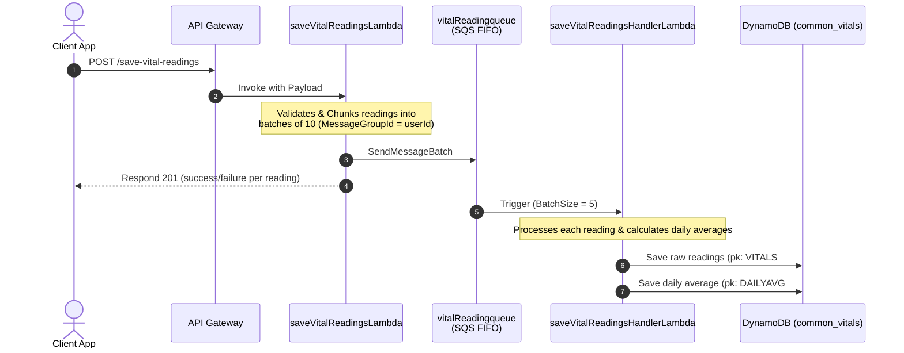
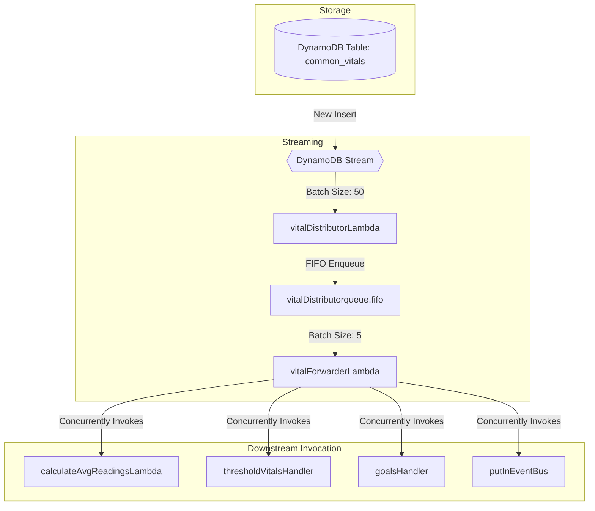
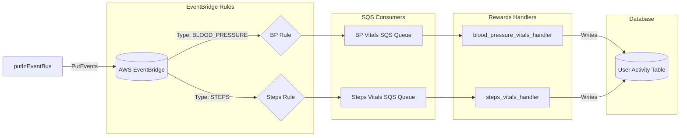

# Vital Service Architecture Overview

The **Vital Service** is a modular, event-driven serverless system designed to ingest, process, store, and distribute clinical and consumer health vital readings (e.g., Blood Pressure, Blood Glucose, Steps, Weight, BMI, Heart Rate, etc.). It leverages key AWS serverless components including API Gateway, SQS FIFO queues, DynamoDB Streams, Lambda functions, and AWS EventBridge to enable loose coupling, scalability, and integration with downstream systems like the **Rewards** and **Goals/Thresholds** modules.

---

## 1. Architectural Data Flows

Below are the key operational pipelines within the Vital service:

### Ingestion Flow (Save Vital Readings)

The ingestion flow processes raw readings from external platforms (e.g., Fitbit, Google Fit, manual entries) and stores them in DynamoDB.

---

### Event Distribution & Downstream Propagation Flow

This flow triggers when a new vital reading is saved. It leverages DynamoDB streams to capture the change and broadcast it to downstream handlers and AWS EventBridge.

---

### EventBridge & Rewards Integration

Events processed by `putInEventBus` are converted to specific EventBridge types and sent to the custom Event Bus, where they are consumed by SQS queues in the Rewards module.

---

## 2. Database Design (DynamoDB Single-Table Design)

The Vital service is backed by two main DynamoDB tables that utilize a single-table design pattern:
1. **Vitals Table**: `${Stage}_common_vitals`
2. **User Data Table**: `${Stage}_common_user_data`

### Vitals Table Schema (`_common_vitals`)

This table stores all vital readings and their computed averages.

*   **Primary Key Scheme**:
    *   **Partition Key (`pk`)**: `S` (String)
    *   **Sort Key (`sk`)**: `S` (String)
*   **Global Secondary Indexes (GSIs)**:
    *   **`pk-sk1-index`**: Partition Key = `pk`, Sort Key = `sk1`
    *   **`pk-sk2-index`**: Partition Key = `pk`, Sort Key = `sk2`
    *   **`pk-sk3-index`**: Partition Key = `pk`, Sort Key = `sk3`
    *   **`pk-sk4-index`**: Partition Key = `pk`, Sort Key = `sk4`
    *   **`pk-sk5-index`**: Partition Key = `pk`, Sort Key = `sk5`

#### Key Entities & Key Mapping

| Entity Type | Partition Key (`pk`) | Sort Key (`sk`) | GSI Sort Key (`sk1`) | GSI Sort Key (`sk2`) | GSI Sort Key (`sk3`) | Additional Attributes |
| :--- | :--- | :--- | :--- | :--- | :--- | :--- |
| **Raw Vital Reading** | `VITALS#${userId}` | `${configDeviceId}#${timestamp}` | `${vitalType}#${timestamp}` | `${configDeviceId}#${userIndex}#${timestamp}` | `SOURCE#${source}` | `deviceId`, `configDeviceId`, `vitalType`, `source`, `syncTimeStamp`, `attributes` (contains metric values) |
| **Daily Average Stats** | `DAILYAVG#${userId}` | `${vitalType}#${formattedDate}` | `${formattedDate}` | *None* | *None* | `averageType: 'DAILY'`, `totalNumberOfReadings`, metric specific sums/averages (e.g. `avgSystolic`, `avgBmi`, etc.) |

---

### User Data Table Schema (`_common_user_data`)

Vitals uses this table to track user-linked health devices.

*   **Key Entities & Key Mapping**:
    *   **Device Link**:
        *   `pk`: `DEVICELIST#${userId}`
        *   `sk`: `DETAILS#${configDeviceId}`
        *   Attributes: `lastReadingTimeStamp`, `deviceId`, status values.

---

## 3. SQS Queue Design

To ensure resilience and order of operations, the vital sync microservice utilizes **FIFO (First-In-First-Out) Queues** with associated **Dead Letter Queues (DLQs)**.

1.  **Vitals Ingestion Queue**:
    *   **Queue Name**: `${Stage}_vital_reading_queue.fifo`
    *   **Dead Letter Queue**: `${Stage}_vital_reading_dl_queue.fifo` (maxReceiveCount = 3)
    *   **Description**: Ingests incoming readings from HTTP posts.
    *   **DLQ Handler**: `${Stage}_vital_reading_dl_queue_handler` reads from the DLQ and sends back messages to the queue or alerts developers.
2.  **Vitals Distributor Queue**:
    *   **Queue Name**: `${Stage}_vital_distributor_queue.fifo`
    *   **Dead Letter Queue**: `${Stage}_vital_distributor_dl_queue.fifo` (maxReceiveCount = 3)
    *   **Description**: Distributes DynamoDB stream events to downstream handlers.
    *   **DLQ Handler**: `${Stage}_vital_distributor_dl_queue_handler` handles failures in message forwarding.
3.  **Averages Calculations DLQ**:
    *   **Queue Name**: `${Stage}_calculate_avg_readings_dlq`
    *   **Description**: Captures failures occurring inside `calculateAvgReadingsLambda`.

---

## 4. API Endpoints

The endpoints exposed on **API Gateway** route client requests to the respective vital Lambda functions:

| Method | Endpoint | Lambda Integration | Description |
| :--- | :--- | :--- | :--- |
| **POST** | `/save-vital-readings` | `saveVitalReadingsLambda` | Ingests new vital readings from user devices. Writes to `vitalReadingqueue`. |
| **POST** | `/vitals-data` | `fetchUserReadingsLambda` | Retrieves raw vital readings for a user. Supports filtering by vital type, GSI, and dates. |
| **POST** | `/fetch-average-readings` | `fetchAvgReadingsLambda` | Retrieves computed daily average vital records (`DAILYAVG#userId`). |
| **POST** | `/device-user-registration` | `userDeviceRegistrationLambda` | Registers/pairs a new health device with a user. |
| **POST** | `/delete-device` | `deleteDeviceLambda` | Unlinks/deletes a single device for the user. |
| **POST** | `/delete-multiple-devices`| `deleteMultipleDevicesLambda` | Unlinks/deletes multiple devices for the user. |
| **POST** | `/get-device-list` | `getDeviceListLambda` | Returns all available devices configured for the organization. |
| **POST** | `/retrieve-device-list` | `retrieveDeviceList` | Retrieves the list of devices registered to a specific user. |
| **POST** | `/add-remove-org-devices` | `addRemoveDeviceLambda` | Configures allowed devices for an organization. |
| **POST** | `/add-device-recommendation`| `addDeviceRecommendationLambda` | Adds device recommendations for patients. |
| **POST** | `/remove-device-recommendation`| `removeDeviceRecommendationLambda` | Removes device recommendations. |
| **POST** | `/get-vitals-graph-list` | `getVitalsGraphListLambda` | Retrieves formatted vital points for graphing (list/graph formats). |
| **POST** | `/get-vitals-tile-order` | `getVitalsTitleOrderLambda` | Retrieves the organization/user layout preference order for vitals dashboard tiles. |
