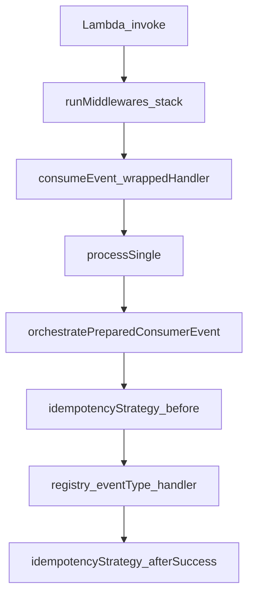

# Event-Driven Development Guide

Internal standard for implementing producers and consumers in this monorepo. Every behavior below maps to **`@api-hub/middleware`** and **`@api-hub/event-platform`** (plus cited app examples).

There is **no** `ensureIdempotent` helper in this codebase. Idempotency is **`IdempotencyStrategy.before` / `afterSuccess`** (see §4).

---

## 1. Overview

### How async consumption works here

1. **`consumeEvent`** ([`libs/event-platform/src/engine/executor/consume-event.ts`](../../libs/event-platform/src/engine/executor/consume-event.ts)) unwraps batched transports (`extractRecords`) or processes a single raw payload via **`processSingle`** → **`orchestratePreparedConsumerEvent`**.
2. **`createEventHandler`** ([`libs/event-platform/src/lib/create-event-handler.ts`](../../libs/event-platform/src/lib/create-event-handler.ts)) wraps **`consumeEvent(mergedDeps, registry)`** as the inner handler and runs it behind **`buildEventExecutionPipeline`** + **`runMiddlewares`** from [`libs/middleware`](../../libs/middleware/src/lib/http-pipeline.ts).
3. **HTTP APIs** use **`buildApiExecutionPipeline`** ([`libs/middleware/src/lib/create-api-handler.ts`](../../libs/middleware/src/lib/create-api-handler.ts)); reliability for payloads remains in **`@api-hub/event-platform`**, not HTTP middleware ([`http-pipeline.ts`](../../libs/middleware/src/lib/http-pipeline.ts) comment).

### Consumer entry (`consumeEvent`)

```typescript
export function consumeEvent(
  deps: EventConsumerDeps,
  registry: Record<string, (event: BaseEvent<any>) => Promise<void>>,
  beforeDispatch?: (event: BaseEvent<any>) => Promise<void>,
) {
  return async function consumed(rawEvent: unknown) {
    const records = extractRecords(rawEvent);

    if (records) {
      return processBatch(
        records,
        ({ raw }) => processSingle({ raw, deps, registry, beforeDispatch }),
        { concurrency: deps.batchConcurrency },
      );
    }

    return processSingle({
      raw: rawevent: any,
      deps,
      registry,
      beforeDispatch,
    });
  };
}
```

### Platform handler composition (`createEventHandler`)

```typescript
  const wrappedHandler = consumeEvent(mergedDeps, registry);

  const stack = buildEventExecutionPipeline<void, TContext>({
    operation: options.operation,
  }) as Array<Middleware<Tevent: any, void, TContext>>;

  return runMiddlewares(
    stack,
    wrappedHandler as unknown as Handler<Tevent: any, void, TContext>,
  );
```

### Publishing coexistence

- **Library adapter:** [`EventBridgeAdapter`](../../libs/event-platform/src/adapters/eventbridge/eventbridge-adapter.ts) + [`toPutEventsEntry`](../../libs/event-platform/src/adapters/eventbridge/eventbridge-put-events.ts).
- **Direct SDK (app code):** e.g. [`publishUserRoleAssignmentRequestedEvent`](../../apps/user-service/src/events/UserRoleAssignmentRequested.ts).

### Flow (consumer)



---

## 2. Consumer implementation

### Pattern A — Preferred: `createEventHandler`

File: [`libs/event-platform/src/lib/create-event-handler.ts`](../../libs/event-platform/src/lib/create-event-handler.ts)

- Builds **`payloadSchemas`** from each entry’s Zod schema **`__meta`** (`eventType`, `eventVersion`).
- Registers **`registry[eventType]`**; **`consumeEvent`** routes by **`baseEvent.eventType`** after **`prepareInboundBaseEvent`** (see README pipeline note).

Per-event **`handler`** is invoked with **flattened payload + `meta`** (not `{ payload, meta }`):

```typescript
    registry[meta.eventType] = async (event) => {
      await e.handler(
        {
          ...(event.payload as any),
          meta: event.meta,
        },
        {} as any,
      );
    };
```

**`operation`** must satisfy **`OperationName`**:

```typescript
type OperationName =
  `${string}.${'created' | 'updated' | 'deleted' | 'processed' | 'failed'}`;
```

Default **`consumer`** deps merged into **`createEventHandler`**:

```typescript
const baseConsumerDeps: EventConsumerDeps = {
  idempotencyStrategy: new DomainIdempotencyStrategy(),
  retry: {
    maxAttempts: 3,
    strategy: 'exponential',
    delayMs: 200,
  },
  dlq: { enabled: true },
};
```

### Pattern B — Package `onEvent` (single schema)

File: [`libs/event-platform/src/lib/define-event-handler.ts`](../../libs/event-platform/src/lib/define-event-handler.ts) — re-exported from [`libs/event-platform/src/index.ts`](../../libs/event-platform/src/index.ts).

```typescript
export function onEvent<TSchema extends z.ZodTypeAny>(
  schema: TSchema,
  handler: (input: {
    payload: z.infer<TSchema>;
    meta: EventSchemaMeta;
  }) => Promise<void>,
) {
  const { eventType } = getSchemaMeta(schema);

  return createEventHandler({
    operation: eventType as any,
    events: [{ schema, handler }],
  });
}
```

**Note:** Types here say **`{ payload, meta }`**, but **`createEventHandler`** passes **`{ ...payload, meta }`** at runtime (see Pattern A). Implement handlers against the **flattened** shape to match runtime behavior.

**Do not confuse** with [`libs/event-platform/src/dx/on-event.ts`](../../libs/event-platform/src/dx/on-event.ts) (`EventConsumer.handle`) — that module is **`@api-hub/event-platform/dx`**, not the default barrel export.

### Pattern C — Legacy / raw Lambda (no platform pipeline)

Useful as contrast only.

**EventBridge (minimal):** [`apps/template-service/src/handlers/events/carePlanTemplatePublished.ts`](../../apps/template-service/src/handlers/events/carePlanTemplatePublished.ts)

```typescript
export const main = async (event: EventBridgeEvent<'Template.Published.v1', TemplateEvent>): Promise<void> => {
  const logger = createChildLogger(baseLogger, {
    templateId: event.detail.templateId,
    orgId: event.detail.orgId,
    version: event.detail.version,
  });

  logger.info({
    event: 'careplan_template_published_received',
    message: 'Example CarePlan consumer received Template.Published.v1',
  });
};
```

**SNS notification fan-out:** [`apps/user-service/src/consumers/notification.ts`](../../apps/user-service/src/consumers/notification.ts) — parses **`SNSEvent`** records manually; does **not** use **`consumeEvent`** or middleware pipeline.

**Repo drift (anti-pattern):** [`apps/user-service/src/handlers/v1/userRoleAssignmentRequested.ts`](../../apps/user-service/src/handlers/v1/userRoleAssignmentRequested.ts) imports **`createEventHandler`** / **`onEvent`** but exports a **raw** **`handler`** without wrapping:

```typescript
import { createEventHandler, onEvent } from "@api-hub/event-platform";
// ...
export const handler = async (event: UserRoleAssignmentRequestedEvent) => {
```

Remove unused imports or migrate to **`createEventHandler`** + **`mapRawToBaseEvent`**.

### EventBridge → `BaseEvent`

[`apps/template-service/src/lib/event-bridge-base-events.ts`](../../apps/template-service/src/lib/event-bridge-base-events.ts):

```typescript
export function toBaseEventFromEventBridge<DPayload>(params: {
  eventType: string;
  source: string;
  eventVersion: string;
  parseDetail: (detail: unknown) => DPayload;
  raw: unknown;
}): BaseEvent<DPayload> {
  const eb = params.raw as { id?: string; time?: string; detail?: unknown };

  const detail = params.parseDetail(eb.detail);
  const id = eb.id ?? randomUUID();

  return {
    eventId: id,
    eventType: params.eventType,
    eventVersion: params.eventVersion,
    timestamp: typeof eb.time === 'string' ? eb.time : new Date().toISOString(),
    source: params.source,
    idempotencyKey: id,
    payload: detail,
    meta: {
      correlationId: id, // temp fallback (will improve in next fix)
    },
  };
}
```

Wire with **`EventConsumerDeps.mapRawToBaseEvent`** ([`libs/event-platform/src/typings/consumer.types.ts`](../../libs/event-platform/src/typings/consumer.types.ts)).

---

## 3. Middleware breakdown

### Pipeline definition (`buildEventExecutionPipeline`)

File: [`libs/middleware/src/lib/http-pipeline.ts`](../../libs/middleware/src/lib/http-pipeline.ts)

```typescript
/**
 * SQS / EventBridge / async execution stack: same as API but **no** HTTP request schema.
 */
export function buildEventExecutionPipeline<
  TResult = unknown,
  TContext = unknown,
>(options: { operation: string }): Array<
  Middleware<MiddlewarePipelineevent: any, TResult, TContext>
> {
  const tracer = getTracerForService(getConfig().serviceName);
  return [
    asyncErrorMiddleware(),
    contextMiddleware(),
    invocationContextMiddleware({ operation: options.operation }),
    loggerMiddleware(),
    tracerMiddleware(tracer, {
      captureResponse: false,
      operation: options.operation,
    }),
    performanceMiddleware(options.operation),
  ];
}
```

Index **0** is the **outer** wrapper ([`runMiddlewares`](../../libs/middleware/src/lib/middlewareEngine.ts)):

```typescript
/**
 * Composes middleware and a final handler. Each middleware calls `next()` to continue the chain.
 * Optional global `hooks` run outside the per-link chain (before all / after success / on failure).
 */
export function runMiddlewares<Tevent: any, TResult, TContext = unknown>(
  middlewares: Middleware<Tevent: any, TResult, TContext>[],
  handler: Handler<Tevent: any, TResult, TContext>,
  options?: MiddlewareEngineOptions<Tevent: any, TResult, TContext>
): (event: Tevent: any, context: TContext) => Promise<TResult> {
```

### Per-middleware responsibilities

#### `asyncErrorMiddleware` (async / non-HTTP)

[`libs/middleware/src/lib/error.middleware.ts`](../../libs/middleware/src/lib/error.middleware.ts)

```typescript
export function asyncErrorMiddleware<
  TResult = unknown,
  TContext = unknown,
>(): Middleware<MiddlewarePipelineevent: any, TResult, TContext> {
  return async ({ event: any, next }) => {
    try {
      return await next();
    } catch (error: unknown) {
      const appError = normalizePipelineError(error);
      const raw = (event as MiddlewarePipelineEvent).__context;
      const correlationId = raw?.correlationId ?? 'unknown';
      const awsRequestId = raw?.awsRequestId ?? 'unknown-request-id';
      const logger = createChildLogger(baseLogger, {
        correlationId,
        awsRequestId,
      });

      logger.error({
        event: 'async_pipeline_error',
        operation: raw?.operation,
        correlationId,
        traceId: raw?.traceId,
        'error.code': appError.code,
        'error.retryable': appError.retryable ?? false,
        err: serializeError(appError),
      });

      throw appError;
    }
  };
}

/** @deprecated Use {@link asyncErrorMiddleware} or {@link httpApiErrorMiddleware}. */
export const errorMiddleware = asyncErrorMiddleware;
```

#### `contextMiddleware`

[`libs/middleware/src/lib/context-middleware.ts`](../../libs/middleware/src/lib/context-middleware.ts)

```typescript
/**
 * Fills `event.__context` with correlation, Lambda request id, and transport hints
 * (`source`, `eventType`) for HTTP, EventBridge, and SQS. Does not set those fields
 * on the event root.
 */
export function contextMiddleware<
  TResult = unknown,
  TContext = unknown,
>(): Middleware<MiddlewarePipelineevent: any, TResult, TContext> {
  return async ({
    event: any,
    context,
    next,
  }: MiddlewareParams<MiddlewarePipelineevent: any, TResult, TContext>) => {
    
    applyStandardEventContext(event: any, context);
    return next();
  };
}
```

#### `invocationContextMiddleware`

[`libs/middleware/src/lib/invocation-context.middleware.ts`](../../libs/middleware/src/lib/invocation-context.middleware.ts)

```typescript
/**
 * Sets `event.__context.operation` (handler / route name). Run after `contextMiddleware` and
 * before `loggerMiddleware` so structured logs and tracing include the operation.
 */
export function invocationContextMiddleware<
  TResult = unknown,
  TContext = unknown,
>(options: { operation: string }): Middleware<
  MiddlewarePipelineevent: any,
  TResult,
  TContext
> {
  return async ({ event: any, next }) => {
    const e = event as MiddlewarePipelineEvent;
    e.__context = { ...e.__context, operation: options.operation };
    return next();
  };
}
```

#### `loggerMiddleware`

[`libs/middleware/src/lib/logger.middleware.ts`](../../libs/middleware/src/lib/logger.middleware.ts)

```typescript
/**
 * Binds `event.__context` into observability AsyncLocalStorage. Does not set reserved logger keys;
 * `service` is supplied by the Powertools logger from `SERVICE_NAME`, not from middleware.
 */
export function loggerMiddleware<
  TResult = unknown,
  TContext = unknown,
>(): Middleware<MiddlewarePipelineevent: any, TResult, TContext> {
  return async ({ event: any, next }) => {
    const ctx = loggerContextFromEvent(event);
    return withLoggerContext(ctx, async () => {
      return await next();
    });
  };
}
```

#### `tracerMiddleware`

[`libs/middleware/src/lib/tracer.middleware.ts`](../../libs/middleware/src/lib/tracer.middleware.ts)

```typescript
/**
 * AWS Lambda Powertools Tracer: opens a subsegment for the **remainder of the chain** (schema,
 * performance, business handler) so work and downstream calls run under one X-Ray subsegment.
 * Puts `correlationId` from `event.__context` on the segment.
 *
 * Run **after** context, invocation-context, and logger middleware so `event.__context` and AsyncLocalStorage are set.
 */
export function tracerMiddleware<
  TResult = unknown,
  TContext = unknown,
>(
  tracer: Tracer,
  options?: TracerMiddlewareOptions,
): Middleware<MiddlewarePipelineevent: any, TResult, TContext> {
```

#### `performanceMiddleware`

[`libs/middleware/src/lib/performance.middleware.ts`](../../libs/middleware/src/lib/performance.middleware.ts)

```typescript
/**
 * Measures `next()` duration, logs structured timing, and emits Powertools EMF metrics
 * (`Latency`, `Success`, `Failure` counts) — no domain logic.
 *
 * Metrics namespace and service name come from `initObservability` (see `ensureObservabilityInitialized`).
 */
export function performanceMiddleware<
  TResult = unknown,
  TContext = unknown,
>(operation: string): Middleware<unknown, TResult, TContext> {
```

---

## 4. Idempotency implementation

### Orchestrator integration

[`libs/event-platform/src/engine/processor/orchestrate-consumer-message.ts`](../../libs/event-platform/src/engine/processor/orchestrate-consumer-message.ts)

```typescript
  const idemContext = {
    eventId: baseEvent.eventId,
    eventType: baseEvent.eventType,
  };

  const idemDecision = await deps.idempotencyStrategy.before(idemContext);

  if (idemDecision === 'DUPLICATE') {
    recordConsumerDuplicateEvent(baseEvent.eventType);
    return { outcome: 'duplicate' };
  }

  if (idemDecision === 'RETRY') {
    return handleIdempotencyContention({
      rawForDelivery,
      deps,
      baseevent: any,
      traceCtx,
    });
  }
```

After a successful handler invocation:

```typescript
    await deps.idempotencyStrategy.afterSuccess({
      eventId: baseEvent.eventId,
      eventType: baseEvent.eventType,
    });
```

### Default: `DomainIdempotencyStrategy`

[`libs/event-platform/src/core/idempotency/domain-idempotency.strategy.ts`](../../libs/event-platform/src/core/idempotency/domain-idempotency.strategy.ts)

```typescript
export class DomainIdempotencyStrategy implements IdempotencyStrategy {

  async before(context: IdempotencyContext): Promise<IdempotencyResult> {
    // 🔒 Basic validation
    if (!context?.eventId) {
      throw new Error('Missing eventId for idempotency');
    }

    return 'PROCEED';
  }

  async afterSuccess(): Promise<void> {
    // ✔ No-op — domain write already ensured idempotency
  }
```

### Store-backed: `StoreIdempotencyStrategy` + Dynamo reference store

**Strategy:** [`libs/event-platform/src/core/idempotency/store-idempotency.strategy.ts`](../../libs/event-platform/src/core/idempotency/store-idempotency.strategy.ts)

```typescript
export class StoreIdempotencyStrategy implements IdempotencyStrategy {
  constructor(private readonly store: IdempotencyStore) {}

  async before(context: IdempotencyContext): Promise<IdempotencyResult> {
    if (!context?.eventId) {
      throw new Error('Missing eventId for idempotency');
    }

    let result: string;

    try {
      result = await this.store.claim(context.eventId);
    } catch (err) {
      // 🔥 Infrastructure failure → retry
      console.error('Idempotency claim failed', {
        eventId: context.eventId,
        error: err,
      });
      return 'RETRY';
    }

    switch (result) {
      case 'ACQUIRED':
        return 'PROCEED';

      case 'DUPLICATE':
        console.info('Duplicate event detected', {
          eventId: context.eventId,
        });
        return 'DUPLICATE';

      case 'IN_PROGRESS':
        console.warn('Event already in progress', {
          eventId: context.eventId,
        });
        return 'RETRY';
```

**`markCompleted`** on success:

```typescript
  async afterSuccess(context: IdempotencyContext): Promise<void> {
    try {
      await this.store.markCompleted(context.eventId);
    } catch (err) {
      // 🔥 Critical: don't break flow, but log
      console.error('Failed to mark idempotency completed', {
        eventId: context.eventId,
        error: err,
      });
    }
  }
```

**Reference DynamoDB implementation:** [`libs/event-platform/src/infra/dynamodb-idempotency-store.ts`](../../libs/event-platform/src/infra/dynamodb-idempotency-store.ts)

- **`ConditionExpression`** on first-time lock:

```typescript
            ConditionExpression: 'attribute_not_exists(pk)',
```

- **`TABLE_NAME`** from **`process.env.IDEMPOTENCY_TABLE`** (must be set where used).

This class is exported from **`@api-hub/event-platform`** ([`libs/event-platform/src/index.ts`](../../libs/event-platform/src/index.ts)) alongside **`StoreIdempotencyStrategy`**.

---

## 5. Retry behavior

### Policy (`evaluateDeliveryPolicy`)

[`libs/event-platform/src/core/policy/delivery-policy.ts`](../../libs/event-platform/src/core/policy/delivery-policy.ts)

```typescript
/**
 * Retry vs dead-letter vs fail vs discard (decision-only; no I/O).
 *
 * Order: non-retryable → discard or dead_letter → retry (if allowed) → dead letter when exhausted and DLQ on → otherwise fail.
 */
export function evaluateDeliveryPolicy(
  params: EvaluateDeliveryPolicyParams,
): DeliveryDecision {
```

Includes **`idempotencyContention`** branch (same retry/max attempt framing as retryable handler failures).

### Framework retry transport (`SqsRetryStrategy`)

[`libs/event-platform/src/core/retry/sqs-retry-strategy.ts`](../../libs/event-platform/src/core/retry/sqs-retry-strategy.ts)

```typescript
export class SqsRetryStrategy implements RetryStrategy {
  private client = new SQSClient({});

  constructor(private queueUrl: string) {}

  async scheduleRetry({
    rawevent: any,
    retryCount: _retryCount,
    delayMs,
  }: {
    rawEvent: unknown;
    retryCount: number;
    delayMs: number;
  }) {
    await this.client.send(
      new SendMessageCommand({
        QueueUrl: this.queueUrl,
        MessageBody: JSON.stringify(rawEvent),
        DelaySeconds: Math.min(Math.floor(delayMs / 1000), 900),
      }),
    );
  }
}
```

### DLQ helper (`SqsDlqStrategy`)

[`libs/event-platform/src/core/dlq/sqs-dlq.strategy.ts`](../../libs/event-platform/src/core/dlq/sqs-dlq.strategy.ts)

```typescript
export class SqsDlqStrategy implements DlqStrategy {
  async send(message: DlqMessage): Promise<void> {
    try {
      const body = JSON.stringify(message);

      if (Buffer.byteLength(body, 'utf8') > 256 * 1024) {
        console.warn('DLQ message too large, truncating...');
      }

      await this.client.send(
        new SendMessageCommand({
          QueueUrl: this.queueUrl,
          MessageBody: body,
          MessageAttributes: {
            eventType: {
              DataType: 'String',
              StringValue: message.metadata?.eventType ?? 'unknown',
            },
            correlationId: {
              DataType: 'String',
              StringValue: message.metadata?.correlationId ?? 'unknown',
            },
            retryCount: {
              DataType: 'Number',
              StringValue: String(message.metadata?.retryCount ?? 0),
            },
          },
        }),
      );
```

### Serverless — EventBridge + DLQ (template-service)

[`apps/template-service/serverless.yml`](../../apps/template-service/serverless.yml)

```yaml
  carePlanTemplatePublishedConsumer:
    handler: src/handlers/events/carePlanTemplatePublished.main
    events:
      - eventBridge:
          eventBus:
            Ref: TemplateEventBus
          pattern:
            source:
              - template-service
            detail-type:
              - Template.Published.v1
          retryPolicy:
            maximumEventAge: 3600
            maximumRetryAttempts: 2
          deadLetterQueueArn:
            Fn::GetAtt:
              - TemplateEventsDLQ
              - Arn
```

DLQ queue resource:

```yaml
    TemplateEventsDLQ:
      Type: AWS::SQS::Queue
      Properties:
        QueueName: template-events-dlq-${self:provider.stage}
```

### Serverless — user-service EventBridge rule (no DLQ block here)

[`apps/user-service/serverless.yml`](../../apps/user-service/serverless.yml)

```yaml
  userRoleAssignmentRequested:
    handler: src/handlers/v1/userRoleAssignmentRequested.handler
    timeout: 30
    memorySize: 256
    events:
      - eventBridge:
          eventBus:
            Fn::GetAtt:
              - UserServiceBus
              - Arn
          pattern:
            source:
              - user-service
            detail-type:
              - UserRoleAssignmentRequested.v1
```

Align operational DLQ/retry expectations with **`evaluateDeliveryPolicy`** + AWS-side defaults where **`retryPolicy` / `deadLetterQueueArn`** are absent.

### Serverless — SQS redrive policy

[`apps/user-service/serverless.yml`](../../apps/user-service/serverless.yml)

```yaml
    UserRemindersQueue:
      Type: AWS::SQS::Queue
      Properties:
        QueueName: user-reminders-queue-${self:provider.stage}
        VisibilityTimeout: 180  # 6x Lambda timeout (30s * 6 = 180s)
        MessageRetentionPeriod: 345600  # 4 days
        ReceiveMessageWaitTimeSeconds: 20  # Long polling
        RedrivePolicy:
          deadLetterTargetArn: !GetAtt UserRemindersQueueDLQ.Arn
          maxReceiveCount: 3
```

---

## 6. Producer implementation

### Platform EventBridge adapter (`BaseEvent` → PutEvents)

[`libs/event-platform/src/adapters/eventbridge/eventbridge-adapter.ts`](../../libs/event-platform/src/adapters/eventbridge/eventbridge-adapter.ts)

```typescript
  async publish(event: BaseEvent): Promise<void> {
    await this.client.send(
      new PutEventsCommand({
        Entries: [toPutEventsEntry(event: any, this.config)],
      }),
    );
  }
```

[`libs/event-platform/src/adapters/eventbridge/eventbridge-put-events.ts`](../../libs/event-platform/src/adapters/eventbridge/eventbridge-put-events.ts)

```typescript
/** Maps a {@link BaseEvent} to a single PutEvents entry (no side effects). */
export function toPutEventsEntry(
  event: Baseevent: any,
  config: Pick<EventBridgeAdapterConfig, 'eventBusName' | 'source' | 'detailType'>,
): PutEventsRequestEntry {
  return {
    EventBusName: config.eventBusName,
    Source: config.source,
    DetailType: config.detailType ?? event.eventType,
    Detail: serializeBaseEvent(event),
  };
}
```

### Application-level PutEvents (detail JSON string)

[`apps/user-service/src/events/UserRoleAssignmentRequested.ts`](../../apps/user-service/src/events/UserRoleAssignmentRequested.ts)

```typescript
  const result = await client.send(
    new PutEventsCommand({
      Entries: [
        {
          EventBusName: EVENT_BUS,
          Source: 'user-service',
          DetailType: 'UserRoleAssignmentRequested.v1',
          Detail: JSON.stringify(parsed),
        },
      ],
    }),
  );
```

Prefer **`BaseEvent`** + **`EventBridgeAdapter`** when standardizing envelopes across services.

---

## 7. Before vs after

| Without platform pipeline | With `createEventHandler` + middleware |
|---------------------------|----------------------------------------|
| [`carePlanTemplatePublished.ts`](../../apps/template-service/src/handlers/events/carePlanTemplatePublished.ts): manual **`EventBridgeEvent`** + **`createLogger`** | [`create-event-handler.ts`](../../libs/event-platform/src/lib/create-event-handler.ts): **`consumeEvent`** + **`buildEventExecutionPipeline`** |
| [`notification.ts`](../../apps/user-service/src/consumers/notification.ts): manual SNS parsing loop | **`consumeEvent`** batch path via **`extractRecords`** |
| [`userRoleAssignmentRequested.ts`](../../apps/user-service/src/handlers/v1/userRoleAssignmentRequested.ts): manual **`detail`** parse + throw | **`prepareInboundBaseEvent`**, **`evaluateDeliveryPolicy`**, **`DomainIdempotencyStrategy`** / **`StoreIdempotencyStrategy`**, DLQ hooks |

---

## 8. Folder structure

| Area | Location |
|------|-----------|
| Middleware | [`libs/middleware/src/lib/`](../../libs/middleware/src/lib/) |
| Event platform (`consumeEvent`, policies, adapters) | [`libs/event-platform/src/`](../../libs/event-platform/src/) (`engine/`, `core/`, `sdk/`, `adapters/`, `infra/`, `lib/`) |
| App Lambda handlers | `apps/<service>/src/handlers/` (e.g. `handlers/events/`) |
| App SNS/SQS-style consumers | e.g. [`apps/user-service/src/consumers/`](../../apps/user-service/src/consumers/) |
| Extended narrative | [`libs/event-platform/README.md`](../../libs/event-platform/README.md), [`docs/middleware/flow.md`](../middleware/flow.md) |

---

## 9. Mandatory development rules

1. **Standard async Lambda consumers** must use **`createEventHandler`** (or package **`onEvent`**) so **`buildEventExecutionPipeline`** runs ([`create-event-handler.ts`](../../libs/event-platform/src/lib/create-event-handler.ts)).
2. **Do not rely on HTTP middleware for consumer payload validation** — async pipeline omits **`schemaValidationMiddleware`** ([`http-pipeline.ts`](../../libs/middleware/src/lib/http-pipeline.ts)); validation/versioning runs via **`prepareInboundBaseEvent`** + **`payloadSchemas`** / **`parseInboundEvent`** ([`libs/event-platform/README.md`](../../libs/event-platform/README.md)).
3. **Idempotency:** use **`DomainIdempotencyStrategy`** (domain conditional writes) **or** **`StoreIdempotencyStrategy`** + **`IdempotencyStore`** (reference Dynamo:**[`dynamodb-idempotency-store.ts`](../../libs/event-platform/src/infra/dynamodb-idempotency-store.ts)**). **Do not invent `ensureIdempotent`.**
4. **Correlation:** prefer **`contextMiddleware`** + **`loggerMiddleware`** (**`withLoggerContext`**) rather than manual **`correlationId`** threading where the pipeline applies ([`logger.middleware.ts`](../../libs/middleware/src/lib/logger.middleware.ts)).
5. **Retries:** align **`evaluateDeliveryPolicy`** max attempts with queue **`maxReceiveCount`** / EventBridge **`maximumRetryAttempts`**; use **`BaseError`** with **`retryable: false`** for poison payloads ([`README.md`](../../libs/event-platform/README.md)).
6. **Tracing:** **`tracerMiddleware`** runs after context / invocation-context / logger ([`tracer.middleware.ts`](../../libs/middleware/src/lib/tracer.middleware.ts)).
7. **Do not ship unused platform imports** — fix **`userRoleAssignmentRequested`**-style drift ([§2](#2-consumer-implementation)).

---

## 10. Copy-paste template (final)

[`defineEvent`](../../libs/event-platform/src/core/schema/define-event.ts):

```typescript
export function defineEvent<T extends z.ZodTypeAny>(
  schema: T,
  meta: EventSchemaMeta
): T & { __meta: EventSchemaMeta } {
  return Object.assign(schema, { __meta: meta });
}
```

**Skeleton:** EventBridge consumer using **`createEventHandler`**, **`defineEvent`**, and **`mapRawToBaseEvent`** (adapt **`toBaseEventFromEventBridge`** into your service or share it). **`operation`** must match **`OperationName`** (e.g. **`myservice.created`**).

```typescript
import type { MiddlewarePipelineEvent } from '@api-hub/middleware';
import {
  createEventHandler,
  defineevent: any,
  DynamoDbIdempotencyStore,
  StoreIdempotencyStrategy,
} from '@api-hub/event-platform';
import type { Context } from 'aws-lambda';
import { randomUUID } from 'node:crypto';
import { z } from 'zod';

const myPayloadSchema = defineEvent(
  z.object({
    entityId: z.string(),
  }),
  {
    eventType: 'MyEntity.Created.v1',
    eventVersion: '1.0.0',
    source: 'my-service',
  },
);

function mapRawEventBridgeToBaseEvent(raw: unknown) {
  const eb = raw as { id?: string; time?: string; detail?: unknown };
  const detail = myPayloadSchema.parse(eb.detail);
  const id = eb.id ?? randomUUID();
  return {
    eventId: id,
    eventType: 'MyEntity.Created.v1',
    eventVersion: '1.0.0',
    timestamp:
      typeof eb.time === 'string' ? eb.time : new Date().toISOString(),
    source: 'my-service',
    idempotencyKey: id,
    payload: detail,
    meta: {
      correlationId: id,
    },
  };
}

export const handler = createEventHandler<
  MiddlewarePipelineevent: any,
  Context
>({
  operation: 'myentity.created',
  consumer: {
    mapRawToBaseEvent: mapRawEventBridgeToBaseevent: any,
    idempotencyStrategy: new StoreIdempotencyStrategy(
      new DynamoDbIdempotencyStore(),
    ),
  },
  events: [
    {
      schema: myPayloadSchema,
      handler: async (input, _lambdaCtx) => {
        await Promise.resolve(input.entityId);
      },
    },
  ],
});
```

Deploy only after **`IDEMPOTENCY_TABLE`** is configured for **`DynamoDbIdempotencyStore`**. For domain-only dedupe, omit **`consumer.idempotencyStrategy`** override (defaults to **`DomainIdempotencyStrategy`**).

---

## References

- **`EventBridge, SQS, SNS` (transports, before/after, DLQ layers):** [Event platform transports guide](./EVENT_PLATFORM_TRANSPORTS_GUIDE.md)
- [`libs/event-platform/README.md`](../../libs/event-platform/README.md)
- [`docs/middleware/flow.md`](../middleware/flow.md)
