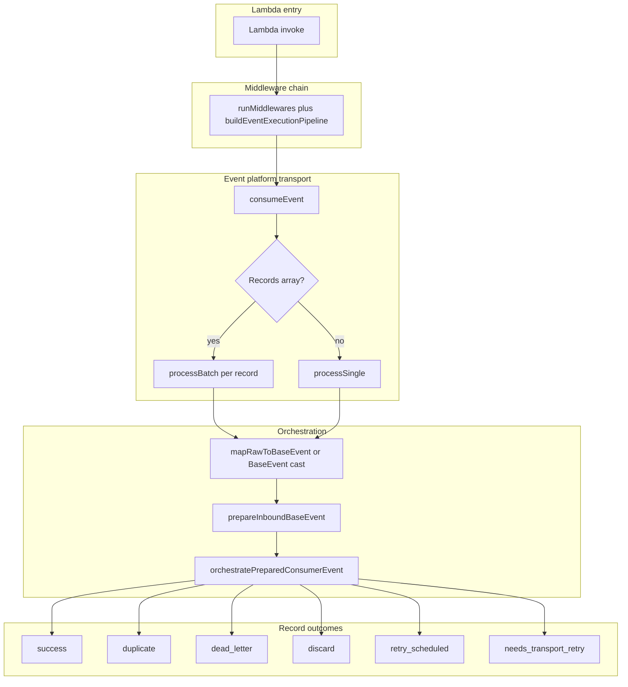
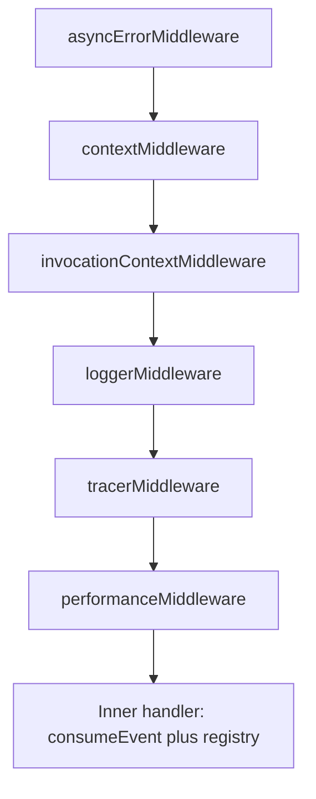

# Event Platform — Developer Guide

Enterprise handbook for building **reliable, observable event consumers** on `@api-hub/event-platform`, with invocation middleware from `@api-hub/middleware` and metrics/logging from `@api-hub/observability`.

---

## Related documentation

| Document | Purpose |
|----------|---------|
| [libs/event-platform/README.md](../../libs/event-platform/README.md) | Package overview, `BaseEvent` contract, team checklist |
| [SQS_CREATE_SQS_EVENT_HANDLER.md](./SQS_CREATE_SQS_EVENT_HANDLER.md) | `createSqsEventHandler` deep dive and migration |
| [SQS_PRODUCTION_READINESS.md](./SQS_PRODUCTION_READINESS.md) | SQS ops: alarms, FIFO, visibility, testing gaps |
| [DYNAMODB_STREAM_RUNTIME.md](./DYNAMODB_STREAM_RUNTIME.md) | DynamoDB Streams runtime and normalization |

---

## 1. Introduction

### What the event platform is

`@api-hub/event-platform` is the shared library for **canonical domain events**: the wire shape (`BaseEvent` / `EventEnvelope`), Zod payload schemas, inbound validation and versioning, idempotency hooks, retry and DLQ **policy**, and Lambda-oriented **consumer factories** that compose with `@api-hub/middleware` and `@api-hub/observability`.

### Why use it

- **One contract** (`eventType`, `eventVersion`, payload schema, `meta.correlationId`) across services.
- **Consistent execution**: the same orchestration (`consumeEvent` → `processSingle` / `processBatch` → `orchestratePreparedConsumerEvent`) for EventBridge-style handlers, SQS, and DynamoDB Streams.
- **Operational behavior**: retries, DLQ disposition, partial batch failures (SQS / Streams), and metrics are centralized instead of reimplemented per service.

### Problems it solves

- Ad-hoc JSON parsing and silent schema drift.
- Lost correlation between logs and downstream calls.
- Incorrect retry semantics (infinite loops, no poison-message path).
- Duplicated side effects under at-least-once delivery.

### Supported transports

| Transport | Primary entry point | Notes |
|-----------|---------------------|--------|
| **EventBridge** | `createEventHandler` / `onEvent` | Lambda receives the EventBridge envelope; map with `parseInboundEvent` (see §3). |
| **SQS** (including **SNS → SQS**) | `createSqsEventHandler` | Typed `SQSBatchResponse`, default `transportMode: 'sqs-native'`, per-message logger context. |
| **DynamoDB Streams** | `createDynamoStreamHandler` / `onDynamoEvent` | Same stack as SQS; partial batch failures use stream `eventID`. |

Publishing (out of scope for this guide) uses `EventPublisher`, `createSnsPublishEvent`, `EventBridgeAdapter`, etc. — see the package README.

---

## 2. Architecture overview

### Layers

1. **Middleware (invocation)** — `buildEventExecutionPipeline` from `@api-hub/middleware` wraps the handler: async error boundary, request/context, invocation metadata, logger, tracer, performance. **HTTP request schema validation is not in this stack**; reliability (idempotency, payload schema, retry, DLQ) lives in `@api-hub/event-platform` ([`http-pipeline.ts`](../../libs/middleware/src/lib/http-pipeline.ts)).
2. **Transport runtime** — `consumeEvent` detects batch transports (`Records` array) vs single payload; optional `wrapProcessSingle` (SQS / DynamoDB) for per-record Async Local Storage.
3. **Orchestration** — `processSingle` / `processBatch` → `mapRawToBaseEvent` (or cast) → `prepareInboundBaseEvent` → `orchestratePreparedConsumerEvent` (idempotency, routing, handler, retries, DLQ hooks, metrics, tracing).
4. **Observability** — `getLogger` / `getContext` from `@api-hub/observability` inside orchestration; consumer metrics (`TotalEventsProcessed`, `DuplicateEvents`, …) from [`consumer-metrics.ts`](../../libs/observability/src/metrics/consumer-metrics.ts).
5. **Retry / DLQ policy** — `evaluateDeliveryPolicy` and related helpers in [`delivery-policy.ts`](../../libs/event-platform/src/core/policy/delivery-policy.ts); optional `DlqStrategy` for application-initiated DLQ sends ([`dlq-config.ts`](../../libs/event-platform/src/core/dlq/dlq-config.ts)). **AWS** queue redrive to a DLQ is still infrastructure configuration.
6. **Idempotency** — `IdempotencyStrategy.before` / `afterSuccess` / `onError` around the handler ([`orchestrate-consumer-message.ts`](../../libs/event-platform/src/engine/processor/orchestrate-consumer-message.ts)).

### Execution lifecycle



**Partial batch transports (SQS, DynamoDB Streams):** outcomes that **ack without** `batchItemFailure` are: `success`, `duplicate`, `dead_letter`, `retry_scheduled`, `discard` ([`process-outcomes.ts`](../../libs/event-platform/src/engine/processor/process-outcomes.ts)). `needs_transport_retry` surfaces as a **failed item** in `SQSBatchResponse` / Dynamo batch response.

**EventBridge (typical `createEventHandler`):** no `Records`; orchestration uses **`runInProcessHandlerAttempts`** when neither SQS-native surface retry, Dynamo stream surface retry, nor `transportRetry` applies — see §8.

### Middleware lifecycle and order

`runMiddlewares` invokes middleware **in array order**; each middleware calls `next()` to continue. The first middleware in the array is the **outer** layer.



Source: [`buildEventExecutionPipeline`](../../libs/middleware/src/lib/http-pipeline.ts).

---

## 3. EventBridge consumer guide

### Contract

EventBridge delivers an envelope (`source`, `detail-type` / `detailType`, `detail`, …). The platform unwraps **`detail`** into a `BaseEvent` candidate inside [`normalizeTransportToPayloadCandidate`](../../libs/event-platform/src/sdk/consumer/transport-normalize.ts). **`createEventHandler` does not set `mapRawToBaseEvent` by default** — without it, `processSingle` treats the **entire** Lambda event as a `BaseEvent`, which is wrong for native EventBridge invokes. **Always** supply mapping using `parseInboundEvent` unless your function is invoked with a bare `BaseEvent`.

### Schema definition

```typescript
import { defineEvent } from '@api-hub/event-platform';
import { z } from 'zod';

export const OrderCreatedSchema = defineEvent(
  z.object({
    orderId: z.string(),
    customerId: z.string(),
  }),
  {
    eventType: 'Order.Created',
    eventVersion: '1.0.0',
    source: 'orders-svc',
    transport: 'eventbridge',
  },
);
```

### Multi-event handler — `createEventHandler`

Handlers receive **flattened** payload fields plus `meta` (spread from `payload` + `meta` on `BaseEvent`).

```typescript
import type { EventBridgeEvent } from 'aws-lambda';
import {
  createEventHandler,
  parseInboundEvent,
} from '@api-hub/event-platform';
import { OrderCreatedSchema } from './schemas/order-created';

export const handler = createEventHandler<
  EventBridgeEvent<string, unknown>,
  unknown
>({
  operation: 'order.created',
  consumer: {
    mapRawToBaseEvent: (raw) => parseInboundEvent(raw),
    // Optional: make transport explicit for readers and future policy tuning
    transportMode: 'eventbridge',
  },
  events: [
    {
      schema: OrderCreatedSchema,
      handler: async (event) => {
        // event.orderId, event.customerId, event.meta.correlationId
        await fulfillOrder(event.orderId);
      },
    },
  ],
});
```

### Single-event wrapper — main package `onEvent` (limitations)

The **`onEvent` exported from `@api-hub/event-platform`** ([`define-event-handler.ts`](../../libs/event-platform/src/lib/define-event-handler.ts)) calls `createEventHandler` **without** `consumer.mapRawToBaseEvent`. It is only correct when the **Lambda root** `event` is already a full `BaseEvent` (uncommon for native EventBridge invokes).

Handler signature: **`{ payload, meta }`** (not flattened).

**For standard EventBridge envelopes, do not use this `onEvent` unless you wrap or remap the event yourself.** Prefer **`onEvent`** / **`createEventHandler`** with the EventBridge transport profile as shown above, even for a single schema.

**Publish bootstrap:** use **`configureEventPlatform`** + **`publishEvent`** for outbound events only. Consume with **`onEvent`** (EventBridge) or **`onQueue`** (SQS).

### Sample EventBridge payload (AWS → Lambda)

The Lambda `event` looks like:

```json
{
  "version": "0",
  "id": "eb-uuid",
  "detail-type": "OrderCreated",
  "source": "orders.orders-svc",
  "account": "123456789012",
  "time": "2026-05-14T12:00:00Z",
  "region": "us-east-1",
  "resources": [],
  "detail": {
    "eventId": "01HX...",
    "eventType": "Order.Created",
    "eventVersion": "1.0.0",
    "timestamp": "2026-05-14T12:00:00.000Z",
    "source": "orders-svc",
    "idempotencyKey": "01HX...",
    "payload": { "orderId": "o-1", "customerId": "c-1" },
    "meta": { "correlationId": "corr-123", "tenantId": "t-1" }
  }
}
```

`parseInboundEvent` uses `detail` as the candidate and validates a full `BaseEvent`.

### serverless.yml (template)

Representative **Serverless Framework v3** fragment (adjust names, ARNs, and filters to your org):

```yaml
functions:
  onOrderCreated:
    handler: src/handlers/order-created.handler
    events:
      - eventBridge:
          eventBus: ${self:custom.domainEventBusArn}
          pattern:
            source:
              - orders.orders-svc
            detail-type:
              - OrderCreated
```

### Retry and DLQ behavior

- **In-process:** For EventBridge (no SQS receive count, no Dynamo stream record), orchestration uses **`runInProcessHandlerAttempts`**: up to `consumer.retry.maxAttempts` attempts with backoff sleep between attempts ([`orchestrate-consumer-message.ts`](../../libs/event-platform/src/engine/processor/orchestrate-consumer-message.ts)).
- **AWS layer:** Configure EventBridge replay, Lambda **async** retry, and on-failure destinations separately; they are not replaced by this library.
- **DLQ (`dlq.enabled` + optional `dlq.strategy`):** On terminal failure, `handleDlq` may run your strategy; without a strategy, non-retryable errors can result in **`discard`** ([`delivery-policy.ts`](../../libs/event-platform/src/core/policy/delivery-policy.ts)).

### Observability, correlation, tracing, idempotency

- **Correlation:** Set on the envelope `detail.meta.correlationId` (or rely on `normalizeEventMeta` fallback to `eventId`).
- **Logging / tracing:** Middleware runs first; handler logs pick up invocation context. Optional `consumer.tracing: EventTracingHooks` for fine-grained lifecycle (see §9).
- **Idempotency:** Same as other transports — default `DomainIdempotencyStrategy` (see §7).

---

## 4. SQS consumer guide

### Entry point — `createSqsEventHandler`

```typescript
import type { Context, SQSEvent, SQSBatchResponse } from 'aws-lambda';
import { z } from 'zod';
import { createSqsEventHandler, defineEvent } from '@api-hub/event-platform';

const AlertCreatedSchema = defineEvent(
  z.object({ alertId: z.string() }),
  {
    eventType: 'Alert.Created',
    eventVersion: '1.0.0',
    source: 'alerts-svc',
    transport: 'sqs',
  },
);

export const handler = createSqsEventHandler({
  operation: 'alert.created',
  events: [
    {
      schema: AlertCreatedSchema,
      handler: async (event) => {
        await notify(event.alertId, event.meta.correlationId);
      },
    },
  ],
});
```

### Defaults the platform applies

| Concern | Behavior |
|---------|-----------|
| **Parsing** | `mapRawToBaseEvent` defaults to `parseInboundEvent` — JSON body, **SNS subscription unwrap**, then `BaseEvent` validation. |
| **Transport mode** | `transportMode: 'sqs-native'` — failed attempts map to **`needs_transport_retry`** for partial batch when appropriate; SQS redelivery drives surface retries ([`create-sqs-event-handler.ts`](../../libs/event-platform/src/lib/create-sqs-event-handler.ts)). |
| **Batch response** | Always returns `SQSBatchResponse` (`batchItemFailures` with `messageId`). |
| **Concurrency** | Optional `consumer.batchConcurrency`. |
| **FIFO** | `fifoGroupScheduling` / `consumer.sqsFifoGroupScheduling`; poison short-circuit via `fifoPoisonReceiveCountThreshold` / `consumer.sqsFifoPoisonReceiveCountThreshold`. |
| **Long handlers** | Optional `visibilityHeartbeat` (queue URL from `SQS_QUEUE_URL` / `SQS_QUEUE` when `true`). |

### What developers should do

- Implement **business logic only** in the `handler`; return `void` or throw on failure.
- Use **`BaseError`** from `@api-hub/utils` with `retryable: false` for permanent failures (validation, unknown entity).
- Register **every** `eventVersion` you support in `payloadSchemas` via `events` entries.

### What the platform does automatically

- Transport unwrap, envelope validation, Zod payload parse, version checks (if configured).
- Idempotency `before` / `afterSuccess`, delivery policy, metrics (`TotalEventsProcessed`, `Retries`, …), optional tracing hooks.
- **Partial batch failure** aggregation ([`process-batch.ts`](../../libs/event-platform/src/engine/processor/process-batch.ts)).
- Per-message **logger context** via `withLoggerContext` ([`create-sqs-event-handler.ts`](../../libs/event-platform/src/lib/create-sqs-event-handler.ts)).

### Batch processing and partial failures

```typescript
export const handler = createSqsEventHandler({
  operation: 'orders.dispatch',
  consumer: { batchConcurrency: 5 },
  events: [
    /* … */
  ],
});
```

If one record throws or returns a terminal retry outcome that maps to transport retry, only that record’s `messageId` appears in `batchItemFailures`; successful messages are deleted from the queue.

### SNS → SQS

Subscription notifications are detected via `Type: Notification` and inner `Message` JSON ([`transport-normalize.ts`](../../libs/event-platform/src/sdk/consumer/transport-normalize.ts)); no extra code in the handler.

### FIFO example (shorthand options)

```typescript
export const handler = createSqsEventHandler({
  operation: 'payments.capture',
  fifoGroupScheduling: true,
  fifoPoisonReceiveCountThreshold: 8,
  consumer: { batchConcurrency: 10 },
  events: [/* … */],
});
```

### serverless.yml (template)

```yaml
functions:
  consumeAlerts:
    handler: dist/handlers/alerts-sqs.handler
    reservedConcurrency: 20
    events:
      - sqs:
          arn: ${self:custom.alertQueueArn}
          batchSize: 10
          functionResponseType: ReportBatchItemFailures
    environment:
      SQS_QUEUE_URL: ${self:custom.alertQueueUrl}

resources:
  Resources:
    AlertQueue:
      Type: AWS::SQS::Queue
      Properties:
        VisibilityTimeout: 180
        RedrivePolicy:
          deadLetterTargetArn: !GetAtt AlertDlq.Arn
          maxReceiveCount: 5
    AlertDlq:
      Type: AWS::SQS::Queue
```

Align **`maxReceiveCount`** with `consumer.retry.maxAttempts` using [`recommendedSqsRedriveMaxReceiveCount`](../../libs/event-platform/src/infra/recommended-sqs-redrive-max-receive-count.ts) (see §8).

---

## 5. DynamoDB Streams consumer guide

### Entry points

- **`createDynamoStreamHandler`** — multiple routes (`table`, `eventName`, `schema`, `handler`).
- **`onDynamoEvent`** — single schema; optional `route.table` / `route.eventName`; operation defaults to `` `${source}.processed` `` ([`on-dynamo-event.ts`](../../libs/event-platform/src/lib/on-dynamo-event.ts)).

```typescript
import { createDynamoStreamHandler, defineEvent } from '@api-hub/event-platform';
import { z } from 'zod';

const PatientUpdatedSchema = defineEvent(
  z.object({ patientId: z.string() }),
  {
    eventType: 'Patient.Updated',
    eventVersion: '1.0.0',
    source: 'patients-svc',
    transport: 'sqs',
  },
);

export const handler = createDynamoStreamHandler({
  operation: 'patient.updated',
  consumer: { batchConcurrency: 10 },
  events: [
    {
      table: 'patients',
      eventName: ['MODIFY'],
      schema: PatientUpdatedSchema,
      handler: async (event) => {
        await syncReadModel(event.patientId);
      },
    },
  ],
});
```

### INSERT / MODIFY / REMOVE and images

Normalization lives under `libs/event-platform/src/dynamo-stream/`. Payload selection for `BaseEvent.payload`:

- **INSERT / MODIFY:** prefer **NewImage**, then OldImage, then keys.
- **REMOVE:** **OldImage**, then keys.

AttributeValues are **unmarshalled** to plain JS objects before mapping to your Zod payload.

### Normalization and routing

- **`normalizeDynamoStreamRecord`** — stream metadata + images + optional correlation fields from item attributes.
- **`StreamRecordFilteredError`** — no matching route: record is **acked** (success), not a batch failure; metric `DynamoStreamRecordsFiltered` ([`DYNAMODB_STREAM_RUNTIME.md`](./DYNAMODB_STREAM_RUNTIME.md)).
- **Route matching:** `table` as substring, `RegExp`, or predicate; `eventName` as single value, array, or predicate. **First match wins** — declare specific routes first.

### Defaults

- `transportMode: 'dynamodb-stream'`
- Default **`retry.maxAttempts`: 5** (vs **3** on `createSqsEventHandler`) — see [`create-dynamo-stream-handler.ts`](../../libs/event-platform/src/lib/create-dynamo-stream-handler.ts).

### Partial batch failures

Failed records return `batchItemFailures: [{ itemIdentifier: eventID }]`.

### serverless.yml (template)

```yaml
functions:
  onPatientsStream:
    handler: dist/handlers/patients-stream.handler
    events:
      - stream:
          type: dynamodb
          arn: ${self:custom.patientsTableStreamArn}
          batchSize: 100
          startingPosition: LATEST
          functionResponseType: ReportBatchItemFailures
          bisectBatchOnFunctionError: true
```

### Replay safety and ordering

- **At-least-once:** duplicates possible; combine **idempotency** with conditional writes.
- **Per-shard ordering:** AWS guarantees ordering per shard key; the library’s **FIFO group scheduling** applies to **SQS FIFO**, not DynamoDB ordering semantics beyond partial batch handling.

---

## 6. Correlation and trace propagation

### Fields on `BaseEvent.meta`

Defined in [`base-event.types.ts`](../../libs/event-platform/src/typings/base-event.types.ts):

| Field | Role |
|-------|------|
| `correlationId` | Required after normalization; drives logs and trace context. |
| `causationId` | Optional upstream event id for causal chains. |
| `traceId` / `spanId` | Optional distributed tracing ids. |
| `retryCount` | Incremented during in-process retries. |

### Automatic propagation

[`normalizeEventMeta`](../../libs/event-platform/src/core/event-envelope/normalize-event-meta.ts) sets `correlationId` to the incoming value or falls back to **`eventId`**.

SQS per-record context is built in [`sqs-per-message-context.ts`](../../libs/event-platform/src/lib/sqs-per-message-context.ts); DynamoDB in [`dynamo-stream-per-message-context.ts`](../../libs/event-platform/src/dynamo-stream/dynamo-stream-per-message-context.ts). Both feed **`withLoggerContext`** so `getLogger()` inside the handler emits correlated structured logs.

### Tracing

`tracerMiddleware` uses the service tracer from `@api-hub/middleware` / `@api-hub/observability` configuration. For consumer-specific spans, supply `EventTracingHooks` on `consumer.tracing` (types exported from `@api-hub/event-platform`; hook implementations are plain objects).

---

## 7. Idempotency guide

### Why it matters

All supported transports are **at-least-once**. The same logical event can be delivered twice.

### Strategies

| Strategy | When to use |
|----------|-------------|
| **`DomainIdempotencyStrategy`** (default) | Domain persistence already enforces uniqueness (conditional Put, version columns). `afterSuccess` is a no-op. |
| **`StoreIdempotencyStrategy`** + **`IdempotencyStore`** | Cross-instance dedupe via external store (`DynamoDbIdempotencyStore`, `InMemoryIdempotencyStore` for tests). |

Factory:

```typescript
import {
  createIdempotencyStrategy,
  createSqsEventHandler,
  DynamoDbIdempotencyStore,
} from '@api-hub/event-platform';

const store = new DynamoDbIdempotencyStore(); // or pass table name; env IDEMPOTENCY_TABLE

export const handler = createSqsEventHandler({
  operation: 'billing.invoice',
  consumer: {
    idempotencyStrategy: createIdempotencyStrategy({ mode: 'store', store }),
  },
  events: [/* … */],
});
```

### Duplicate handling

When **`idempotencyStrategy.before`** resolves to **`DUPLICATE`** (for example with **`StoreIdempotencyStrategy`** when the key was already completed), orchestration returns outcome **`duplicate`**, increments **`DuplicateEvents`** metric, and **does not** re-run the handler.

**`DomainIdempotencyStrategy`** always returns **`PROCEED`** from `before`; duplicate protection is expected from **domain-level** conditional writes, with **`DuplicateEventError`** surfaced from `onError` when applicable.

### DynamoDB stream keys

The stream mapper sets a deterministic **`idempotencyKey`** (e.g. table + `eventID`) where applicable — see [`map-dynamo-stream-record.ts`](../../libs/event-platform/src/dynamo-stream/map-dynamo-stream-record.ts).

---

## 8. Retry and DLQ guide

### Outcomes (per record)

From [`process-outcomes.ts`](../../libs/event-platform/src/engine/processor/process-outcomes.ts): `success`, `duplicate`, `dead_letter`, `retry_scheduled`, `discard`, `needs_transport_retry`.

### Retryable vs non-retryable

[`isNonRetryableHandlerError`](../../libs/event-platform/src/core/policy/delivery-policy.ts): `BaseError` with `retryable === false`, `ZodError`, and certain `Error` names (`ValidationError`, `SchemaValidationError`). Non-retryable → **`discard`** (or dead-letter when `dlq.enabled && dlq.strategy`).

### SQS flow

With **`sqs-native`**, handler failures use **`runSingleHandlerAttempt`** path: typically **`needs_transport_retry`** without in-process sleep loops; **SQS visibility** and **receive count** drive redelivery. Configure **DLQ** in CloudFormation / CDK with `maxReceiveCount` ≥ `retry.maxAttempts` ([`recommendedSqsRedriveMaxReceiveCount`](../../libs/event-platform/src/infra/recommended-sqs-redrive-max-receive-count.ts)).

### EventBridge flow

Uses **`runInProcessHandlerAttempts`**: bounded retries with backoff inside the invocation (see §3). Still configure Lambda / EventBridge operational retry as needed.

### DynamoDB Streams flow

`transportMode: 'dynamodb-stream'` enables **surface retry** semantics aligned with Lambda partial batch responses (see engineering doc).

### Poison messages

- **SQS FIFO:** `fifoPoisonReceiveCountThreshold` surfaces **`needs_transport_retry`** early to isolate poison receives.
- **General:** combine non-retryable errors, DLQ strategy, and AWS redrive.

### `transportRetry` (advanced)

When `consumer.transportRetry` is set, `effectiveTransportMode` becomes **`framework-managed`** unless overridden — retries can re-publish via your strategy instead of failing the Lambda ([`consumer.types.ts`](../../libs/event-platform/src/typings/consumer.types.ts)).

---

## 9. Observability guide

### Logging

Orchestration uses **`getLogger()`** from `@api-hub/observability` with structured fields (`correlationId`, `eventType`, disposition, …). SQS and Dynamo handlers set **per-record** ALS context.

### Metrics (CloudWatch EMF via Powertools)

Emitted from [`consumer-metrics.ts`](../../libs/observability/src/metrics/consumer-metrics.ts):

| Metric | Meaning |
|--------|---------|
| `TotalEventsProcessed` | Successful handler completion |
| `DuplicateEvents` | Idempotent skip |
| `ProcessingFailures` | Failure / rethrow paths |
| `DeliveryDisposition` | Disposition dimension |
| `Retries` / `RetryCount` | Retry scheduling |
| `SqsVisibilityExtensions` / `SqsVisibilityHeartbeatsSkipped` / `SqsVisibilityHeartbeatLoopsEnded` | Heartbeat health |
| `SqsFifoBatchScheduleSnapshots` / `SqsFifoBatchTailsDeferred` / `SqsFifoBatchPoisonShortCircuits` | FIFO scheduler |
| `DynamoStreamBatchRecordsReceived` / `DynamoStreamRecordsFiltered` | Stream batch |

### Tracing

- Middleware **`tracerMiddleware`** wraps the invocation.
- Optional **`EventTracingHooks`**: `onEventReceived`, `onEventProcessed`, `onEventFailed`, `onRetry`, `onDlq`, `onFifoBatchTailDeferred`, etc. ([`event-tracing-hooks.ts`](../../libs/event-platform/src/core/tracing/event-tracing-hooks.ts)).

### Per-message vs batch

- **Per-message:** SQS and DynamoDB use `wrapProcessSingle` for ALS and (SQS) visibility heartbeat.
- **Batch-level:** e.g. `recordDynamoStreamBatchDispatch` for stream batch size.

---

## 10. Middleware lifecycle guide

### Order of execution

1. `asyncErrorMiddleware` — normalizes errors at the edge.
2. `contextMiddleware` — async context.
3. `invocationContextMiddleware` — operation name, invocation metadata.
4. `loggerMiddleware` — logger setup.
5. `tracerMiddleware` — tracer segment for the invocation.
6. `performanceMiddleware` — timing.

Then the **inner handler** runs `consumeEvent` (registry + consumer deps).

### Responsibility split

| Layer | Responsibility |
|-------|------------------|
| Middleware | HTTP-less concerns: logging, tracing, performance, error envelope for the Lambda boundary. |
| Event platform | Payload validation, versioning, idempotency, handler dispatch, retry/DLQ **policy**, transport-specific batch responses. |

---

## 11. Best practices

1. **Envelope:** Always publish and consume a full **`BaseEvent`**; document `eventType` and semver `eventVersion`.
2. **Schemas:** `defineEvent` + Zod; register every version consumers must accept.
3. **EventBridge:** Always `mapRawToBaseEvent: (raw) => parseInboundEvent(raw)` (or equivalent) with `createEventHandler`.
4. **SQS:** Use `createSqsEventHandler`; set `functionResponseType: ReportBatchItemFailures`; align **visibility timeout** with handler p95; use **visibility heartbeat** for long work.
5. **DynamoDB:** Prefer `createDynamoStreamHandler` over deprecated `createStreamHandler`; order routes from most specific to least.
6. **Idempotency:** Prefer domain conditionals; add **store** strategy when cross-instance dedupe is required.
7. **Errors:** Use **`BaseError`** with explicit **`retryable`** for operational clarity.
8. **Ops:** `maxReceiveCount` ≥ `retry.maxAttempts`; monitor DLQ depth and `DuplicateEvents`.

---

## 12. Anti-patterns

| Do not | Why |
|--------|-----|
| Wrap `createSqsEventHandler` and swallow all errors | Breaks partial batch semantics and metrics. |
| Omit `mapRawToBaseEvent` for EventBridge | Raw EventBridge envelope is not a `BaseEvent`. |
| Manually re-send to DLQ for normal failures | Use `dlq.strategy` + policy; let SQS redrive handle transport DLQ. |
| Parse JSON only with `JSON.parse` and skip `parseInboundEvent` | Loses SNS unwrap and `BaseEvent` validation. |
| Ignore idempotency on non-replay-safe writes | Duplicates will corrupt data under at-least-once delivery. |
| Use `createStreamHandler` for new code | Deprecated; use `createDynamoStreamHandler` ([`create-stream-handler.ts`](../../libs/event-platform/src/lib/create-stream-handler.ts)). |

---

## 13. Migration guide

### EventBridge

**Before:** Custom Lambda parsing `event.detail`, ad-hoc validation.

**After:** `createEventHandler` + `parseInboundEvent` + `defineEvent` registry + middleware pipeline.

### SQS

**Before:** `createEventHandler` + manual `mapRawToBaseEvent: parseInboundEvent` + manual `SQSBatchResponse`.

**After:** `createSqsEventHandler` — typed batch response, defaults, per-message ALS. See [SQS_CREATE_SQS_EVENT_HANDLER.md](./SQS_CREATE_SQS_EVENT_HANDLER.md).

### DynamoDB Streams

**Before:** `createStreamHandler` + `EventConsumer` wiring.

**After:** `createDynamoStreamHandler` / `onDynamoEvent` with the same orchestration as SQS.

---

## 14. Troubleshooting

| Symptom | Likely cause | What to check |
|---------|----------------|---------------|
| Messages retry forever | Retryable error + high `maxAttempts` / SQS redrive | Logs for `retryable`; DLQ policy; `fifoPoisonReceiveCountThreshold`. |
| Handler never sees messages (SQS) | Visibility too low vs processing time | Increase timeout; add `visibilityHeartbeat`. |
| Duplicate side effects | Missing idempotency / non-conditional writes | Strategy + domain keys. |
| `Event is not valid JSON` | Non-JSON body or double-encoded string | Producer; SNS raw message delivery settings. |
| Schema / version errors | Wrong `eventVersion` on wire | `prepareInboundBaseEvent` logs; consumer `versionCheck`. |
| Partial batch always fails one index | FIFO lane blocked | `onFifoBatchTailDeferred` tracing; earlier message failure. |
| Dynamo records skipped | No route match | Table / `eventName` filters; `StreamRecordFilteredError` path. |

---

## 15. FAQ

**When should I use EventBridge vs SQS vs DynamoDB Streams?**

- **EventBridge:** Cross-service domain routing, content filtering, archives/replay, low coupling.
- **SQS:** Buffered work queues, fan-out workers, strict throughput control, **FIFO** when ordering per group is required.
- **DynamoDB Streams:** React to table changes (CDC), projection / sync jobs, outbox-style processing from persisted data.

**How do retries work?**

- **SQS native:** Surface `needs_transport_retry` + queue redelivery; optional in-process idempotency contention handling.
- **EventBridge:** In-process bounded retries in `runInProcessHandlerAttempts` plus AWS-level configuration.
- **Streams:** Partial batch failures + Lambda retries.

**How does DLQ work?**

- **Application:** `dlq.enabled` and optional `dlq.strategy.send` for explicit DLQ messages ([`dlq-config.ts`](../../libs/event-platform/src/core/dlq/dlq-config.ts)).
- **Infrastructure:** SQS / EventBridge DLQ / on-failure destinations — must align counts with `retry.maxAttempts`.

**How does correlation work?**

Publish `meta.correlationId` on the `BaseEvent`; otherwise normalization falls back to `eventId`. Middleware + ALS ensure logs include the active correlation id.

**How does tracing work?**

`tracerMiddleware` creates the invocation trace scope; optional `EventTracingHooks` add consumer-stage signals (`onEventReceived`, `onEventFailed`, …).

---

## Appendix — default `EventConsumerDeps` snapshot

Values differ slightly per factory (`createEventHandler`, `createSqsEventHandler`, `createDynamoStreamHandler`). Treat the **source files** as authoritative; this table reflects typical defaults:

| Setting | `createEventHandler` | `createSqsEventHandler` | `createDynamoStreamHandler` |
|---------|----------------------|-------------------------|------------------------------|
| `idempotencyStrategy` | `DomainIdempotencyStrategy` | same | same |
| `retry.maxAttempts` | 3 | 3 | 5 |
| `dlq.enabled` | true | true | true |
| `transportMode` | unset (`sqs-native` unless `transportRetry`) | `sqs-native` | `dynamodb-stream` |
| `mapRawToBaseEvent` | none (pass explicit for EventBridge) | `parseInboundEvent` | stream mapper |

---

*This guide is maintained alongside the libraries. When behavior changes, update the linked source files and this document together.*
