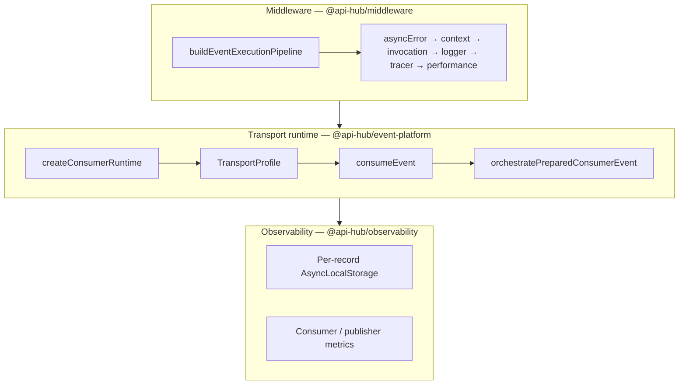
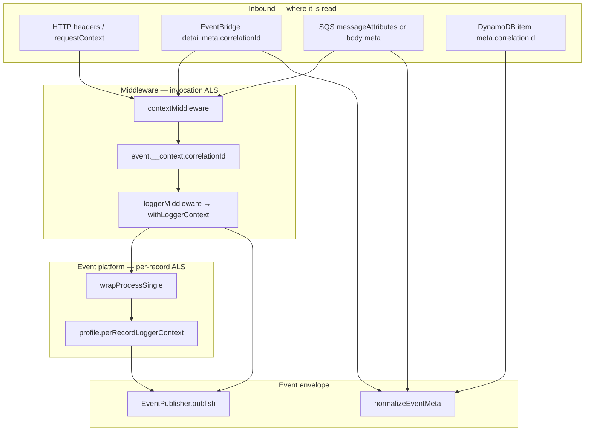
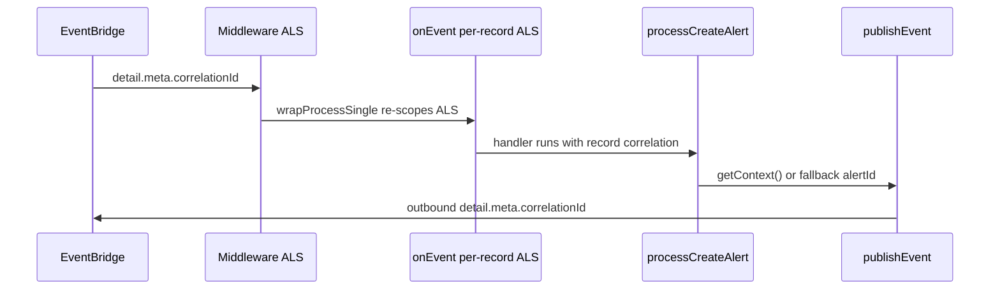

# Event platform: transports handbook

This is the **authoritative transport guide** for **EventBridge**, **SQS**, **SNS publish**, and **DynamoDB Streams** on `@api-hub/event-platform`, with invocation middleware from `@api-hub/middleware` and metrics/logging from `@api-hub/observability`.

**Companion docs**

| Document | Purpose |
|----------|---------|
| [EVENT_PLATFORM_DEVELOPER_GUIDE.md](./EVENT_PLATFORM_DEVELOPER_GUIDE.md) | Full developer handbook (policy, versioning, troubleshooting) |
| [SQS_CREATE_SQS_EVENT_HANDLER.md](./SQS_CREATE_SQS_EVENT_HANDLER.md) | SQS deep dive (visibility heartbeat, FIFO, partial batch) |
| [DYNAMODB_STREAM_RUNTIME.md](./DYNAMODB_STREAM_RUNTIME.md) | DynamoDB Streams normalization and routing |
| [SQS_PRODUCTION_READINESS.md](./SQS_PRODUCTION_READINESS.md) | SQS ops: alarms, redrive, visibility |

Application code must **not** call `PutEvents`, `SendMessage`, `ReceiveMessage`, or `Publish` directly except inside platform adapters or documented factories.

---

## 1. Unified runtime (all transports)

Every first-class Lambda consumer uses the same stack:



| Layer | Responsibility |
|-------|----------------|
| **`buildEventExecutionPipeline`** | Invocation scope: logger, tracer, performance, error boundary. **No** payload schema / idempotency / DLQ here. |
| **`createConsumerRuntime`** | Wires transport profile, schema registry, default consumer deps, outcome mapping. |
| **Transport profile** | Parse inbound wire shape → `BaseEvent`, per-record logger context, partial-batch response coercion. |
| **`consumeEvent` → orchestration** | Validation, idempotency, handler dispatch, retry/DLQ **policy**, consumer metrics. |

### Handler entry points (use these)

| Transport | Preferred API | Alias / legacy |
|-----------|---------------|----------------|
| **EventBridge** | **`onEvent({ operation, events, consumer? })`** | `createEventHandler`, `createEventBridgeEventHandler` |
| **SQS** | **`onQueue({ operation, events, consumer? })`** | `createSqsEventHandler` |
| **DynamoDB Streams** | **`onDynamoEvent(schema, handler, route?)`** or **`createDynamoStreamHandler({ operation, events })`** | — |

**Do not use:** legacy `createStreamHandler`, removed DX `onEvent(schema)` (EventConsumer.handle path), or raw `EventConsumer` for new Lambdas.

---

## 2. Canonical event shape (`BaseEvent`)

| Field | Role |
|--------|------|
| `eventId` | Unique occurrence id |
| `eventType` | Stable name; **registry routing key** |
| `eventVersion` | Semver schema version |
| `timestamp` | ISO time |
| `source` | Producing service |
| `idempotencyKey` | Dedup key (defaults to `eventId` on publish) |
| `payload` | Domain data (`defineEvent` + Zod) |
| `meta` | **`correlationId` required** after normalization; optional `traceId`, `tenantId`, `retryCount`, `publishedAt` |

Type: [`libs/event-platform/src/typings/base-event.types.ts`](../../libs/event-platform/src/typings/base-event.types.ts).

### Define events once

```typescript
import { z } from 'zod';
import { defineEvent } from '@api-hub/event-platform';

export const OrderCreatedSchema = defineEvent(
  z.object({ orderId: z.string() }),
  {
    eventType: 'Order.Created',
    eventVersion: '1.0.0',
    source: 'orders-service',
    transport: 'eventbridge', // publish routing hint: eventbridge | sns | sqs
  },
);
```

---

## 3. Correlation ID (creation, propagation, chaining)

Correlation ties **logs, traces, and downstream events** to one user action or request. There are three related but distinct uses:

| Use | Where | Purpose |
|-----|--------|---------|
| **Invocation ALS** | `@api-hub/middleware` | Logger / tracer for the whole Lambda invoke |
| **Per-record ALS** | `@api-hub/event-platform` transport profiles | Correct scope for SQS batches and concurrent workers |
| **Wire envelope** | `BaseEvent.meta.correlationId` | Propagate across services on publish → consume |

**Do not confuse** `correlationId` (trace a flow) with `eventId` (unique occurrence / idempotency default).

### End-to-end flow



Implementation: [`standard-event-context.ts`](../../libs/middleware/src/lib/standard-event-context.ts), [`correlation.ts`](../../libs/observability/src/http/correlation.ts), transport profiles under [`libs/event-platform/src/lib/`](../../libs/event-platform/src/lib/).

### Resolution by transport

#### HTTP / API Gateway (`withApiHandler`)

`resolveCorrelationIdForHttp` (via `contextMiddleware`):

1. `x-correlation-id` / `X-Correlation-Id` / `correlation-id` headers
2. `requestContext.requestId`
3. Lambda `awsRequestId`
4. `randomUUID()`

`withApiHandler` copies `event.__context.correlationId` onto **`req.context.correlationId`** for handlers.

Legacy `withLambdaHandler` uses `extractCorrelationId` directly (falls back to `corr-{timestamp}-{random}`).

#### EventBridge (`onEvent`)

| Layer | Source | Fallback chain |
|-------|--------|----------------|
| **Invocation** | `event.detail.meta.correlationId` | → HTTP path → `randomUUID()` |
| **Per-record ALS** | `detail.meta.correlationId` | → legacy `detail.correlationId` → `detail.eventId` → `awsRequestId` → `'unknown'` |

After parse, `normalizeEventMeta` fills missing envelope correlation with **`eventId`**.

Handlers receive **`input.meta.correlationId`** (flattened payload + `meta`).

#### SQS (`onQueue`)

| Layer | Source | Fallback chain |
|-------|--------|----------------|
| **Invocation** | **`Records[0]` only** — attribute or body `meta.correlationId` | → EventBridge/HTTP path → `randomUUID()` |
| **Per-record ALS** | Message attribute `correlationId` | → unwrapped body `meta.correlationId` → **`messageId`** |

For SQS batches, **per-record ALS inside the handler is authoritative** — outer invocation logs may reflect only the first record.

#### DynamoDB Streams

From **NewImage/OldImage**: `meta.correlationId`, then top-level `correlationId`.

Per-record ALS fallback: extracted value → **`eventID`** → `'unknown'`.

### Runtime propagation (four steps)

1. **`contextMiddleware`** → `applyStandardEventContext` → stores `correlationId` on **`event.__context`** (not the event root).
2. **`loggerMiddleware`** → `withLoggerContext(event.__context)` → invocation AsyncLocalStorage.
3. **`createPerRecordLoggerConsumeOptions`** → `wrapProcessSingle` → nested `withLoggerContext` per record (SQS / EventBridge / Streams).
4. **`tracerMiddleware`** annotates X-Ray with `correlationId` from ALS or `event.__context`.

Read current correlation in code: **`getContext().correlationId`** or **`getLoggerContext().correlationId`** (`@api-hub/observability`).

### Publishing rules

| API | How correlation is resolved |
|-----|----------------------------|
| **`EventPublisher.publish`** | `input.meta.correlationId` **or** ALS — **throws** if both missing |
| **`publishEvent` (DX)** | Pass `meta: { correlationId }` or rely on ALS |
| **`createSnsPublishEvent`** | `evt.correlationId` → 2nd arg → `evt.meta.correlationId` → ALS |
| **`createBaseEvent`** (low-level) | `meta.correlationId ?? eventId` |

**Recommended pattern (alert-service):** prefer ALS from the consumer handler; fall back to a stable business id when ALS is `'unknown'`:

```typescript
import { getContext } from '@api-hub/observability';
import { publishEvent } from '@api-hub/event-platform';

function currentCorrelationId(fallback: string): string {
  const id = getContext().correlationId;
  return id && id !== 'unknown' ? id : fallback;
}

await publishEvent(AlertCreatedEventSchema, payload, {
  meta: {
    correlationId: currentCorrelationId(payload.alertId),
    tenantId: payload.organizationId,
  },
});
```

**Chaining rule:** downstream events should **reuse upstream `meta.correlationId`** (not `eventId`) so logs trace one action across services.

### Reference flow: alert-service EventBridge



### Known gaps (avoid in new code)

| Issue | Detail |
|-------|--------|
| EventBridge legacy field | Per-record context reads `detail.correlationId`; invocation resolver only reads `detail.meta.correlationId`. Prefer **`meta.correlationId`** on all new producers. |
| SQS batch invocation ALS | Middleware uses **`Records[0]`** only. Do not rely on outer ALS for per-message work in batches. |
<!-- | Stale `normalizeContext` | `libs/observability/src/core/normalize-context.ts` checks `detail.correlationId` — do not use for new code. | -->
| Publisher strictness | `EventPublisher` throws without meta/ALS; always pass `meta.correlationId` or ensure ALS is set before publish. |

### Correlation checklist

**Publish**

- [ ] Set `meta.correlationId` explicitly when ALS may be unset (`'unknown'`)
- [ ] In HTTP handlers: use `req.context.correlationId` or `getContext()`
- [ ] In consumers: reuse `input.meta.correlationId` or per-record ALS for outbound events

**Consume**

- [ ] EventBridge: put correlation on **`detail.meta.correlationId`**
- [ ] SQS: body `meta.correlationId` and/or message attribute `correlationId`
- [ ] DynamoDB: persist on item as `meta.correlationId` when stream consumers need it

---

## 4. Publishing (step-by-step)

### Pattern A — SNS (user-service, device-service)

Best for **fan-out topics** already wired in Serverless.

```typescript
import { createSnsPublishEvent } from '@api-hub/event-platform';

export const publishEvent = createSnsPublishEvent({
  topicArnEnvKey: 'USER_EVENTS_TOPIC_ARN',
  source: 'user-service',
});

// In domain code:
await publishEvent(UserCreatedSchema, payload, {
  meta: { correlationId, tenantId },
  idempotencyKey: inputEventId,
});
```

**Steps:** (1) `defineEvent` with `transport: 'sns'`. (2) Factory at module scope. (3) Pass `correlationId` from logger context when available. (4) Set `idempotencyKey` for business dedupe.

### Pattern B — EventBridge DX (alert-service)

Best when the service **owns the bus** and publishes typed outbound events.

**1. Bootstrap once per process** (`event-runtime.ts`):

```typescript
import { configureEventPlatform, EventBridgeAdapter } from '@api-hub/event-platform';

configureEventPlatform({
  publishers: {
    eventbridge: new EventBridgeAdapter({
      eventBusName: process.env.ALERT_EVENT_BUS_NAME!,
      source: 'alert-service',
    }),
  },
});
```

**2. Publish from domain code:**

```typescript
import { publishEvent } from '@api-hub/event-platform';

await publishEvent(AlertCreatedEventSchema, payload, {
  meta: { correlationId: getContext().correlationId },
});
```

**3. Fail-safe wrapper + metrics** (recommended for non-critical outbound):

```typescript
import { recordPublishFailure } from '@api-hub/observability';

try {
  await publishEvent(schema, payload, overrides);
} catch (error) {
  recordPublishFailure(schema.__meta.eventType, error);
  logger.warn({ event: 'publish_failed', error });
}
```

| Concern | SNS factory | EventBridge DX |
|---------|-------------|----------------|
| Config | Env topic ARN | `configureEventPlatform` + adapter |
| API | `createSnsPublishEvent()` | `publishEvent(schema, payload)` |
| Skip when unset | Warn + no-op | Throws if runtime not configured |

**Rule:** Domain modules never import `@aws-sdk/client-eventbridge` / `@aws-sdk/client-sns` directly.

---

## 5. EventBridge consumer (step-by-step)

Reference: [`apps/alert-service/src/handlers/events/consumer/event-bridge/createAlertConsumer.ts`](../../apps/alert-service/src/handlers/events/consumer/event-bridge/createAlertConsumer.ts).

### Step 1 — Inbound schema

```typescript
export const CreateAlertEventSchema = defineEvent(alertCreateIngestPayloadSchema, {
  eventType: 'Alert.Create',
  eventVersion: '1.0.0',
  source: 'upstream-producer',
  transport: 'eventbridge',
});
```

### Step 2 — Consumer deps (DLQ, optional overrides)

```typescript
import { createDefaultSqsDlqStrategy, type EventConsumerDeps } from '@api-hub/event-platform';

export function buildAlertEventConsumerDeps(): Partial<EventConsumerDeps> {
  const dlqStrategy = createDefaultSqsDlqStrategy(); // reads DLQ_QUEUE_URL / EVENT_DLQ_QUEUE_URL
  return dlqStrategy
    ? { dlq: { enabled: true, strategy: dlqStrategy } }
    : { dlq: { enabled: false } };
}
```

Platform default idempotency is **`DomainIdempotencyStrategy`** — no separate table; domain writes must be idempotent (see §8).

### Step 3 — Handler

```typescript
import { onEvent } from '@api-hub/event-platform';

export const handler = onEvent({
  operation: 'alert.create.processed',
  consumer: buildAlertEventConsumerDeps(),
  events: [
    {
      schema: CreateAlertEventSchema,
      handler: async (input) => {
        const { meta, ...payload } = input;
        await processCreateAlert(payload);
      },
    },
  ],
});
```

`onEvent` uses `eventBridgeTransportProfile`: unwraps `detail`, maps `needs_transport_retry` → **Lambda failure** so EventBridge async retry and `onFailure` DLQ fire.

### Step 4 — Serverless (infra alignment)

```yaml
functions:
  onCreateAlert:
    handler: src/handlers/events/consumer/event-bridge/createAlertConsumer.main
    maximumRetryAttempts: 2
    destinations:
      onFailure:
        type: sqs
        arn: !GetAtt AlertCreateConsumerDLQ.Arn
    environment:
      DLQ_QUEUE_URL: !Ref AlertCreateConsumerDLQ
      EVENT_DLQ_QUEUE_URL: !Ref AlertCreateConsumerDLQ
    events:
      - eventBridge:
          eventBus: ${self:custom.eventBusName}
          pattern:
            detail-type: ['Alert.Create']
```

| Layer | EventBridge DLQ |
|-------|-----------------|
| **AWS** | `destinations.onFailure` → SQS (messages that exhausted async retries) |
| **Application** | `SqsDlqStrategy` via `createDefaultSqsDlqStrategy` for terminal `dead_letter` outcomes from delivery policy |

Align `maximumRetryAttempts` with `consumer.retry.maxAttempts` (default **3** in platform; alert-service uses **2** at AWS layer — document per service).

---

## 6. SQS consumer (step-by-step)

See [SQS_CREATE_SQS_EVENT_HANDLER.md](./SQS_CREATE_SQS_EVENT_HANDLER.md) for heartbeat, FIFO, and partial batch details.

### Step 1 — Schema + handler

```typescript
import { onQueue, defineEvent } from '@api-hub/event-platform';

export const handler = onQueue({
  operation: 'order.created.processed',
  consumer: {
    batchConcurrency: 5,
    dlq: { enabled: true, strategy: createDefaultSqsDlqStrategy() },
  },
  visibilityHeartbeat: true, // long-running handlers: SQS_QUEUE_URL required
  events: [
    {
      schema: OrderCreatedSchema,
      handler: async (input) => {
        const { meta, ...payload } = input;
        await handleOrder(payload, meta);
      },
    },
  ],
});
```

### Step 2 — Serverless

```yaml
functions:
  onOrderCreated:
    handler: src/handlers/onOrderCreated.main
    events:
      - sqs:
          arn: !GetAtt OrderQueue.Arn
          batchSize: 10
          functionResponseType: ReportBatchItemFailures
    environment:
      DLQ_QUEUE_URL: !Ref OrderDLQ
      SQS_QUEUE_URL: !Ref OrderQueue
```

### Step 3 — Queue redrive (AWS layer)

Use `recommendedSqsRedriveMaxReceiveCount(consumer)` (+ optional buffer) so **`maxReceiveCount`** ≥ `retry.maxAttempts`.

| Setting | Purpose |
|---------|---------|
| `functionResponseType: ReportBatchItemFailures` | Partial batch — failed messages retry, successes delete |
| `transportMode: 'sqs-native'` (default for `onQueue`) | Uses `ApproximateReceiveCount` in delivery policy |
| Visibility timeout | ≥ p95 handler duration; use heartbeat if longer |

---

## 7. DynamoDB Streams consumer (step-by-step)

See [DYNAMODB_STREAM_RUNTIME.md](./DYNAMODB_STREAM_RUNTIME.md).

### Step 1 — Multi-route handler

```typescript
import { createDynamoStreamHandler, defineEvent } from '@api-hub/event-platform';

export const handler = createDynamoStreamHandler({
  operation: 'patient.updated.processed',
  consumer: { batchConcurrency: 10 },
  events: [
    {
      table: 'patient-service-${stage}',
      eventName: ['MODIFY'],
      schema: PatientUpdatedSchema,
      handler: async (input) => {
        const { meta, ...payload } = input;
        await syncPatient(payload, meta);
      },
    },
  ],
});
```

### Step 2 — Single-schema shortcut

```typescript
import { onDynamoEvent } from '@api-hub/event-platform';

export const handler = onDynamoEvent(
  PatientUpdatedSchema,
  async (event) => { /* event + meta */ },
  { table: /patients/, eventName: ['INSERT', 'MODIFY'] },
);
```

### Step 3 — Serverless

```yaml
functions:
  onPatientStream:
    handler: src/handlers/onPatientStream.main
    events:
      - stream:
          type: dynamodb
          arn: !GetAtt PatientTable.StreamArn
          batchSize: 10
          functionResponseType: ReportBatchItemFailures
```

**Idempotency:** stream idempotency key is derived from `tableName:eventID` in the stream mapper. Prefer **conditional writes** on domain items (same as EventBridge).

**Ordering:** `processBatch` does not serialize by shard; use `batchSize: 1` or accept concurrent MODIFY handling.

---

## 8. Idempotency standards

Assume **at-least-once** delivery on every transport.

| Strategy | When to use | Implementation |
|----------|-------------|----------------|
| **`DomainIdempotencyStrategy`** (default) | Same service owns dedupe in its table | Conditional writes, unique keys, `{ duplicate: true }` in domain service |
| **`StoreIdempotencyStrategy`** + `DynamoDbIdempotencyStore` | Cross-instance dedupe before handler | Separate idempotency table + `IDEMPOTENCY_TABLE` env |

### Recommended pattern (alert-service)

- **No** platform idempotency store.
- **`AlertRepository.createAlert`**: `ConditionExpression: 'attribute_not_exists(pk)'` on `EVENT#` transact put.
- **`AlertService.createAlert`**: pre-check `resolveInputEventId`, return `{ duplicate: true }`, skip outbound publish.

```typescript
const { duplicate, publishIntents } = await alertService.createAlert(payload);
if (!duplicate) {
  await publishAlertIntents(publishIntents);
}
```

Platform `onEvent` treats successful handler return as ack — **domain layer** must make replay safe.

---

## 9. Retry & DLQ (two layers)

### Layer A — AWS (physical redelivery / DLQ)

| Transport | Mechanism |
|-----------|-----------|
| **SQS** | Visibility timeout + redrive `maxReceiveCount` → DLQ queue |
| **EventBridge** | Async retry + `destinations.onFailure` (SQS/SNS/Lambda) |
| **DynamoDB Streams** | Lambda event source mapping retries + on-failure destination |

### Layer B — Application (`evaluateDeliveryPolicy`)

Classifies outcomes: `retry`, `discard`, `dead_letter`, `needs_transport_retry`.

- **`dlq.enabled: true`** without `strategy` → metrics/logging only; AWS layer still DLQs for SQS/EventBridge when configured.
- **`createDefaultSqsDlqStrategy()`** → explicit `SqsDlqStrategy` send on terminal dead-letter decisions.
- **`validateConsumerDlqConfig`** (runtime) → throws at cold start if `dlq.enabled` without `strategy` (strict outside test).

Default deps: `retry.maxAttempts: 3`, exponential backoff, `dlq.enabled: true`.

**Non-retryable errors:** throw `BaseError` with `retryable: false`, or validation errors (`ZodError`) — policy discards or dead-letters without infinite retry.

---

## 10. Observability standards

See **§3** for full correlation ID flow. Summary:

### Middleware (every Lambda)

From `buildEventExecutionPipeline` / `buildApiExecutionPipeline`:

- **`correlationId`** / **`awsRequestId`** in AsyncLocalStorage
- Structured logger (`getLogger()`)
- X-Ray tracer (`tracerMiddleware`)
- Performance timer per operation

Event consumers add **per-record** ALS via transport profiles (`correlationHintFromEventBridge`, SQS `messageId`, stream `eventID`).

### Consumer metrics (`@api-hub/observability`)

Emitted from orchestration:

| Metric | When |
|--------|------|
| `TotalEventsProcessed` | Success |
| `DuplicateEvents` | Idempotent duplicate outcome |
| `ProcessingFailures` | Handler / parse failure |
| `ConsumerRetry` | Retry scheduled |
| `ConsumerDeliveryDisposition` | dead_letter / discard |

Optional **`EventTracingHooks`** on `EventConsumerDeps.tracing` for custom spans.

### Publisher metrics

| API | When |
|-----|------|
| `recordPublishFailure(eventType, error)` | Outbound publish catch (alert-service pattern) |
| `recordPublishSuccess(eventType)` | After successful publish (optional) |

Always pass **`meta.correlationId`** on publish. `EventPublisher` requires meta or ALS; `createBaseEvent` alone defaults to `eventId` when building envelopes directly.

---

## 11. Middleware vs event-platform (boundaries)

| Concern | Package |
|---------|---------|
| Invocation logger, tracer, performance, async error shell | `@api-hub/middleware` |
| Payload Zod validation, version check | `@api-hub/event-platform` |
| Idempotency, retry/DLQ policy, handler registry | `@api-hub/event-platform` |
| HTTP request schema | `@api-hub/middleware` (`buildApiExecutionPipeline` only) |
| Consumer metrics | `@api-hub/observability` (called from platform orchestrator) |

**Anti-patterns:** HTTP `withApiHandler` stack for EventBridge/SQS; swallowing errors in handlers (breaks transport retry); raw SDK publish in domain services; separate idempotency table when conditional domain writes suffice.

---

## 12. Service checklist (copy before PR)

### Publisher

- [ ] `defineEvent` with stable `eventType`, semver `eventVersion`, correct `source`
- [ ] SNS: `createSnsPublishEvent` **or** EventBridge: `configureEventPlatform` + `publishEvent`
- [ ] `correlationId` propagated from context
- [ ] `idempotencyKey` set for deduplicated operations
- [ ] Publish failures logged + `recordPublishFailure` where fire-and-forget

### EventBridge consumer

- [ ] `onEvent({ operation, events, consumer? })`
- [ ] `maximumRetryAttempts` + `destinations.onFailure` in serverless
- [ ] `DLQ_QUEUE_URL` + IAM for `SqsDlqStrategy` if using app DLQ
- [ ] Domain idempotency (conditional writes or explicit duplicate handling)

### SQS consumer

- [ ] `onQueue` + `ReportBatchItemFailures`
- [ ] Queue redrive aligned with `retry.maxAttempts`
- [ ] Visibility timeout ≥ handler p95; heartbeat if needed

### DynamoDB Streams consumer

- [ ] `createDynamoStreamHandler` / `onDynamoEvent` (not `createStreamHandler`)
- [ ] `ReportBatchItemFailures`
- [ ] Routes ordered most-specific first

---

## 13. Before vs after (migration snapshot)

| Before | After |
|--------|--------|
| Manual `EventBridgeEvent` + parse `detail` | `onEvent` + `eventBridgeTransportProfile` |
| Manual SQS `Records` loop | `onQueue` + typed `SQSBatchResponse` |
| Ad-hoc stream `mapRecordToBaseEvent` | `createDynamoStreamHandler` + route table |
| `PutEvents` / `Publish` in services | Adapters + `publishEvent` / `createSnsPublishEvent` |
| Silent retry (Lambda success on failure) | Transport outcome mapping → throw for retry |
| DX `configureEventPlatform` consumer | Publish-only DX; consume via `onEvent` / `onQueue` |

---

## 14. References

- [EVENT_PLATFORM_DEVELOPER_GUIDE.md](./EVENT_PLATFORM_DEVELOPER_GUIDE.md)
- [EVENT_DRIVEN_DEVELOPMENT_GUIDE.md](./EVENT_DRIVEN_DEVELOPMENT_GUIDE.md)
- [`libs/event-platform/README.md`](../../libs/event-platform/README.md)
- [`libs/middleware/src/lib/standard-event-context.ts`](../../libs/middleware/src/lib/standard-event-context.ts)
- [`libs/observability/src/http/correlation.ts`](../../libs/observability/src/http/correlation.ts)
- [`libs/event-platform/src/lib/event-bridge-per-message-context.ts`](../../libs/event-platform/src/lib/event-bridge-per-message-context.ts)
- [`libs/observability/src/metrics/consumer-metrics.ts`](../../libs/observability/src/metrics/consumer-metrics.ts)
