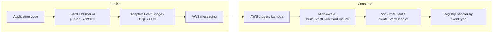

# Event platform: EventBridge, SQS, and SNS

This document is the **transport-focused companion** to the [Event-Driven Development Guide](./EVENT_DRIVEN_DEVELOPMENT_GUIDE.md). It explains how to use **`@api-hub/event-platform`** and **`@api-hub/middleware`** for **EventBridge**, **SQS**, and **SNS**, including **before/after** migration patterns, the **canonical event shape**, and **how dead-lettering works** (especially for SQS).

Application and domain code should **not** call `PutEvents`, `SendMessage` / `ReceiveMessage`, or `Publish` directly except inside **platform adapters** or documented factories.

---

## 1. Canonical event structure (`BaseEvent`)

All platform publishing and consuming assumes a single wire shape:

| Field | Role |
|--------|------|
| `eventId` | Unique id for the occurrence |
| `eventType` | Stable name (e.g. `Order.Created.v1`) |
| `eventVersion` | Semantic version of the schema |
| `timestamp` | ISO time of the event |
| `source` | Producing service identifier |
| `idempotencyKey` | Deduplication / idempotency key |
| `payload` | Domain data (validated with Zod via `defineEvent`) |
| `meta` | Cross-cutting metadata (`correlationId` required; optional `traceId`, `tenantId`, `retryCount`, etc.) |

Type definition: [`libs/event-platform/src/typings/base-event.types.ts`](../../libs/event-platform/src/typings/base-event.types.ts).

**EventBridge** maps this to `Detail` (JSON) plus `DetailType` / `Source` via [`EventBridgeAdapter`](../../libs/event-platform/src/adapters/eventbridge/eventbridge-adapter.ts). **SQS** typically stores the JSON-serialized `BaseEvent` as the message body (see [`SqsAdapter`](../../libs/event-platform/src/adapters/sqs/sqs-adapter.ts)). **SNS** uses [`EventPublisher`](../../libs/event-platform/src/sdk/publisher/event-publisher.ts) with an SNS topic adapter via [`createSnsPublishEvent`](../../libs/event-platform/src/sdk/publisher/create-sns-publish-event.ts).

---

## 2. End-to-end flow (conceptual)



- **Publish path:** Your code builds or receives a `BaseEvent` (often via `EventPublisher.publish` or DX `publishEvent` after `configureEventPlatform`). The **adapter** is the only layer that speaks the AWS SDK for that transport.
- **Consume path:** Lambda invokes a handler built with **`createEventHandler`**, which runs **`buildEventExecutionPipeline`** then **`consumeEvent`** (routing, idempotency, retry/DLQ *decisions*, metrics). See [`create-event-handler.ts`](../../libs/event-platform/src/lib/create-event-handler.ts) and [`http-pipeline.ts`](../../libs/middleware/src/lib/http-pipeline.ts).

---

## 3. EventBridge

### After (recommended)

- **Publish:** `EventPublisher` + `EventBridgeAdapter`, or `configureEventPlatform` with an `EventPublishAdapter` backed by EventBridge.
- **Consume:** `createEventHandler` with `consumer.mapRawToBaseEvent` that converts the EventBridge record (e.g. `detail`) into `BaseEvent`, plus `defineEvent` schemas in `events`.

The adapter sends **`PutEvents`** internally:

```21:27:libs/event-platform/src/adapters/eventbridge/eventbridge-adapter.ts
  async publish(event: BaseEvent): Promise<void> {
    await this.client.send(
      new PutEventsCommand({
        Entries: [toPutEventsEntry(event: any, this.config)],
      }),
    );
  }
```

### Before (legacy)

- Handler typed as `EventBridgeEvent<DetailType, Detail>` and manual parsing of `event.detail`.
- `PutEventsCommand` in application service files with hand-built `Detail` JSON.

### Before vs after (EventBridge)

| Before | After |
|--------|--------|
| Manual `EventBridgeEvent` + `createLogger` only | `createEventHandler` + `buildEventExecutionPipeline` + `consumeEvent` |
| `PutEventsCommand` in feature modules | `EventPublisher` + `EventBridgeAdapter` (or DX `publishEvent`) |
| No shared retry/idempotency/DLQ semantics | `EventConsumerDeps`: `retry`, `dlq`, `idempotencyStrategy` |

### EventBridge DLQ (AWS)

EventBridge rules/targets can be configured with a **dead-letter queue** (often SQS) and **retry policy** (`maximumRetryAttempts`, `maximumEventAge`). That is **infrastructure**: it runs when the target (e.g. Lambda) fails or throttles **before** your platform code classifies the outcome. Align those retries with in-process policy where possible (see §6).

Reference example in the main guide: `serverless.yml` with `deadLetterQueueArn` and `retryPolicy` for a template consumer.

---

## 4. SQS

### After (recommended)

- **Publish:** `EventPublisher` with an adapter that implements `EventPublishAdapter`—the reference **`SqsAdapter`** serializes `BaseEvent` and calls **`SendMessage`** ([`sqs-adapter.ts`](../../libs/event-platform/src/adapters/sqs/sqs-adapter.ts)).
- **Consume:** Lambda triggered by SQS should use **`createEventHandler`** (or `consumeEvent` with `mapRawToBaseEvent` for each SQS record shape). Batches use **`extractRecords`** → **`processBatch`** and support **partial batch failure** responses where configured.

Long-polling **`SqsAdapter.subscribe`** exists for workers; it isolates per-message failures, extends visibility on failure, and logs via observability. For production Lambda consumers, **`createEventHandler`** remains the default pattern.

### Before (legacy)

- Manual loop over `event.Records`, `JSON.parse`, no shared idempotency or delivery policy.
- `SendMessage` / `DeleteMessage` in application code.

### Before vs after (SQS)

| Before | After |
|--------|--------|
| Manual `SQSEvent` record parsing | `mapRawToBaseEvent` + `prepareInboundBaseEvent` + Zod schemas |
| Ad-hoc retry / delete | `evaluateDeliveryPolicy`, optional `transportRetry`, partial batch outcomes |
| Raw `SendMessage` in use cases | `EventPublisher` + `SqsAdapter` (or equivalent adapter) |

---

## 5. SNS

### After (recommended)

- Use **`createSnsPublishEvent`**, which builds an **`EventPublisher`** backed by **`createSnsTopicAdapter`** (topic ARN from env), with optional payload schemas and logging. This keeps envelopes consistent with the rest of the platform.
- **Consume:** SNS often fans out to SQS or Lambda; the consumer still uses **`createEventHandler`** + **`mapRawToBaseEvent`** if the payload is `BaseEvent` JSON (or map from `SnsMessage` + nested body first).

### Before (legacy)

- Direct `PublishCommand` with ad-hoc message structure, or consumers that manually parse `SNSEvent` without `consumeEvent` (see `notification.ts`-style patterns called out in the main guide).

### Before vs after (SNS)

| Before | After |
|--------|--------|
| `PublishCommand` with custom JSON | `createSnsPublishEvent` / `EventPublisher` + SNS adapter |
| Hand-rolled fan-out consumer | `createEventHandler` once records resolve to `BaseEvent` |

---

## 6. DLQ: two layers (SQS and platform)

Understanding both avoids surprise when messages “disappear” or retry forever.

### Layer A — AWS (authoritative for queue redrive)

For **SQS subscriptions**, the **redrive policy** on the source queue sends messages to a **DLQ** after **`maxReceiveCount`** receives without successful delete. The service team must align **`maxReceiveCount`** with consumer **`retry.maxAttempts`** so AWS does not DLQ the message *before* application policy has had a fair number of attempts.

Helper (optional): **`recommendedSqsRedriveMaxReceiveCount`** from `@api-hub/event-platform` takes `Pick<EventConsumerDeps, 'retry'>` and returns `max(1, retry.maxAttempts)` as a baseline for SQS redrive configuration. Operators may add a small buffer (e.g. +1) for edge cases.

**EventBridge** DLQ is configured on the rule/target (often pointing at an SQS queue), not inside this library.

### Layer B — Application (`DlqConfig` + optional strategy)

Platform code decides **retry vs discard vs dead_letter candidate** via **`evaluateDeliveryPolicy`** and related helpers. Configuration type:

```3:15:libs/event-platform/src/core/dlq/dlq-config.ts
/**
 * Dead-letter awareness for application code. Actual queue routing is done by
 * SQS redrive policies / EventBridge — this flag only controls structured outcomes.
 */
export type DlqConfig = {
  enabled: boolean; 
  strategy?: DlqStrategy; 
  enrich?: (params: {
    event: unknown;
    error: unknown;
    retryCount?: number;
  }) => Partial<DlqMessage>;
};
```

- With **`dlq.enabled: true`** but **no** `strategy`, the runtime still classifies outcomes (logging, metrics, `dead_letter` / `needs_transport_retry` paths) but **does not** call a custom DLQ sender. Failed SQS messages may still end up in the **AWS** DLQ via redrive when visibility expires and receive count exceeds **`maxReceiveCount`**.
- With **`SqsDlqStrategy`** (or another `DlqStrategy`), the app can **explicitly send** a structured **`DlqMessage`** to a chosen queue when the policy says **dead letter**. That is complementary to—not a replacement for—AWS redrive.

**Summary:** For SQS, **physical** dead-lettering is typically **AWS redrive → DLQ queue**. **Application** `DlqConfig` controls **how your code classifies failures** and optionally **forwards a copy** via `strategy`. Both should be configured together intentionally.

Default consumer deps in **`createEventHandler`** set **`dlq: { enabled: true }`** with **`DomainIdempotencyStrategy`** and **`retry.maxAttempts: 3`**—adjust per service and match infra.

---

## 7. Middleware vs event-platform (short)

- **`buildEventExecutionPipeline`** ([`http-pipeline.ts`](../../libs/middleware/src/lib/http-pipeline.ts)): async error wrapper, context, invocation, logger, tracer, performance. **No** HTTP schema middleware on this path.
- **Reliability** (payload/version validation, idempotency, retry/DLQ *decisions*, batch item failures): **`@api-hub/event-platform`**.

---

## 8. Mandatory rules (reminder)

1. Standard **Lambda consumers** use **`createEventHandler`** (or **`onEvent`**) so middleware + **`consumeEvent`** always run.
2. **Publish** through **`EventPublisher`** / **`createSnsPublishEvent`** / DX **`publishEvent`**, not raw SDK calls in domain code.
3. **Idempotency:** **`DomainIdempotencyStrategy`** or **`StoreIdempotencyStrategy`** + store (e.g. **`DynamoDbIdempotencyStore`**); see main guide §4.
4. **SQS:** align **`maxReceiveCount`** (and optional app **`SqsDlqStrategy`**) with **`retry.maxAttempts`** and ops expectations.

---

## 9. References

- [Event-Driven Development Guide](./EVENT_DRIVEN_DEVELOPMENT_GUIDE.md) — full narrative, copy-paste Lambda skeleton, idempotency and retry details.
- [`libs/event-platform/README.md`](../../libs/event-platform/README.md)
- [`docs/ers/flow-clean.mermaid`](../ers/flow-clean.mermaid) — architecture sketch for mail/docs
- [`docs/middleware/flow.md`](../middleware/flow.md)
