# Idempotency: event-platform vs HTTP (domain writes)

How idempotency works for **async consumers** (`@api-hub/event-platform`) vs **HTTP APIs** (`@api-hub/middleware` + application repositories).

**HTTP idempotency middleware was removed** from `@api-hub/middleware`. There is no `IDEMPOTENCY_TABLE` for REST in this stack. HTTP dedupe is **domain conditional writes** (same pattern as alert-service `inputEventId` / `EVENT#`).

---

## Responsibility split

```mermaid
flowchart TB
  subgraph http [HTTP withApiHandler]
    Client[Client request]
    withApi[withApiHandler pipeline]
    Handler[Business handler]
    Repo[Domain table conditional put]
    Client --> withApi --> Handler --> Repo
  end

  subgraph async [event-platform - Async]
    Envelope[BaseEvent idempotencyKey + eventId]
    Consumer[createEventHandler / onEvent / onDynamoEvent]
    Orchestrate[orchestratePreparedConsumerEvent]
    Strategy[IdempotencyStrategy before/afterSuccess]
    StoreOrDomain[Store claim on eventId OR domain conditional writes]
    Envelope --> Consumer --> Orchestrate --> Strategy --> StoreOrDomain
  end
```



[`http-pipeline.ts`](../../libs/middleware/src/lib/http-pipeline.ts): logger, tracer, schema, performance — **no** idempotency middleware. [`buildEventExecutionPipeline`](../../libs/middleware/src/lib/http-pipeline.ts): async invocation only; event idempotency is in **event-platform**.

---

## Layer comparison table

| Layer | @api-hub/event-platform (async) | HTTP (`withApiHandler` + domain) |
|-------|----------------------------------|----------------------------------|
| **Transport** | EventBridge, SQS, DynamoDB Streams | API Gateway HTTP |
| **Enablement** | Always on: `DomainIdempotencyStrategy` in `createDefaultConsumerDeps()`. Optional `StoreIdempotencyStrategy` via `consumer.idempotencyStrategy`. | No platform HTTP idempotency. Implement in **repository/service** (conditional writes). |
| **Key source** | `BaseEvent.idempotencyKey` + `eventId`; store mode claims **`eventId`**. | Business field on domain item (e.g. `inputEventId`, `clientRequestId`). |
| **Dedupe mechanism** | `IdempotencyStrategy.before` / `afterSuccess` + optional `DynamoDbIdempotencyStore` | `ConditionExpression: attribute_not_exists(pk)` (or transact condition) on domain table |
| **Duplicate behavior** | Skip handler (`duplicate` outcome) with store strategy; domain strategy runs handler and repo dedupes | Service returns existing resource / `{ duplicate: true }` / `DuplicateEventError` |
| **Replay payload** | No cached HTTP body | Stable API response built in handler from domain state |
| **Separate idempotency table** | Optional (`IDEMPOTENCY_TABLE`) only for **store** strategy | **Not used** — use domain table only |
| **Reference** | [`orchestrate-consumer-message.ts`](../../libs/event-platform/src/engine/processor/orchestrate-consumer-message.ts), alert consumer deps | [`alert-repository.ts`](../../libs/alert-core/src/lib/repositories/alert-repository.ts), [`event-consumer-deps.ts`](../../apps/alert-service/src/handlers/events/bootstrap/event-consumer-deps.ts) |

---

## HTTP flow (domain conditional write)

1. Client calls `POST` / `PUT` / `PATCH` via `withApiHandler` (normal pipeline).
2. Handler calls service → repository **conditional put** on business key.
3. Duplicate: conditional failure → `DuplicateEventError` or idempotent success path in service.
4. No `Idempotency-Key` header required by middleware (unless you validate it in Zod/business logic).

```typescript
// HTTP — no idempotency option on withApiHandler
export const createAlert = withApiHandler(
  { operation: 'alert.create', bodySchema: CreateAlertSchema },
  async (req) => alertService.createAlert(req.body), // repo uses inputEventId conditional write
);
```

---

## Async flow (event-platform)

Unchanged. See [EVENT_PLATFORM_TRANSPORTS_GUIDE.md](./EVENT_PLATFORM_TRANSPORTS_GUIDE.md) §8.

```typescript
createEventHandler({
  operation: 'processAlerts',
  events: [...],
  consumer: buildAlertEventConsumerDeps(), // domain idempotency in alert-core
});
```

Optional cross-instance pre-handler dedupe:

```typescript
consumer: {
  idempotencyStrategy: createIdempotencyStrategy({
    mode: 'store',
    store: new DynamoDbIdempotencyStore(process.env.IDEMPOTENCY_TABLE),
  }),
},
```

Use **only** when domain conditional writes are insufficient for async consumers.

---

## Production checklist

| Concern | HTTP | Async consumer |
|---------|------|----------------|
| **Table** | Your **domain** DynamoDB table | Domain table and/or optional `IDEMPOTENCY_TABLE` for store strategy |
| **Key** | `inputEventId`, natural unique attrs | `eventId` / `idempotencyKey` on envelope |
| **Middleware** | None in `@api-hub/middleware` | `DomainIdempotencyStrategy` (default) |
| **Infra** | Do **not** deploy HTTP `IDEMPOTENCY_TABLE` for api-hub middleware | `IDEMPOTENCY_TABLE` only if using `StoreIdempotencyStrategy` |

---

## Operational notes

- **`IdempotencyStrategy.onError`** is not invoked in orchestration — async duplicates are handled in **repositories** or store `before`.
- **`StoreIdempotencyStrategy`** keys on **`eventId`**, not `idempotencyKey`.
- HTTP and async can both use domain writes; a separate event-platform idempotency table is **optional** and **only** for async store strategy.

---

## Related docs

- [EVENT_PLATFORM_TRANSPORTS_GUIDE.md](./EVENT_PLATFORM_TRANSPORTS_GUIDE.md)
- [EVENT_DRIVEN_DEVELOPMENT_GUIDE.md](./EVENT_DRIVEN_DEVELOPMENT_GUIDE.md)
- [middleware/flow.md](../middleware/flow.md)
