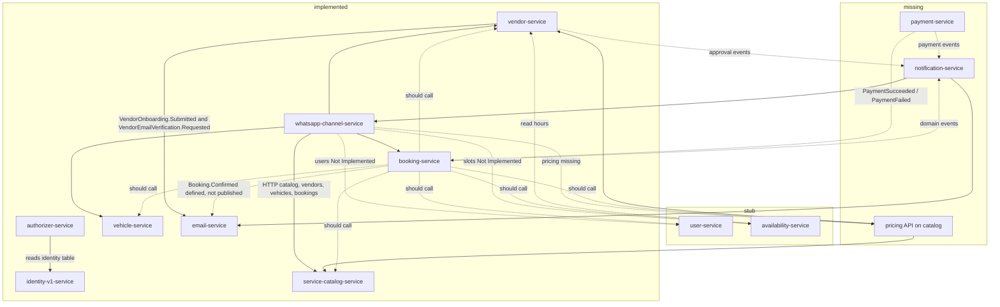

The backend lives under `apps/`, not `app/`. Ten services were read from source, `serverless.yml`, and tests. A pilot cannot run on this code. About **30% of P0 behavior exists**, and the bookable path stops before a real slot, price, payment, or notification.

# Beauty on Wheels MVP Backend Gap Analysis

## 1. Executive Summary

**Overall MVP readiness: about 30%.** Identity login, vendor onboarding data, catalog CRUD, customer vehicles, and a local booking status machine exist. The pilot path does not: there is no working slot inventory, no price calculation, no payment, no customer address store, no notification orchestrator, and no resource-level authorization on bookings.

**Services analyzed: 10**

| Area | What is actually in the repo |
|---|---|
| Identity and tokens | `identity-v1-service`, `authorizer-service` |
| People and addresses | `user-service` (routes only; every method throws) |
| Providers | `vendor-service` |
| Catalog | `service-catalog-service` |
| Schedule and slots | `availability-service` (routes only; every method throws) |
| Customer vehicles | `vehicle-service` |
| Bookings | `booking-service` |
| Email | `email-service` |
| WhatsApp | `whatsapp-channel-service` |

Shared libraries used by these apps: `libs/authentication-core`, `libs/middleware`, `libs/observability`, `libs/utils`, `libs/event-platform`. `libs/booking-core` is a stub (`bookingCore()` returns the string `"booking-core"`). The booking lifecycle lives only in `apps/booking-service`.

**Major completed areas**

- Email/password registration, password login, refresh, logout, change password, and `GET /me` in identity.
- Cognito token authorizer that requires an application user row.
- Vendor onboarding sections, service areas, weekly operating hours, staff, branches, documents, bank details, and admin status changes.
- Catalog CRUD for categories, services, add-ons, and packages, including `basePrice` and `durationMinutes`.
- Customer vehicle CRUD, default vehicle, and vehicle types, scoped to the JWT user.
- Booking create plus `CREATED → CONFIRMED → CHECKED_IN → IN_PROGRESS → COMPLETED`, cancel from early states, and a permanent slot lock row.
- Meta webhook verification, signature check, inbound SQS, and outbound Cloud API send.

**Major gaps**

- `user-service` and `availability-service` are scaffolds. Both `serverless.yml` files contain a bare line `tools/codegen/create-microservice.js` and are not valid Serverless configs.
- No payment service, no pricing service, no notification service, no community model.
- Booking stores caller-supplied IDs and `totalAmount`. It does not check customer, address, vehicle, provider, service, mapping, slot, or price.
- `POST /bookings/{id}/confirm` sets `paymentStatus` to `PAID` with no payment (`bookings.repository.ts`).
- WhatsApp runs the booking conversation itself (category, provider, vehicle, slot, price, coupon, create, confirm, cancel). It is not a notification channel.
- `Booking.Confirmed` is defined and email listens for it. Booking never publishes it.

**Critical architectural problems**

1. **WhatsApp owns booking conversation state**, including `PAYMENT_PENDING`, while booking has no `PAYMENT_PENDING` status.
2. **Two operating-hour APIs.** Vendor hours are implemented (`MONDAY`…). Availability working hours are unimplemented (`MON`…).
3. **Slot inventory has two intended owners and one real lock.** Booking writes a permanent `SLOT_RESERVATION#…` row. Availability, which should own slots, throws `Not Implemented`.
4. **Confirm and paid are the same write.**
5. **The authorizer loads permissions and does not enforce them.** Only vendor-service checks owner or admin. Booking does not read the caller.

**Biggest risks**

- Any authenticated caller can read, confirm, cancel, or complete any booking (`GET /bookings` with no filter lists every booking).
- `POST /whatsapp/messages` has no platform authorizer.
- Duplicate booking creates succeed whenever the client omits `id` (`randomUUID()`).
- Slot locks never expire, so a failed checkout holds the slot until cancel.
- A repeated `Booking.Confirmed` can send two emails. Email idempotency is a no-op unless a test injects a strategy.
- Vehicle type sets disagree: vehicle-service has `BIKE`; vendor capabilities have `OTHER` and no `BIKE`; catalog accepts any string and indexes only the first type.

---

## 2. Service Inventory

| Service | Purpose | Current Status | MVP Responsibility |
|---|---|---|---|
| `identity-v1-service` | Registration, login, OTP storage, Cognito tokens, sessions, role/permission reads | PARTIAL | Identity and authentication |
| `authorizer-service` | API Gateway token authorizer; maps Cognito `sub` to an application user | PARTIAL | Authentication gate only. It does not authorize resources |
| `user-service` | Declared user, customer, vendor, KYC, address, and preference routes | MISSING | Customer profile, addresses, operational notification preferences, community membership |
| `vendor-service` | Provider profile, onboarding, lifecycle, hours, capabilities, geo areas | PARTIAL | Provider onboarding, approval, working hours, service mapping, community assignment on the provider |
| `service-catalog-service` | Categories, services, add-ons, packages, base prices | PARTIAL | Catalog. Recommended owner of price calculation |
| `availability-service` | Declared hours, slots, block/unblock, holidays | MISSING | Slot generation, holds, capacity, blocks, holidays |
| `vehicle-service` | Authenticated user’s vehicles | PARTIAL | Customer vehicles. Compatibility stays a catalog concern |
| `booking-service` | Booking records and local status machine | PARTIAL | Booking lifecycle, validation orchestration, cancellation, provider job actions |
| `email-service` | SES templates and three operational events; undeployed campaign code | PARTIAL | Email channel. Campaigns are Phase 2 |
| `whatsapp-channel-service` | Meta Cloud API plus an in-process booking conversation | WRONG RESPONSIBILITY | WhatsApp transport, templates, delivery status only |

There is no `payment-service` and no `notification-service`. Those two capabilities have no owner in the tree.

---

## 3. MVP Feature Gap Matrix

| Module | Feature | Priority | Owning Service | Current Status | Gap | Required Change | Dependencies |
|---|---|---|---|---|---|---|---|
| Foundation | Customer registration | P0 | identity-v1-service | PARTIAL | Register and OTP-verify create users with role `user`. OTP is stored, not sent. No `UserRegistered` event | Deliver OTP through the notification layer. Publish registration | notification-service |
| Foundation | Customer login | P0 | identity-v1-service | PARTIAL | Password login works. OTP login cannot reach the user because send does not deliver a code | Wire OTP send to notification | notification-service |
| Foundation | Customer profile | P0 | user-service | MISSING | `GET/PUT /customers/{userId}` throw `Not Implemented`. Identity `GET /me` is the only profile read | Implement customer profile on the user table, scoped to the caller | identity user id |
| Foundation | Provider onboarding | P0 | vendor-service | PARTIAL | Sections through bank and documents reach `PENDING_REVIEW` and emit `VendorOnboarding.Submitted`. Hours and capabilities are not required sections | Keep the flow. Add approval as a separate action | admin role |
| Foundation | Provider approval | P0 | vendor-service | PARTIAL | Admin `PATCH /vendors/{id}/status` can set `ACTIVE` or `REJECTED` with no transition rules and no reviewer record. Moving to `ACTIVE` stores an OTP and emits email verification | Add approve/reject with reason, actor, and history. Stop treating activation as email OTP | identity admin role |
| Foundation | Community management | P0 | user-service (definitions and customer membership); vendor-service (provider assignment) | MISSING | No community entity or API | Admin CRUD for communities; `communityId` on customer and vendor | admin role |
| Foundation | Admin and RBAC | P0 | authorizer-service + each service | PARTIAL | Permissions are copied into authorizer context. `requirePermission` is unused. No role-admin API. Role rows are not seeded, and `listRoles` looks for `GSI1PK=ROLE_CATALOG`, which nothing writes | Seed roles. Enforce permission and resource owner in each service | identity table |
| Customer | Add / edit / delete address | P0 | user-service | MISSING | Routes exist and throw. Schema has no default flag | Implement address items and deactivate/delete | customer profile |
| Customer | Default address | P0 | user-service | MISSING | Not in `AddressSchema` | `isDefault` with a single default per user | addresses |
| Customer | Address on booking | P0 | booking-service | MISSING | Booking schema has no `addressId` | Require `addressId` and check it belongs to the customer | user-service |
| Customer | Vehicle CRUD and default | P0 | vehicle-service | COMPLETE | List filters read `request.query`, which middleware does not set, so status and type filters never apply | Fix the filter source. Add a service principal that can read one customer’s vehicles | authorizer |
| Customer | Vehicle selection and compatibility | P0 | vehicle-service + service-catalog-service | MISSING | No check that the vehicle type is allowed for the service or the provider | Catalog `vehicleTypes` checked at booking against the customer vehicle and vendor capabilities | catalog, vendor, booking |
| Marketplace | Categories and services | P0 | service-catalog-service | PARTIAL | CRUD, duration, and `active` exist. Any authenticated user can write. Category delete-if-empty uses `Select: COUNT` and then `items.length`, so the guard always sees zero | Restrict writes to catalog admin. Fix the count | admin role |
| Marketplace | Vehicle applicability | P0 | service-catalog-service | PARTIAL | `vehicleTypes` is a free string list. Only `vehicleTypes[0]` is indexed | Use the shared vehicle-type set. Index every type or filter in the item | vehicle-service enum |
| Marketplace | Provider service mapping | P0 | vendor-service | PARTIAL | `PUT /vendors/{id}/capabilities` stores `serviceIds` and `packageIds` with no catalog check | Validate ids against catalog. Enable/disable per service | catalog |
| Marketplace | Working hours | P0 | vendor-service | COMPLETE | One interval per weekday, `closed`, close after open. A partial week is allowed | Availability must read these hours. Do not implement a second schedule in availability | availability-service |
| Marketplace | Holidays | P0 | availability-service | MISSING | `GET/POST /vendors/{id}/holidays` throw | Persist exception dates and exclude them from slot generation | vendor hours |
| Marketplace | Slots | P0 | availability-service | MISSING | Generate, list, get, block, and unblock throw. No table | Slot items with status, capacity, and hold expiry | vendor hours, holidays |
| Marketplace | Block slot / temporary unavailability | P0 | availability-service | MISSING | Routes throw. Vendor `operational-status` can be `TEMPORARILY_UNAVAILABLE`, which booking does not read | Block and holiday writes, plus a booking check of operational status | vendor-service |
| Marketplace | Pricing | P0 | service-catalog-service | PARTIAL | `basePrice`, add-on `price`, and package `discountedPrice` are stored. Nothing computes a total. WhatsApp calls `POST /pricing/calculate`, which does not exist | Add calculate/validate using catalog prices, provider overrides, and vehicle type. Coupons stay Phase 2 | vendor overrides |
| Marketplace | Provider/service price | P0 | vendor-service | MISSING | Capabilities tests assert `basePrice` is not stored | Provider price override per service, optional | catalog base price |
| Booking | Create booking | P0 | booking-service | PARTIAL | Stores `customerId`, `vendorId`, `vehicleId`, `serviceIds`, `bookingDate`, `slotId`, `totalAmount`. No address, no price breakdown | Accept address. Reject client price. Call catalog, vehicle, vendor, availability | those four services |
| Booking | Pre-booking validation | P0 | booking-service | MISSING | Presence checks only. IDs are trusted | Validate each reference and eligibility before the write | identity/user, vehicle, vendor, catalog, availability, pricing |
| Booking | Slot hold and expiry | P0 | availability-service | PARTIAL | Booking inserts `SLOT_RESERVATION#vendor#date#slot` with `attribute_not_exists`. The lock is permanent until cancel or reschedule. No TTL and no hold-versus-booked distinction | Availability owns hold, expiry, and release. Booking requests hold and commit | availability table |
| Booking | Payment | P0 | new `payment-service` | MISSING | No Razorpay, Stripe, order, webhook, timeout, reconciliation, or refund anywhere in application code | Payment orders, success, failure, timeout, refund, and events | booking id, amount |
| Booking | Confirm only after payment | P0 | booking-service | NEEDS REFACTOR | Confirm from `CREATED` sets status `CONFIRMED` and `paymentStatus` `PAID` | Introduce `PAYMENT_PENDING`. Confirm only on `PaymentSucceeded` or an explicit manual-payment admin action | payment-service |
| Booking | Duplicate confirmation | P0 | booking-service | PARTIAL | A second confirm throws `BusinessRuleError`. It is not an idempotent success | Return the current booking when already confirmed for the same payment | payment event idempotency key |
| Booking | State machine | P0 | booking-service | PARTIAL | Transitions exist for `CREATED`, unused `PENDING`, `CONFIRMED`, `CHECKED_IN`, `IN_PROGRESS`, `COMPLETED`, `CANCELLED`. `PAYMENT_PENDING` does not exist. `CHECKED_IN` and `IN_PROGRESS` cannot be cancelled | Add `PAYMENT_PENDING`. Define allowed cancels. Reject illegal transitions, which the code already does for the states it has | payment events |
| Booking | Cancellation | P0 | booking-service | PARTIAL | `POST …/cancel` and `DELETE` both cancel from `CREATED`, `PENDING`, `CONFIRMED`, delete the slot row, leave `paymentStatus` unchanged, set `performedBy` to `'customer'`, and emit nothing | Actor-specific cancel, slot release through availability, refund request, `BookingCancelled` | availability, payment, notification |
| Booking | Reschedule | P1 | booking-service | PARTIAL | `PUT /bookings/{id}` can change date, slot, or vendor and swap the reservation row. No availability or price check. Old slot delete has no `bookingId` condition. Customer id change leaves the old lookup row | Re-price, hold the new slot, release the old one, keep one customer lookup | availability, pricing |
| Provider ops | Today’s and upcoming bookings | P0 | booking-service | PARTIAL | `GET /vendors/{vendorId}/bookings` returns every vendor booking, newest date first. No today, upcoming, or status filter | Query filters on `GSI1` | vendor auth |
| Provider ops | Check-in, start, complete | P0 | booking-service | PARTIAL | Local transitions and version checks exist. No provider ownership check, no completion event | Enforce the vendor owner. Publish `BookingCheckedIn`, `ServiceStarted`, `ServiceCompleted` | notification-service |
| Notifications | Orchestration | P0 | new `notification-service` | MISSING | Email consumes three event types directly. WhatsApp consumes none | One consumer of domain events, channel routing, retry, status | event bus |
| Notifications | WhatsApp channel | P0 | whatsapp-channel-service | WRONG RESPONSIBILITY | Meta send, webhook, and signature exist. `conversation.flow.ts` creates and confirms bookings | Keep transport and status. Remove booking, price, and coupon decisions from this service | notification-service |
| Notifications | Templates | P0 | notification-service | PARTIAL | WhatsApp registry names exist and are not used at runtime. Email selects `BookingConfirmed` in SES, whose body is not in the repo | Channel-agnostic template ids for confirm, cancel, reminder, status, payment, completion | email, WhatsApp |
| Notifications | Reminders | P0 | notification-service | MISSING | `booking_reminder_v1` is a name only. No scheduler | Schedule eligible future bookings once, with a dedupe key | booking read model |
| Notifications | Delivery tracking | P0 | notification-service | MISSING | WhatsApp logs Meta statuses. Email returns an SES id and does not store it | Notification row: created, queued, sent, delivered, failed, retry, provider id, channel, timestamps, correlation id | both channels |
| Preferences | Operational channel prefs | P0 | user-service | MISSING | `GET/PUT /users/{id}/preferences` throw. Schema has email and SMS booleans and no WhatsApp flag. `marketingConsent` is a separate customer field | Operational flags only: WhatsApp, SMS, email, push | notification routing |
| Customer experience | History and details | P0 | booking-service | PARTIAL | `GET /customers/{id}/bookings` returns denormalized rows with no ownership check and no payment or address detail | Scope to the caller. Return provider, vehicle, service, slot, price, payment status, booking status | user, vehicle, catalog snapshots on the booking |
| Customer experience | Rating | P1 | booking-service | MISSING | No fields or routes | One rating per `COMPLETED` booking | completion state |
| Support | Ops search | P0 | each domain service, read by an admin API | MISSING | Admin can list vendors. No admin search across customer, booking, payment, or notification | Admin read APIs with audit-friendly detail | RBAC |
| Reliability | Event bus | P0 | vendor-service, booking-service, notification-service | PARTIAL | Vendor stream publishes two events onto `nv${stage}-bw-vendor-event-bus`. Booking bus env is unused | Booking and payment publish domain events on a shared bus | event-platform |
| Reliability | Retry and DLQ | P0 | email, WhatsApp, vendor streams | PARTIAL | Those three have retries and DLQs. `infra/serverless/resources/alarms/dlq-depth.yml` is not referenced by any service | Attach DLQ alarms. Add DLQ for payment and notification workers | CloudWatch |
| Reliability | Idempotency | P0 | booking, payment, notification, email | PARTIAL | Same booking id is rejected by `attribute_not_exists`. Omitted id always inserts. Email `DomainIdempotencyStrategy` does not suppress duplicates | Idempotency keys on create, pay, confirm, cancel, and send | event-platform store |
| Reliability | Audit | P0 | booking-service first, then vendor and payment | PARTIAL | Booking writes `AUDIT#{timestamp}` with `action`, hardcoded `performedBy`, and a text blob. No reader. No correlation id | Structured who, what, when, entity, previous, new, correlation id, and an admin read | auth context |
| Security | Resource authorization | P0 | all HTTP services | PARTIAL | Vehicle and most vendor routes check the caller. Booking, catalog writes, and future user/availability routes do not | Owner or admin on every resource id | authorizer context |
| Observability | Logs, metrics, alarms | P0 | platform libs + each service | PARTIAL | Middleware logs and correlation ids exist. WhatsApp emits EMF counts. No payment, booking, or DLQ alarms are deployed | Alarms on DLQ depth, booking failures, payment failures, notification failures | CloudWatch |
| Reporting | Pilot dashboard | P1 | booking + payment read models | MISSING | No aggregate APIs | Counts for bookings, completions, cancellations, revenue, providers, customers | confirmed payment amounts |
| Reporting | Notification metrics | P1 | notification-service | MISSING | WhatsApp has in-process counters only | Sent, delivered, failed by channel and type | delivery ledger |
| Marketing | Consent, segments, coupons, campaigns | Phase 2 | email-service (undeployed), WhatsApp local consent | PHASE 2 | Campaign handlers, CSV recipients, and Step Functions code exist and are not in `email-service` `serverless.yml`. WhatsApp stores `CONSENT#WHATSAPP#…` / `MARKETING` and calls a user route that throws | Leave until after pilot. Do not block booking on coupons | none for MVP |

---

## 4. Service-by-Service Detailed Analysis

### Service: `identity-v1-service`

#### Purpose
Application identity on `identity-table-${stage}`: email/password registration, password login, OTP verify that can also create a user, Cognito token issue and refresh, sessions, and read-only role and permission lists.

#### Current APIs
Public: `POST /auth/register`, `POST /auth/login`, `POST /auth/refresh-token`, `POST /otp/send`, `POST /otp/verify`, `GET /health`.

Authenticated: `POST /auth/logout`, `POST /auth/change-password`, `GET /me`, session list and revoke, `GET /roles`, `GET /permissions`.

`requirePermission` exists in `src/auth/require-auth.ts` and no handler calls it. `assignRole` has no HTTP route.

#### Current Events
None. `RegistrationService.register` has a comment to publish `UserRegistered` and does not.

#### Current Data
Single table, PK/SK, only `GSI1` is real. Code still queries `GSI2` and `GSI5`, which `identity-index.constant.ts` aliases onto `GSI1`. Entities include `User`, `Profile`, email/phone/username lookups, sessions, refresh tokens, OTP, roles, permissions, login history, password history, and an `AuditLog` type with no HTTP caller.

Registration writes `roleId: 'user'` and `status: 'ACTIVE'`. `USER_STATUS.ACTIVE` in constants is `'active'`. Login compares case-insensitively. Refresh accepts both.

#### Current Integrations
Cognito via `@api-hub/authentication-core`. Password check is local PBKDF2, then Cognito is given a random password so it can issue tokens. No notification call.

#### MVP Responsibilities
Customer and provider login, admin identities, role assignment.

#### Existing Implementation
Register, login, refresh, logout, change password, and `GET /me` are real. OTP is hashed and stored. `postsend` returns `referenceId` and does not send the code. Non-production stages use `OTP_DEV_CODE` default `123456`.

#### Gaps
OTP delivery, profile update, role administration, permission enforcement, `UserRegistered`, tenant/community on the user. `listRoles` cannot see roles because `GSI1PK=ROLE_CATALOG` is never written. `GET /permissions` returns only the caller’s `roleId`. OTP verify does not increment attempts, and a verified OTP can still match.

#### Required Changes
Seed customer, provider, and admin roles. Add an admin assign-role API. Publish registration. Send OTP through notification-service. Fix the GSI aliases before any tenant or refresh-index query is required in production. `SessionsService.deletesessionid` calls a GSI5 query that is not caught.

#### Risks
`verifyPassword` returns true if the raw password string equals the stored `passwordHash` before the PBKDF2 check. `COGNITO_APP_CLIENT_SECRET` is an environment variable, default empty. Dev OTP `123456` will authenticate if that stage is exposed.

#### Tests
`services.spec.ts` and `identity.repository.spec.ts`. No change-password or session-delete service tests. Roles and permissions services are imported and not tested.

---

### Service: `authorizer-service`

#### Purpose
Shared REST token authorizer `${stage}-platform-authorizer`. A valid Cognito user must have `IDENTITY#{sub}` / `LOOKUP`. Inactive users are denied. A user with zero permissions is still allowed. The IAM policy is stage-wide `…/{apiId}/{stage}/*/*`.

#### Current APIs
No HTTP API. One Lambda.

#### Current Events
None.

#### Current Data
Reads `identity-table-${stage}`. Does not create it.

#### Current Integrations
Cognito JWKS. Context strings: `identityId`, `userId`, `roles`, `permissions`.

#### MVP Responsibilities
Prove who the caller is. Resource checks stay in each service.

#### Existing Implementation
Token validation and application-user lookup are implemented. A library test states that an authenticated user with no permissions is allowed.

#### Gaps
No permission check and no path-parameter check. Downstream services that only attach `securedAuthorizer` are authenticated and not authorized.

#### Required Changes
Keep this service as the authenticator. Add `authorize` calls in booking, catalog, user, and availability. Add a service principal for WhatsApp and notification workers so they are not a human admin token.

#### Risks
Authorizer cache TTL is 0, so every call reads DynamoDB. There is no alarm on authorizer errors.

#### Tests
One handler test. Library tests cover the policy builder.

This service is required for every protected route. It is not the RBAC product.

---

### Service: `user-service`

#### Purpose
Scaffold for users, customers, vendors, KYC, addresses, and preferences. Every service method throws `new Error("Not Implemented")`.

#### Current APIs
All routes use the shared authorizer. Handlers never read `userContext`.

`GET/POST /users`, `GET/PUT/DELETE /users/{userId}`, `GET/PUT /customers/{userId}`, `GET/PUT /vendors/{userId}`, `POST/GET /vendors/{userId}/kyc`, address list/create/update/delete, preference get/put.

Function keys `getuserid` and `putuserid` are declared three times. In YAML the last key wins, so GET/PUT for users and customers would be dropped even if the file parsed. Line 10 is a bare scalar `tools/codegen/create-microservice.js`, so the file is not valid Serverless YAML.

#### Current Events
`EVENT_BUS_NAME` is read from SSM and never used.

#### Current Data
No table resource, no key builder, no entity types. `DYNAMODB_TABLE_NAME` points at `/common/dynamodb/table`. IAM statements are a root key, not `provider.iam`.

#### Current Integrations
None.

#### MVP Responsibilities
Customer profile, addresses including default, operational notification preferences, community membership. Provider KYC here duplicates vendor-service and should not become a second onboarding system.

#### Existing Implementation
Zod schemas only. `AddressSchema` has type, lines, city, and geo fields, and no default. `PreferenceSchema` has `notifications`, `emailNotifications`, `smsNotifications`, `language`, `timezone`. No WhatsApp flag. `CustomerProfileSchema.marketingConsent` is present and must stay out of operational preferences.

#### Gaps
The entire service.

#### Required Changes
Fix `serverless.yml`. Create a user table (do not reuse an unspecified shared SSM table without a key design). Implement profile, addresses, default address, and operational preferences with owner-or-admin checks. Add phone lookup for a service principal (`GET /users?phone=` does not exist; WhatsApp already documented this as a missing contract). Leave marketing consent unused for MVP.

#### Risks
Implementing the current handlers without an owner check creates IDOR on every `{userId}`. Vendor profile and KYC routes overlap vendor-service.

#### Tests
None.

Relevant to MVP. Not deployable today.

---

### Service: `vendor-service`

#### Purpose
Provider aggregate: profile, owner, address, onboarding, lifecycle, operational status, geo service areas, weekly hours, staff, branches, document metadata and S3 upload URLs, bank details, and capability references. It does not own catalog definitions, slots, holidays, or prices.

#### Current APIs
All authenticated. Owner-or-admin via `assertVendorAccess`, except list and `PATCH /status`, which use `assertAdminAccess`.

`POST/GET /vendors`, `GET/PATCH /vendors/{vendorId}`, `PATCH …/status`, `PATCH …/operational-status`, onboarding GET/PUT/PATCH, service areas, operating hours, staff, `GET /capabilities`, capabilities PUT, branches, documents, bank details.

`handleRegisterVendor` exists and is not in `serverless.yml`.

#### Current Events
DynamoDB stream publishers, bus `nv${stage}-bw-vendor-event-bus`:

- `VendorOnboarding.Submitted` when profile `onboardingStatus` becomes `PENDING_REVIEW`.
- `VendorEmailVerification.Requested` when `status` becomes `ACTIVE` and email, first name, and OTP are present.

Stream lambdas retry, bisect, and use SQS DLQs. No stream filter; mappers drop other records. Email consumes both events.

#### Current Data
Table `vendor-service-api-${stage}-vendor`. PK `VENDOR#{vendorId}`. SKs for profile, owner, address, bank, capabilities, hours, branch, document, service area, staff. GSI1 for status and owner lookup. GSI2 for city and postal code.

#### Current Integrations
DynamoDB, S3 presigned document URLs, EventBridge, SQS DLQ. No catalog, availability, or vehicle calls. Cognito ids are env vars only.

#### MVP Responsibilities
Onboarding, approval, lifecycle, operating hours, which services a provider offers, which communities they serve.

#### Existing Implementation
Onboarding through business info, owner, address, branch, documents, and bank is implemented and tested. Completing required sections sets `PENDING_REVIEW` and `applicationId`. Hours are one interval per weekday. Capabilities store `vehicleTypes`, `serviceIds`, and `packageIds`. Create binds `ownerUserId` to the authenticated user. Create starts `PENDING_VERIFICATION` and `OFFLINE`.

#### Gaps
No approve/reject workflow, no reviewer, no reason persisted (`applyStatusUpdate` ignores schema `reason`). No community id. Capability ids are not checked against the catalog. `GET /capabilities` returns a hardcoded vehicle list, not catalog services. No holidays or slots, which matches the service comments. Vehicle enum is `HATCHBACK`, `SEDAN`, `SUV`, `MUV`, `LUXURY`, `OTHER`.

#### Required Changes
Admin approve and reject with actor, reason, and timestamp. `communityIds` on the profile. Validate `serviceIds` against catalog. Optional provider price overrides. Publish `VendorApproved` / `VendorRejected` for notification. Keep hours here and have availability read them.

#### Risks
OTP for “email verification” is stored on the vendor item and published in the event. Status can jump to `ACTIVE` with no transition table. `dynamodb:Scan` is allowed. Service areas are geographic, not communities.

#### Tests
19 spec files for onboarding, vendors, staff, capabilities, hours, service areas, streams, and authorization. No branch, document, or bank specs.

This is the strongest domain service and is required for the pilot.

---

### Service: `service-catalog-service`

#### Purpose
Global catalog: categories, services (`durationMinutes`, `vehicleTypes`, `basePrice`, `active`), add-ons (`price`, duration), packages (`discountedPrice` plus item refs).

#### Current APIs
Authenticated, no role check: CRUD for `/categories`, `/services`, `/packages`, `/addons`. List/get service requires `categoryId`. Add-ons require `categoryId` and `serviceId`.

#### Current Events
Table stream is enabled. No publisher and no consumer.

#### Current Data
Table `service-catalog-service-${stage}-service-catalog`. Category and service share `CAT#{categoryId}`. Packages have their own partition plus a catalog index row. LSIs for display order, active, entity type, vehicle type, and duration. GSI1 on lowercase name.

#### Current Integrations
DynamoDB only.

#### MVP Responsibilities
Catalog and, by recommendation, the price calculation API the rest of the platform is missing.

#### Existing Implementation
Category, service, and add-on CRUD with active flags and duration. Services require a parent category and at least one vehicle type string. Packages reject duplicate service ids and do not check that the service exists.

#### Gaps
No provider id, no override, no final price function. `LSI4SK` is only the first vehicle type. `countServices` uses `Select: COUNT` and then `items.length`, so “cannot delete a category that has services” always sees zero. `listPackages` queries LSI3 with a condition on `SK`; the index range key is `LSI3SK`.

#### Required Changes
Admin-only writes. Shared vehicle-type enum. `POST /pricing/calculate` that sums base prices and add-ons, applies a vendor override when present, and checks vehicle type. Ignore `couponCode` until Phase 2. Fix the count and package list. Do not enable the unused stream until a consumer exists.

#### Risks
Any logged-in user can change prices. A multi-type service is invisible to filters on the second type.

#### Tests
None.

Required for MVP. Pricing calculation is the missing piece, not another CRUD pass.

---

### Service: `availability-service`

#### Purpose
Intended vendor hours, slot generate/list/get, block/unblock, and holidays. Every method in `availability.service.ts`, `slots.service.ts`, and `holidays.service.ts` throws `Not Implemented`.

#### Current APIs
`GET/PUT /vendors/{vendorId}/working-hours`, `GET/POST /vendors/{vendorId}/slots`, `GET /slots/{slotId}`, `POST /slots/{slotId}/block`, `POST /slots/{slotId}/unblock`, `GET/POST /vendors/{vendorId}/holidays`.

Slot and holiday schemas are empty. `Slot` in `api-types.d.ts` has `capacity`, `available`, and `AVAILABLE | FULL | BLOCKED`, and nothing reads them.

#### Current Events
`EVENT_BUS_NAME` is unused.

#### Current Data
No table. Repositories only return `DYNAMODB_TABLE_NAME` from SSM. IAM references `AvailabilityTable`, which is not defined. `serverless.yml` has the same invalid codegen line as user-service.

#### Current Integrations
None. WhatsApp calls these routes and treats “Not Implemented” as unavailable.

#### MVP Responsibilities
This service should own slot inventory: generation from vendor hours, holidays, blocks, capacity, temporary holds, and release.

#### Existing Implementation
Route declarations and a type.

#### Gaps
The entire slot model.

#### Required Changes
Fix Serverless config. Add a table. Generate slots from vendor operating hours. Persist holidays and blocks. Hold with TTL, commit on payment, release on cancel, expiry, or payment failure. Authorize the vendor owner or admin. Do not store a second weekly schedule; read vendor hours or accept them as an input snapshot at generation time.

#### Risks
`GET/POST /slots/{slotId}` is not vendor-scoped. Implementing it as written is an IDOR. Booking’s permanent `SLOT_RESERVATION` will fight this service if both remain sources of truth.

#### Tests
None.

Required for MVP. Nothing else can safely sell a slot until this exists.

---

### Service: `vehicle-service`

#### Purpose
Vehicles for the authenticated user. The first vehicle becomes the default. Default changes use a transaction. This is the customer garage, not a vendor fleet.

#### Current APIs
`GET/POST /vehicles`, `GET/PUT/DELETE /vehicles/{vehicleId}`, `PUT /vehicles/{vehicleId}/default`, `GET /vehicle-types`.

Types: `HATCHBACK`, `SEDAN`, `SUV`, `MUV`, `LUXURY`, `BIKE`.

#### Current Events
None. No stream.

#### Current Data
`vehicle-table-${stage}`. PK `USER#{userId}`, SK `VEHICLE#{vehicleId}`. LSIs for status, type, and default. TTL attribute exists and is disabled.

#### Current Integrations
DynamoDB only. Every repository call uses `request.context.userContext.userId`.

#### MVP Responsibilities
Add, edit, delete, default, and the vehicle chosen on a booking. Compatibility rules belong to the catalog plus vendor capabilities.

#### Existing Implementation
CRUD, registration, fuel enum, year not in the future, atomic default swap, and promotion of another vehicle when the default is deleted. A caller cannot read another user’s vehicle by id.

#### Gaps
No service-id link. WhatsApp cannot list a customer’s vehicles because `GET /vehicles` uses the caller’s JWT, and there is no service-to-service principal. Status and type filters never apply because the handler reads `request.query` while middleware puts query strings on `request.params`.

#### Required Changes
Align `BIKE` / `OTHER` with vendor and catalog. Add an authorized `GET /customers/{customerId}/vehicles` for the booking client. Fix filters. Booking must load the vehicle and check type.

#### Risks
`dynamodb:Scan` is in IAM and unused. No event when the default vehicle changes; booking does not need one if it stores a snapshot.

#### Tests
None.

Required for MVP. The ownership model is the one booking and user-service should copy.

---

### Service: `booking-service`

#### Purpose
Stores a booking and moves it through a local status machine. It does not call any other service.

#### Current APIs
All use the token authorizer. Handlers do not read the caller.

`GET/POST /bookings`, `GET/PUT/DELETE /bookings/{bookingId}`, `POST …/confirm`, `…/check-in`, `…/start`, `…/complete`, `…/cancel`, `GET /customers/{customerId}/bookings`, `GET /vendors/{vendorId}/bookings`.

Permissions `booking:read|create|update|cancel` exist in `libs/authentication-core` and are not checked.

#### Current Events
None published. `EVENT_BUS_NAME` in env config is unused. The only contract in the repo is `Booking.Confirmed` in `libs/event-platform`. Email already subscribes to source `booking-service` and that detail type.

#### Current Data
Booking table with PK/SK and GSI1, GSI2, GSI3. GSI2 and GSI3 are unused.

Items: `BOOKING#{id}`, `CUSTOMER#{customerId}` lookup, `VENDOR#{vendorId}` lookup, `SLOT_RESERVATION#{vendorId}#{date}#{slotId}`, `AUDIT#{timestamp}`.

Schema status values: `CREATED`, `PENDING`, `CONFIRMED`, `CHECKED_IN`, `IN_PROGRESS`, `COMPLETED`, `CANCELLED`. Payment values: `PENDING`, `PAID`, `REFUNDED`. Create always writes `CREATED` and `PENDING` payment. `PENDING` booking status is never written. `REFUNDED` is never written. There is no address field.

Transitions in `bookings.service.ts`:

```26:34:apps/booking-service/src/services/bookings.service.ts
const VALID_TRANSITIONS: Record<string, string[]> = {
  CREATED: ['CONFIRMED', 'CANCELLED'],
  PENDING: ['CONFIRMED', 'CANCELLED'],
  CONFIRMED: ['CHECKED_IN', 'CANCELLED'],
  CHECKED_IN: ['IN_PROGRESS'],
  IN_PROGRESS: ['COMPLETED'],
  COMPLETED: [],
  CANCELLED: []
};
```

Confirm sets `paymentStatus` to `PAID` when status becomes `CONFIRMED`.

#### Current Integrations
DynamoDB only. WhatsApp is a client: it `POST /bookings` and then immediately `POST …/confirm`.

#### MVP Responsibilities
Create, validate, hold, confirm after payment, provider check-in/start/complete, cancel, history. Reschedule is P1 and a partial PUT already exists.

#### Existing Implementation
Create with a conditional slot lock, optimistic `version` on status updates, illegal transitions rejected, cancel deletes the slot item, reschedule swaps the slot item, audit rows written, customer and vendor lists via GSI1.

#### Gaps
No `PAYMENT_PENDING`. No validation of related ids. No price check. No hold expiry. No payment. No events. No actor. No pagination or today/upcoming filter. No rating. Audit `performedBy` is `'customer'` or `'system'`. Cancelling after check-in is impossible. A retry without `id` creates a second booking. A second confirm throws instead of returning the existing booking. Changing `customerId` leaves the old lookup. The old slot delete on reschedule is not conditioned on this booking.

#### Required Changes
Add `addressId`, price snapshot, and `PAYMENT_PENDING`. Call user, vehicle, vendor, catalog, availability, and pricing before insert. Ask availability to hold and release. Confirm only from a payment success event or a manual-payment admin action. Publish `BookingCreated`, `BookingConfirmed`, `BookingCancelled`, `ServiceCompleted`. Scope every route to the customer, the vendor owner, or an admin. Use the auth user id on audit rows. Make create and confirm idempotent.

#### Risks
`GET /bookings` with no query calls `listAllBookings`. Slot locks never expire. Confirm marks the booking paid, so WhatsApp’s later “payment pending” copy is already false in the database.

#### Tests
`bookings.service.spec.ts` with a mocked repository: create validation, slot conflict, a few transitions. No repository, handler, auth, payment, or event tests.

Required for MVP. The state machine is a base to extend, not a pilot booking system.

---

### Service: `email-service`

#### Purpose
Operational SES mail for three events, plus SES template CRUD and `POST /send-email`. Campaign, CSV, Step Functions, and tracking code exists under `src/modules` and is not deployed.

#### Current APIs
`GET /health`, template CRUD, `POST /send-email` (authorizer). `emailNotification` is an EventBridge consumer, not an HTTP API.

#### Current Events
On the vendor bus:

| Source | Detail type | Template name in code |
|---|---|---|
| `vendor-service` | `VendorOnboarding.Submitted` | `VendorOnboardingSubmitted` |
| `booking-service` | `Booking.Confirmed` | `BookingConfirmed` |
| `vendor-service` | `VendorEmailVerification.Requested` | `vendor_email_confirmation` |

Each rule retries 3 times and has `EmailNotificationDlq`. `EmailNotificationQueue` exists and no Lambda consumes it. The live path is EventBridge to Lambda.

#### Current Data
No operational delivery table. Undeployed campaign tracking has `PENDING | SENT | FAILED`, attempts, and `messageId`.

#### Current Integrations
SES, EventBridge, SQS DLQ. Uses `@api-hub/event-platform`.

#### MVP Responsibilities
Email channel behind notification-service. Vendor onboarding mail can stay. Booking mail must be triggered by a real publish.

#### Existing Implementation
Event handler, template selection, SES send, and tests for those three events. Marketing campaign code is present and not in `serverless.yml`. That is Phase 2.

#### Gaps
No cancel, reminder, payment, or completion template. SES template bodies are not in the repo. No delivery ledger. Idempotency strategy does not dedupe a repeated `Booking.Confirmed`. Booking never emits that event, so the booking email path is unwired.

#### Required Changes
After notification-service exists, email should accept a notification command (template id, variables, recipient) rather than branching on every domain event. Until that service exists, publishing `Booking.Confirmed` from booking would light up one email only. Do not deploy campaigns for the pilot.

#### Risks
`POST /send-email` can send arbitrary mail for any authenticated user. Duplicate events send duplicate mail.

#### Tests
Ten test files, including booking-confirmed and the two vendor events. No cancel, reminder, or payment tests.

Partially relevant. It is the only real outbound operational channel, and it is not connected to booking.

---

### Service: `whatsapp-channel-service`

#### Purpose
The code does two jobs. One is a Meta channel: webhook, signature, inbound queue, Cloud API send. The other is a booking conversation in `src/flows/conversation.flow.ts` and `src/flows/state-machine.ts`.

`ARCHITECTURE.md` says the service does not own booking or payments. The flow creates and confirms bookings.

#### Current APIs
Public: `GET/POST /webhooks/whatsapp`, `GET /health`, `POST /whatsapp/messages`.

`POST /whatsapp/messages` has no authorizer. README and `serverless.yml` describe it as a validated text send using the WhatsApp secret.

#### Current Events
No EventBridge consumer. Inbound SQS `WhatsAppInboundQueue`, visibility 90 seconds, `maxReceiveCount` 3, DLQ retention 14 days.

#### Current Data
Conversation table: conversation state, `MSG#{metaMessageId}` idempotency (`processing` / `processed`), `IDENT#WHATSAPP#…`, `CONSENT#WHATSAPP#…` / `MARKETING`, and a booking claim that blocks a second `POST /bookings`.

#### Current Integrations
Meta Graph `v25.0`. HTTP clients in `domain.providers.ts` call catalog, availability, `POST /pricing/calculate`, `POST /pricing/validate-coupon`, booking create/confirm/cancel/get/list, vehicles, vendors, and `PUT /customers/{id}`. `INTEGRATION_NOTES.md` marks pricing as a missing contract, availability and user routes as blocked, and booking create/confirm/cancel as verified. Create, confirm, cancel, and pricing POSTs are not retried.

#### MVP Responsibilities
Send and receive WhatsApp messages for notifications. Persist provider message id and status. Do not decide price, payment, or booking status.

#### Existing Implementation
Webhook verify, HMAC `X-Hub-Signature-256` with `timingSafeEqual`, fail closed if the app secret is missing. Inbound enqueue, Meta text send, template registry (`booking_confirmation_v1`, `booking_reminder_v1`, `booking_cancelled_v1`, `payment_pending_v1`, `payment_success_v1`, `marketing_offer_v1`). `OutboundMessageService.sendTemplate` is not constructed in `composition.ts`. Live chat uses session strings in `templates/messages.ts`. Status callbacks are logged in `channel.service.ts` and not stored. `ENVIRONMENT.md` says `WHATSAPP_APP_SECRET` is not in the secret yet, so live POSTs fail closed until it is added.

#### Gaps
Not a notification consumer. Templates are unused. No delivery row. No reminder scheduler. Booking, coupon, and payment-pending copy live in this service. Customer resolution depends on a local map because user-service cannot look up a phone.

#### Required Changes
Split transport from the conversation. The channel should expose send-template and status webhook persistence for notification-service. If the pilot UI is WhatsApp chat, move `conversation.flow.ts` to a separate experience client that calls booking APIs and does not confirm payment or calculate price. Delete the coupon step for MVP. Stop calling `POST …/confirm` until payment succeeds.

#### Risks
Unauthenticated `POST /whatsapp/messages` can send WhatsApp text to any recipient if the secret is configured. The conversation can mark a booking paid by calling confirm. Marketing opt-out is implemented here while operational preferences are not. Verify-token comparison on GET is plain string equality.

#### Tests
14 specs, including webhook signature, a conversation walkthrough, consent, and `POST /whatsapp/messages`. No test that a notification event is consumed.

Relevant as a channel. The booking flow is the wrong responsibility and should not grow.

---

## 5. API Gap Analysis

| Service | API | MVP Requirement | Status | Required Work |
|---|---|---|---|---|
| identity-v1-service | `POST /auth/register`, `POST /auth/login` | Customer registration and login | PARTIAL | OTP delivery and registration event |
| identity-v1-service | `POST /otp/send`, `POST /otp/verify` | Phone login | PARTIAL | Send the code; attempt limits |
| identity-v1-service | `GET /me` | Profile read | PARTIAL | Update stays in user-service |
| identity-v1-service | `GET /roles`, `GET /permissions` | Admin RBAC | PARTIAL | Seed data, assign-role API, enforcement elsewhere |
| authorizer-service | token authorizer | Authenticated calls | COMPLETE | Resource checks are not this Lambda’s job |
| user-service | `GET/PUT /customers/{userId}` | Customer profile | MISSING | Implement with owner check |
| user-service | address CRUD | Addresses | MISSING | Implement, add default |
| user-service | preference GET/PUT | Operational channel prefs | MISSING | Add WhatsApp flag; keep marketing consent off this API |
| user-service | `GET /users?phone=` | Link WhatsApp to a customer | MISSING | Service-principal lookup |
| vendor-service | onboarding GET/PUT | Provider onboarding | COMPLETE | None for data capture |
| vendor-service | `PATCH /vendors/{id}/status` | Approval | NEEDS REFACTOR | Approve/reject workflow with reason and actor |
| vendor-service | operating hours | Working hours | COMPLETE | Availability must consume them |
| vendor-service | capabilities PUT | Provider/service mapping | PARTIAL | Validate catalog ids; add enable flag and optional price |
| vendor-service | service areas | Community assignment | WRONG RESPONSIBILITY | Geo areas are not communities. Add `communityIds` |
| service-catalog-service | category, service, add-on CRUD | Catalog | PARTIAL | Admin auth; fix delete guard and vehicle index |
| service-catalog-service | `POST /pricing/calculate` | Final price | MISSING | New endpoint. Coupons out of scope |
| availability-service | slots, block, holidays | Slot inventory | MISSING | Implement the service |
| availability-service | working-hours | Schedule | WRONG RESPONSIBILITY | Vendor already owns hours |
| vehicle-service | vehicle CRUD and default | Vehicles | COMPLETE | Fix filters; add customer-scoped read for service clients |
| booking-service | `POST /bookings` | Create with customer, address, vehicle, provider, service, slot, price | PARTIAL | Add address; validate; do not trust `totalAmount` |
| booking-service | `POST …/confirm` | Confirm after payment | NEEDS REFACTOR | Stop setting `PAID` inside confirm |
| booking-service | check-in, start, complete | Provider operations | PARTIAL | Provider auth and events |
| booking-service | cancel | Cancellation | PARTIAL | Actor, refund, slot release, event |
| booking-service | `PUT /bookings/{id}` | Reschedule (P1) | PARTIAL | Availability and price |
| booking-service | customer and vendor lists | History and dashboard | PARTIAL | Auth and date/status filters |
| payment-service | orders, webhooks, refunds | Payment | MISSING | New service |
| notification-service | create, route, status | Orchestration | MISSING | New service |
| email-service | EventBridge consumer | Booking email | PARTIAL | Producer does not emit `Booking.Confirmed` |
| whatsapp-channel-service | webhook and `POST /whatsapp/messages` | Channel transport | PARTIAL | Authenticate send; persist status |
| whatsapp-channel-service | conversation flow | Booking UX | WRONG RESPONSIBILITY | Remove domain decisions from this service |

---

## 6. Event & Async Gap Analysis

| Event | Producer | Consumer | Current State | Gap | Priority |
|---|---|---|---|---|---|
| `UserRegistered` | identity-v1-service | notification-service | Comment only | Not defined or published | P0 |
| `VendorOnboarding.Submitted` | vendor stream | email-service | Published and consumed | Works for an ops email. No in-app approval task | P0 |
| `VendorEmailVerification.Requested` | vendor stream | email-service | Published when status becomes `ACTIVE` | OTP in the event payload. Not an approval event | P0 |
| `VendorApproved` / `VendorRejected` | vendor-service | notification-service | Absent | Approval is a status patch | P0 |
| `BookingCreated` | booking-service | notification-service, availability | Absent | Create is silent | P0 |
| `Booking.Confirmed` | booking-service | email-service (wired), notification-service (missing) | Contract and email rule exist. Booking does not publish | Email path is dead | P0 |
| `BookingCancelled` | booking-service | notification-service, availability, payment | Absent | Cancel is local | P0 |
| `PaymentSucceeded` | payment-service | booking-service | Absent | Confirm writes `PAID` itself | P0 |
| `PaymentFailed` | payment-service | booking-service, availability | Absent | No failure path | P0 |
| `ServiceCompleted` | booking-service | notification-service | Absent | Complete is local | P0 |
| Booking reminder | notification-service scheduler | email, WhatsApp | Absent | Registry name only | P0 |
| WhatsApp message status | Meta webhook | whatsapp-channel-service | Parsed and logged | Not stored, not forwarded | P0 |
| Catalog stream | service-catalog table | nobody | Stream on, no Lambda | Unused. Leave it off until needed | P2 |

No implemented cycle exists. WhatsApp calls booking over HTTP. Booking does not call WhatsApp. A future notification path should stay one-way: domain event to notification-service to channel.

---

## 7. Data Model Gap Analysis

| Service | Entity/Table | Existing State | MVP Requirement | Gap | Priority |
|---|---|---|---|---|---|
| identity | `identity-table-${stage}` | User, profile, lookups, session, OTP, role, permission | Login and roles | GSI2/GSI5 are not real indexes. Role catalog index key is never written. Status casing is mixed | P0 |
| user | none | Schemas only | Customer, address, default, preferences, community membership | No table and no keys | P0 |
| vendor | `vendor-service-api-${stage}-vendor` | Full provider aggregate | Approval history and community | No approval record, no `communityId`, capabilities unchecked | P0 |
| catalog | service-catalog table | Category, service, add-on, package | Vehicle rules and a price result | No provider price, first vehicle type only | P0 |
| availability | none | `Slot` type only | Slot, hold, holiday, block | No table | P0 |
| vehicle | `vehicle-table-${stage}` | `USER#` / `VEHICLE#` | Garage | Enough for the owner. No service-principal access pattern | P1 |
| booking | booking table | Booking, customer lookup, vendor lookup, slot reservation, audit | Address, price snapshot, payment id, `PAYMENT_PENDING`, idempotency key | Those attributes are absent. GSI2 and GSI3 are unused. Audit actor is a constant | P0 |
| payment | none | `paymentStatus` string on the booking | Order, provider payment id, refund | No table | P0 |
| notification | none | WhatsApp conversation rows are chat state, not delivery state | Delivery ledger | No notification item | P0 |
| email campaigns | tracking types in source | Undeployed | Phase 2 | Do not reuse campaign tracking as the operational ledger | P2 |
| WhatsApp | conversation table | State machine, message idempotency, marketing consent | Provider message id and status for outbound notifications | Status is not an item | P0 |

Booking audit today stores `action`, `performedBy`, `timestamp`, and a `details` string. It does not store the authenticated user, previous state, new state, or correlation id as separate attributes, and nothing reads the rows.

---

## 8. Infrastructure Gap Analysis

| Service | Component | Existing | Required | Gap | Priority |
|---|---|---|---|---|---|
| user-service | `serverless.yml` | Invalid YAML, duplicate function keys, no table, IAM not under `provider` | Deployable service and table | Cannot deploy | P0 |
| availability-service | `serverless.yml` | Same invalid YAML, `AvailabilityTable` referenced and not defined | Table, Lambdas, IAM | Cannot deploy | P0 |
| identity | Cognito + DynamoDB | Deployed shape is real | Secrets Manager for the app client secret, alarms | Secret is an env var | P0 |
| vendor | Stream, bus, DLQ, S3 | Present | DLQ alarm | Alarm template is unused | P0 |
| catalog | Stream | Enabled | Off, or a real consumer | No consumer | P2 |
| booking | Table, HTTP | Present | Event bus publish IAM, hold expiry schedule | Bus unused. No schedule | P0 |
| payment | all | Absent | API, webhook, secrets, DLQ | New stack | P0 |
| notification | all | Absent | Queue, DLQ, scheduler, table | New stack | P0 |
| email | Rules, DLQ, unused queue | Rules call Lambda directly | Consume notification commands | Queue has no consumer | P1 |
| WhatsApp | API, SQS, DLQ, secrets | Present | App secret field, authorizer on send, status persistence | `WHATSAPP_APP_SECRET` documented as missing from the secret | P0 |
| platform | `dlq-depth.yml` | Template only | Wired into vendor, email, WhatsApp, and future workers | No service includes it | P0 |
| platform | CloudWatch alarms | None attached | Booking, payment, notification, DLQ | Missing | P0 |
| platform | Service auth | Human Cognito authorizer only | Client-credentials or IAM for service calls | WhatsApp uses an optional `SERVICE_AUTH_TOKEN` | P0 |

X-Ray and 14-day log retention exist on identity and email. Several codegen services do not set them.

---

## 9. Security Gap Analysis

**Authentication.** Password login and the token authorizer are real. OTP cannot be delivered. Dev stages accept `123456`. Password equality short-circuit in `verifyPassword` accepts a stored hash as the password. Cognito app client secret defaults to empty.

**Authorization.** Vendor routes and vehicle routes check the caller. These do not:

- Every booking route, including list-all, confirm, cancel, and complete.
- Every catalog write.
- User and availability handlers, which will be IDOR if implemented as they are written.
- `GET /roles` for any logged-in user.
- `POST /whatsapp/messages` with no authorizer.
- `POST /send-email` for any authenticated user.

**IDOR.** Booking id, customer id, and vendor id on booking URLs are not compared to `userContext.userId`. A customer can complete another customer’s booking. A provider can list another provider’s bookings. Catalog mutation is global for every token.

**Cross-tenant.** Community and tenant are not enforced. Identity can store `GSI2PK=TENANT#…` only if `tenantId` is passed, and registration does not pass it. The GSI it would query is not actually GSI2.

**Secrets.** WhatsApp access token is intended to come from Secrets Manager. The app secret is documented as absent, which currently fails webhook POSTs closed. Identity’s Cognito secret is not in Secrets Manager. Vendor email OTP is written onto the profile item and into an event.

**Webhooks.** WhatsApp POST signature check is sound and fails closed. GET verify uses ordinary string compare. There is no payment webhook to secure because there is no payment integration.

**Service-to-service.** No client-credentials client exists. WhatsApp’s notes say an optional bearer token is sent when present. Vendor list is admin-only, so a non-admin service token cannot list providers.

---

## 10. Reliability Gap Analysis

**Idempotency.** Booking create is idempotent only when the client sends the same `id`. The service generates a new UUID otherwise. Confirm, check-in, start, complete, and cancel throw on a repeat instead of returning the current state. Email’s default idempotency strategy does not suppress a second `Booking.Confirmed`. WhatsApp inbound dedupes Meta message ids and has a conversation-level booking claim. Pricing and booking POSTs from WhatsApp are not retried, which avoids a double charge only because payment does not exist. It does not make create safe.

**Slot concurrency.** The conditional `SLOT_RESERVATION` put stops two bookings from taking the same vendor/date/slot string. It does not expire, does not know capacity, and does not know whether availability would have offered that slot. Reschedule deletes the old lock without a condition that this booking owns it.

**Payment consistency.** Confirm and paid are one DynamoDB write. A crash after payment and before confirm cannot happen yet, because payment cannot happen. Adding a gateway without an event and an idempotency key will strand paid-but-unconfirmed and confirmed-but-unpaid bookings. Refunds have an enum value and no writer.

**Booking consistency.** Customer lookup rows are not removed when `customerId` changes. Cancel does not change `paymentStatus`. Status updates use a version condition, which is the right local guard.

**Retries and DLQ.** Vendor stream lambdas, email EventBridge rules, and the WhatsApp inbound queue have retries and DLQs. Nothing alarms on DLQ depth. Poison messages have a place to land and no operator path. Availability, booking, and user have no async workers.

**Ordering.** Booking does not emit events, so ordering is not a problem yet. When it does, confirm must be idempotent because EventBridge is at-least-once.

**Event ownership.** Vendor owns its two events and publishes them from a stream, which is a sound pattern. Booking should do the same after the item write, not from WhatsApp.

---

## 11. Notification / WhatsApp Gap Analysis

WhatsApp is **not** only a communication channel in this repository.

| Concern | Where it lives now | Verdict |
|---|---|---|
| Meta transport, webhook, signature | `whatsapp-channel-service` | Channel |
| Template registry | same service, unused by the runtime | Channel, not connected |
| Booking create, confirm, cancel | `conversation.flow.ts` via `HttpBookingClient` | Booking domain inside the channel |
| Price and coupon | `HttpPricingClient` to APIs that do not exist | Pricing domain inside the channel |
| Payment pending copy and conversation state `paymentPending` | conversation flow | Payment conversation state, while booking has already been set to `PAID` if confirm succeeded |
| Marketing consent and `STOP` / `OPT IN` | conversation table and `OutboundMessageService` | Phase 2, and it is mixed into the same flow as booking |
| Operational preferences | user-service stubs | Missing |
| Central router, retry, delivery status | no service | Missing |
| Email | direct EventBridge rules for three detail types | A channel with domain rules inside the consumer |

`OutboundMessageService` would send approved templates and block `MARKETING_OFFER` without local consent. Composition does not wire it. Live messages are session text.

There is no SMS or push channel. Preferences cannot enable them.

Recommended shape, matching the rule:

```text
booking-service / payment-service / vendor-service
        |  domain events
        v
notification-service
        |  channel command + delivery row
        +-- email-service
        +-- whatsapp-channel-service
```

The chat booking flow can remain a pilot client only if it moves out of the channel service and stops confirming unpaid bookings. Coupons and marketing opt-in are Phase 2 and should leave the pilot path.

---

## 12. Testing Gap Analysis

| Flow | Existing tests | Gap | Priority |
|---|---|---|---|
| Register, login, OTP verify | identity service and repository specs | OTP is never asserted as delivered. Change-password and session delete are thin | P0 |
| Authorizer | one handler test plus library tests | No test that a permission gates an API | P0 |
| Customer, address, preferences | none | Service is unimplemented | P0 |
| Vendor onboarding and hours | solid unit coverage | No approve/reject tests | P0 |
| Catalog | none | Price, vehicle filter, delete guard | P0 |
| Availability and holds | none | Entire P0 path | P0 |
| Vehicles | none | Default swap and auth are untested | P1 |
| Booking lifecycle | service spec with a fake repository | No payment, no cross-service validation, no auth, no idempotent retry, no events | P0 |
| Payment and refund | none | No code | P0 |
| Notification delivery and dedupe | email tests dedupe only when a strategy is injected | No ledger, no reminder | P0 |
| WhatsApp signature and conversation | 14 specs | They lock in the booking-in-channel design | P0 to rewrite with channel-only tests |
| IDOR | vendor authorization spec only | No booking or catalog denial tests | P0 |

P0 before pilot: booking create idempotency, slot hold expiry, payment success and failure, confirm-only-after-payment, cancel with slot release, provider check-in ownership, notification dedupe, and at least one denial test per customer, provider, and admin resource.

---

## 13. Cross-Service Dependency Graph



Solid arrows are in the code. Dotted arrows are required and absent, or present as a client call that the target cannot satisfy.

**What is actually coupled today**

- Authorizer and identity share `identity-table-${stage}`.
- Vendor stream to email is the only working domain event path.
- WhatsApp is the only cross-service HTTP client, and several of its targets throw or do not exist.
- Booking, catalog, vehicle, and availability do not call each other.
- No shared DynamoDB table across booking, vendor, catalog, and vehicle. That boundary is worth keeping.

**Circular dependencies.** None in the running design. Do not let notification-service call back into booking to decide whether to send. It should trust the event payload and a booking id.

**Duplicate responsibilities**

| Problem | Current ownership | Recommended ownership | Services affected | Required refactoring |
|---|---|---|---|---|
| Booking conversation, confirm, and cancel | WhatsApp flow and booking-service | booking-service | both | Channel stops calling confirm as “payment”. Chat client, if kept, only calls booking APIs |
| Price and coupons | WhatsApp client, catalog stores numbers | service-catalog-service calculate API | WhatsApp, catalog, vendor | WhatsApp displays the server total. Coupons removed from MVP |
| Weekly hours | vendor implemented, availability stub | vendor-service | vendor, availability | Availability generates slots from vendor hours |
| Slot lock | booking `SLOT_RESERVATION` | availability-service | booking, availability | Booking requests hold, commit, release |
| Paid status | booking confirm | payment-service event | booking | Confirm does not set `PAID` |
| Provider profile and KYC | vendor-service real, user-service stub | vendor-service | user, vendor | Do not implement user-service vendor/KYC routes |
| Operational mail | email switches on detail type | notification-service routes, email sends | email, future notification | Email becomes a channel |
| Marketing consent | WhatsApp table plus unused customer field | Phase 2, not the preference API | WhatsApp, user | Leave unwired |
| Vehicle type lists | three enums | one shared constant, catalog stores it | vehicle, vendor, catalog | Align `BIKE` and `OTHER` |

---

## 14. MVP Implementation Backlog

Feature priority in the MVP list and build priority are not the same. Reschedule is P1 as a feature, and it is also later in the build because it depends on holds and pricing. Community is P0 as a feature and can follow profile storage because nothing else reads it yet. Payment is a build blocker even though no payment code exists to extend.

| ID | Priority | Service | Task | Why | Dependencies | Complexity | Status |
|---|---|---|---|---|---|---|---|
| F1 | P0 | user-service, availability-service | Repair `serverless.yml` so both apps parse and deploy | Both files are invalid | none | S | MISSING |
| F2 | P0 | identity-v1-service | Seed customer, provider, and admin roles and permissions. Add admin assign-role. Call `authorize` from protected handlers | RBAC data model is unused | authorizer context | M | PARTIAL |
| F3 | P0 | identity-v1-service | Fix GSI2/GSI5 usage, role catalog index writes, and user status casing | Tenant list and some session deletes query indexes that are not the keys they think | table already exists | M | NEEDS REFACTOR |
| F4 | P0 | user-service | Customer profile GET/PUT with owner-or-admin checks, plus phone lookup for a service principal | Profile routes throw. WhatsApp cannot resolve a customer | F1, F2 | M | MISSING |
| F5 | P0 | user-service | Address CRUD, soft delete, single default | Booking has nowhere to point `addressId` | F4 | M | MISSING |
| F6 | P0 | user-service | Operational preferences: WhatsApp, SMS, email, push. No marketing consent on this API | Notification routing has no source of truth | F4 | S | MISSING |
| F7 | P0 | user-service, vendor-service | Community records and customer membership in user-service. `communityIds` on the vendor, set by admin | No community concept exists | F2, F4 | M | MISSING |
| F8 | P0 | vendor-service | Approve and reject with actor, reason, timestamp, and `VendorApproved` / `VendorRejected`. Stop using `ACTIVE` as an email-OTP side effect | Onboarding can reach review and then jumps status | F2 | M | PARTIAL |
| F9 | P0 | service-catalog-service | Admin-only catalog writes. Fix category count and package list. One vehicle-type set | Catalog is world-writable and two queries are wrong | F2, vehicle enum | M | NEEDS REFACTOR |
| F10 | P0 | vendor-service | Validate capability `serviceIds` against catalog. Optional per-service price override | Mapping is an unchecked string list | F9 | M | PARTIAL |
| F11 | P0 | service-catalog-service | `POST /pricing/calculate` from base price, add-ons, provider override, and vehicle type. No coupons | WhatsApp and booking have no price authority | F9, F10 | M | MISSING |
| F12 | P0 | availability-service | Slot table, generation from vendor hours, list, get, holidays, block/unblock, capacity | Every method throws | F1, vendor hours | L | MISSING |
| F13 | P0 | availability-service | Hold, expiry scheduler, commit, release. Vendor-owner authorization | Booking’s lock never expires and does not know holidays | F12 | L | MISSING |
| F14 | P0 | vehicle-service | Align vehicle types. Fix list filters. Authorized read of one customer’s vehicles | Three enums. WhatsApp cannot see the garage | F2 | S | PARTIAL |
| F15 | P0 | booking-service | Create requires address, vehicle, provider, services, slot, and server price. Reject mismatched community, inactive provider, unmapped service, incompatible vehicle | Create trusts the body | F4, F5, F8, F10, F11, F13, F14 | L | MISSING |
| F16 | P0 | booking-service | `PAYMENT_PENDING`. Hold on create. Do not set `PAID` in confirm. Idempotency-Key. Owner checks. Publish created, confirmed, cancelled, completed | Current confirm marks the booking paid | F13, F15 | L | NEEDS REFACTOR |
| F17 | P0 | new payment-service | Create order, webhook success and failure, timeout, status, refund, idempotent events | No payment code | F16 amount snapshot | L | MISSING |
| F18 | P0 | booking-service | Consume `PaymentSucceeded` and `PaymentFailed`. Commit or release the slot. Manual payment is an admin action with audit | Confirmation must follow payment | F16, F17 | M | MISSING |
| F19 | P0 | booking-service | Cancel by customer or provider, release slot, request refund when paid, emit `BookingCancelled`. Provider today/upcoming filters. Check-in, start, and complete only for that vendor | Actor is hardcoded. Lists are unfiltered. No events | F16, F13, F17 | M | PARTIAL |
| F20 | P0 | new notification-service | Consume domain events, create a delivery row, route by operational preferences, retry, DLQ | No orchestrator | F6, F16, F19, email, WhatsApp transport | L | MISSING |
| F21 | P0 | notification-service | Templates for confirm, cancel, reminder, status, payment, completion. Scheduler for one reminder per booking | Names exist only in the WhatsApp registry | F20 | M | MISSING |
| F22 | P0 | whatsapp-channel-service | Persist status callbacks. Authenticate `POST /whatsapp/messages`. Send templates only when notification-service asks. Remove booking, price, coupon, and confirm from this service | Channel currently completes bookings | F20, Meta secret | L | WRONG RESPONSIBILITY |
| F23 | P0 | email-service | Send from a notification command. Keep the two vendor ops emails. Do not deploy campaigns | Booking email is subscribed to an event nobody publishes | F20 | M | PARTIAL |
| F24 | P0 | identity-v1-service | OTP send goes to notification-service. Remove the password-equals-hash short-circuit. Put the Cognito secret in Secrets Manager | Login-by-phone does not deliver a code | F20 | M | PARTIAL |
| F25 | P0 | booking, vendor, payment | Audit items with user id, action, entity, previous, new, correlation id, and an admin read | Booking audit is a text blob with `performedBy: 'customer'` | F16, F8, F17 | M | PARTIAL |
| F26 | P0 | all async stacks | Attach `dlq-depth.yml`. Alarms for booking create failures, payment webhook failures, notification failures | Template exists and is unused | F17, F20 | S | MISSING |
| F27 | P0 | booking, catalog, user, availability | Denial tests for cross-customer and cross-provider access | Only vendor authorization is tested | F15, F16, F19 | M | MISSING |
| F28 | P1 | booking-service | Reschedule: new hold, release old, reprice, same booking id | PUT swaps a lock with no checks | F13, F11, F16 | M | PARTIAL |
| F29 | P1 | booking-service | One rating and optional comment after `COMPLETED` | No model | F19 | S | MISSING |
| F30 | P1 | booking + payment | Admin search for customer, provider, booking, payment, notification, and a pilot count API | Ops cannot inspect a transaction | F17, F20, F25 | M | MISSING |
| F31 | P2 | email-service, WhatsApp | Campaigns, coupons, segmentation, marketing consent | Code exists and is not on the pilot path | none | L | PHASE 2 |

---

## 15. Recommended Implementation Sequence

**Phase 1 — Foundation.** F1–F7 and F2–F3. Identity roles, a deployable user-service, profile, address, preferences, community ids. Vendor approval (F8) can land in the same phase because onboarding data is already there.

**Phase 2 — Marketplace.** F9, F10, F14. Catalog becomes admin-writable and internally consistent. Provider services point at real catalog ids. Vehicle types match.

**Phase 3 — Availability.** F12 and F13. One inventory. Vendor hours stay where they are.

**Phase 4 — Price.** F11. Booking and any client display the same total.

**Phase 5 — Booking.** F15 and F16. Validation, address, hold, `PAYMENT_PENDING`, auth, events, idempotency. Stop treating confirm as payment.

**Phase 6 — Payment.** F17 and F18. New service. Booking commits only on success.

**Phase 7 — Provider operations.** F19. Dashboard filters, check-in, start, complete, cancel, refund request.

**Phase 8 — Notifications.** F20, F21, F23, F24. New orchestrator. Email sends commands. OTP uses that path.

**Phase 9 — WhatsApp channel.** F22. Transport, templates, and status. Move or delete the conversation booking flow. Put `WHATSAPP_APP_SECRET` in the secret.

**Phase 10 — Hardening.** F25, F26, F27. Audit, DLQ alarms, authorization tests.

**Phase 11 — Pilot extras.** F28 reschedule, F29 rating, F30 ops search and counts. Reschedule is a P1 feature and should not start before holds and payment. Reporting is P1 and can trail the first booked job if ops can already open a booking by id.

**Not in this sequence.** F31 marketing, coupons, and campaign deployment.

---

## 16. Pilot Readiness Checklist

### Must be complete before pilot

- [ ] Customer can register and log in, including a delivered OTP if phone login is in the pilot
- [ ] Admin, provider, and customer roles are enforced on each resource
- [ ] Customer profile, at least one address, and a default address
- [ ] Provider can finish onboarding and an admin can approve or reject with a reason
- [ ] Provider is assigned a community, and booking rejects a provider outside the customer’s community
- [ ] Catalog services have duration, active flag, vehicle types, and base price
- [ ] Provider can enable only real catalog services
- [ ] Working hours, holidays, and blocks drive generated slots
- [ ] Slot hold expires and is safe under two concurrent creates
- [ ] Server calculates the price the customer is charged
- [ ] Customer vehicle is stored, selectable, and compatible with the service
- [ ] Booking stores customer, address, vehicle, provider, service, slot, and price snapshot
- [ ] Booking stays `PAYMENT_PENDING` until payment success or an explicit manual payment
- [ ] Payment failure and timeout release the slot
- [ ] Confirm is idempotent and does not set `PAID` by itself
- [ ] Provider sees today’s and upcoming jobs and can check in, start, and complete only their own
- [ ] Customer and provider cancellation releases the slot and starts a refund when money was taken
- [ ] Notification service sends confirm, cancel, reminder, and completion on WhatsApp or email according to operational preferences
- [ ] Delivery status is stored and retries land in a DLQ that alarms
- [ ] WhatsApp service no longer creates, prices, or confirms bookings
- [ ] Booking, payment, and cancel retries do not double-book, double-charge, or double-send
- [ ] Audit records who changed booking, payment, and provider status
- [ ] Authorization tests show a customer cannot open another customer’s booking

### Can be deferred

- [ ] Reschedule
- [ ] Ratings
- [ ] Pilot aggregate dashboard, if support can still open one booking, payment, and notification by id
- [ ] SMS and push channels beyond stored preferences
- [ ] Marketing consent, coupons, segments, and campaign sends
- [ ] Packages, if the pilot sells single services only
- [ ] Staff-level calendars inside a vendor
- [ ] Catalog DynamoDB stream consumer

---

## If we started the MVP today, what work remains?

Ten apps were inspected. The pilot is blocked by missing owners more than by unfinished CRUD. This is the work, in the order the code forces.

**identity-v1-service.** Seed and assign roles. Fix the fake GSI aliases and status casing. Remove the hash-as-password shortcut. Send OTP through notifications once that service exists. Publish registration.

**authorizer-service.** Keep it as the authenticator. Add a service principal for workers. Do not expect it to stop IDOR.

**user-service.** Make it deployable. Implement customer profile, addresses with a default, operational channel preferences, phone lookup, and community membership. Do not implement the vendor/KYC routes. That domain is already in vendor-service.

**vendor-service.** Add real approve/reject, community ids, and catalog-validated service mapping with an optional price override. Leave operating hours here.

**service-catalog-service.** Admin-only writes, one vehicle-type vocabulary, fix the category count and package query, and add `POST /pricing/calculate` without coupons.

**availability-service.** Make it deployable. Own slots, holidays, blocks, holds, expiry, and release. Read vendor hours. Do not build a second weekly schedule.

**vehicle-service.** Align types, fix filters, and allow an authorized read of one customer’s vehicles. Ownership checks can stay as they are.

**booking-service.** This is the largest change to existing code. Add address and a server price. Validate every reference. Introduce `PAYMENT_PENDING`. Stop writing `PAID` inside confirm. Take holds from availability. Scope every route to the caller. Make create and confirm idempotent. Publish created, confirmed, cancelled, and completed. Write a real audit row. Add today/upcoming for the provider. Cancellation must release the slot and request a refund.

**payment-service (new).** Orders, success, failure, timeout, refund, and idempotent events that booking consumes. Nothing in the repo can be extended into this.

**notification-service (new).** The only place that should turn those events into messages, reminders, retries, and a delivery row. It reads operational preferences from user-service.

**email-service.** Become the email sender for that orchestrator. Leave campaign code undeployed.

**whatsapp-channel-service.** Keep Meta webhook, signature, templates, and status storage. Authenticate the send API. Put the app secret in Secrets Manager. Remove `conversation.flow.ts` booking, pricing, coupon, and confirm behavior from this service. If the pilot still needs a WhatsApp chat UI, that UI is a separate client of the booking API, and it must not mark a booking paid.

**Platform.** Wire the existing DLQ alarm, add failure alarms, and add authorization tests before the first real customer.

Marketing, coupons, and campaign tracking are already sketched in email and WhatsApp. They are Phase 2 and are not on this list.