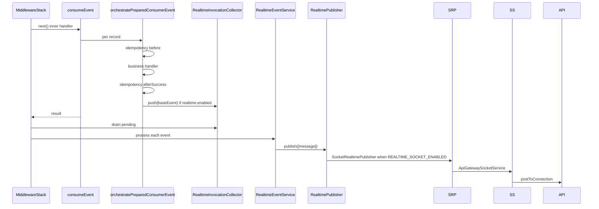
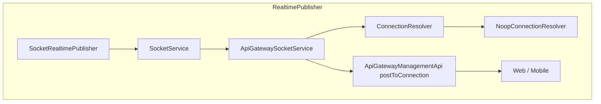
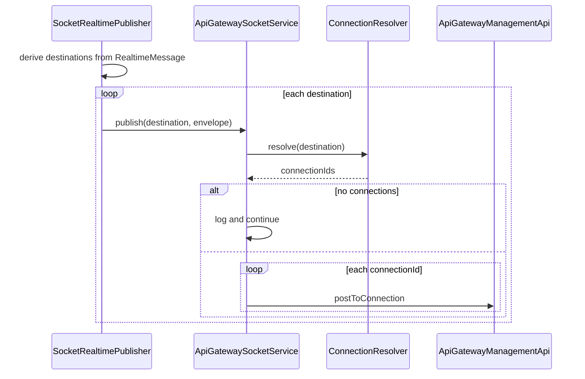
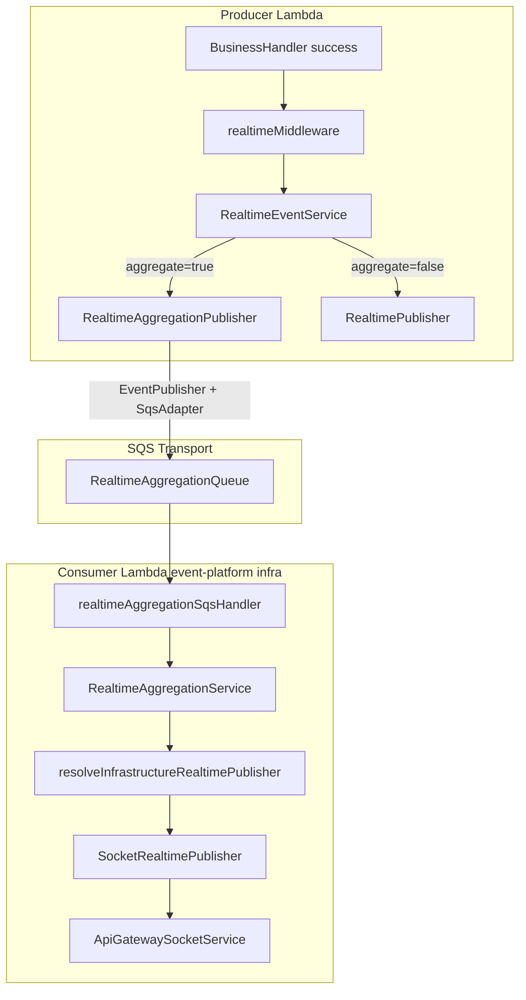
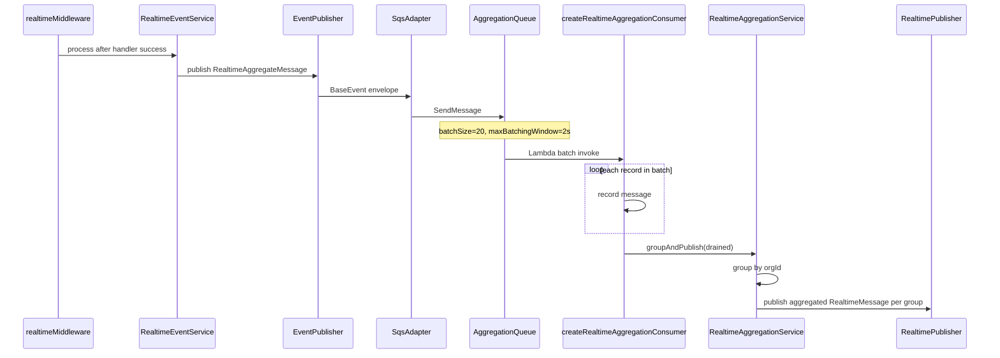
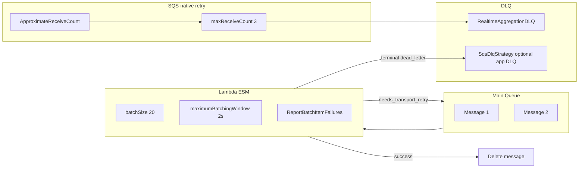

# Middleware execution flow

## HTTP API (`buildApiExecutionPipeline`)

Incoming request

1. `httpApiErrorMiddleware` (outermost wrapper)
2. `contextMiddleware`
3. `invocationContextMiddleware`
4. `loggerMiddleware`
5. `tracerMiddleware`
6. `requestParserMiddleware`
7. `schemaValidationMiddleware` (optional)
8. `performanceMiddleware`
9. Business handler

## Async events (`buildEventExecutionPipeline`)

Incoming event

1. `asyncErrorMiddleware` (outermost wrapper)
2. `contextMiddleware`
3. `invocationContextMiddleware`
4. `loggerMiddleware`
5. `tracerMiddleware`
6. `performanceMiddleware`
7. `realtimeMiddleware` (optional; only when `realtime.enabled` on `createEventHandler`)
8. Business handler (`consumeEvent` → per-record idempotency, schema, retry, handler)

`realtimeMiddleware` calls `next()` first (steps 8 complete), then drains per-invocation successes collected inside `@api-hub/event-platform` after handler + idempotency `afterSuccess`. Realtime failures are logged and never fail the invocation.

Reliability (idempotency, retry, DLQ, transport outcome mapping) belongs in `@api-hub/event-platform`, not in the HTTP/async middleware stack.

### Realtime sequence (direct publish, `aggregate=false`)



### Socket transport architecture (`REALTIME_SOCKET_ENABLED=true`)



When `REALTIME_SOCKET_ENABLED` is not `true`, `resolveSocketRealtimePublisher()` returns `NoopRealtimePublisher` (safe default for tests and local).

Environment variables:

- `REALTIME_SOCKET_ENABLED` — enable socket fan-out (default off)
- `WEBSOCKET_API_ENDPOINT` — API Gateway Management API URL for `postToConnection`

### Socket publish sequence



### Recipient routing examples (socket destinations)

| Input on `RealtimeMessage` | Socket destination key |
|----------------------------|-------------------------|
| `recipientIds: ['DOC123']` | `USER#DOC123` |
| `payload.organizationId: 'ORG1'`, `channel: 'TEAM_ALERTS'` | `ORG#ORG1#TEAM_ALERTS` |
| `payload.patientId: 'PAT001'` | `PATIENT#PAT001` |

Helper: `buildSocketDestinationKey()` in `@api-hub/event-platform`. Connection lookup is via `ConnectionResolver` (currently `NoopConnectionResolver` returning `[]` until a connection repository exists).

### Realtime aggregation architecture (`aggregate=true`)



### Realtime aggregation sequence (`aggregate=true`)



### SQS aggregation flow (retry + DLQ)



No `DelaySeconds` — batching uses Lambda ESM `MaximumBatchingWindowInSeconds` only.

### Example producer: `createEventHandler` with aggregation

```ts
import {
  createEventHandler,
  createRealtimeAggregationPublisher,
} from '@api-hub/event-platform';

const aggregationPublisher = createRealtimeAggregationPublisher({
  queueUrl: process.env.REALTIME_AGGREGATION_QUEUE_URL,
});

createEventHandler({
  operation: 'alert.created',
  consumer: {
    realtimePublisher: myRealtimePublisher,
    realtimeAggregationPublisher: aggregationPublisher,
  },
  realtime: {
    enabled: true,
    aggregate: true,
    resolver: new AlertRecipientResolver(),
    transformer: new AlertTransformer(),
  },
  events: [{ schema: AlertSchema, handler: handleAlert }],
});
```

### Platform aggregation consumer (infrastructure — not domain services)

The aggregation SQS queue has **one shared consumer** owned by `@api-hub/event-platform`. Domain services (alert-service, etc.) only **publish** to the queue when `realtime.aggregate=true`; they must not deploy their own SQS consumer.

**Lambda handler** (deploy once per environment):

```ts
// libs/event-platform/src/handlers/realtime-aggregation-sqs.handler.ts
export const handler = createDefaultRealtimeAggregationConsumer();
```

**Serverless wiring:**

```yaml
onRealtimeAggregate:
  handler: ../../libs/event-platform/src/handlers/realtime-aggregation-sqs.handler.main
  events:
    - sqs:
        arn: !GetAtt RealtimeAggregationQueue.Arn
        batchSize: 20
        maximumBatchingWindow: 2
        functionResponseType: ReportBatchItemFailures
```

Final delivery transport: `resolveInfrastructureRealtimePublisher()` → `resolveSocketRealtimePublisher()` → `SocketRealtimePublisher` → `ApiGatewaySocketService` when `REALTIME_SOCKET_ENABLED=true`; otherwise `NoopRealtimePublisher`.

### Advanced: custom consumer options

```ts
import { createRealtimeAggregationConsumer } from '@api-hub/event-platform';

export const handler = createRealtimeAggregationConsumer({
  consumer: { batchConcurrency: 10 },
});
```

Grouping key: `{organizationId}#{channel}#{eventType}` (e.g. `ORG1#TEAM_ALERTS#TEAM_ALERTS_UPDATED`).

Aggregated payload shape: `{ type: eventType, count: N }`.

### SQS IaC example

```yaml
RealtimeAggregationQueue:
  Type: AWS::SQS::Queue
  Properties:
    VisibilityTimeout: 180
    RedrivePolicy:
      deadLetterTargetArn: !GetAtt RealtimeAggregationDLQ.Arn
      maxReceiveCount: 3

RealtimeAggregationEventSourceMapping:
  Type: AWS::Lambda::EventSourceMapping
  Properties:
    EventSourceArn: !GetAtt RealtimeAggregationQueue.Arn
    BatchSize: 20
    MaximumBatchingWindowInSeconds: 2
    FunctionResponseTypes:
      - ReportBatchItemFailures
```

Environment variables:

- Producer: `REALTIME_AGGREGATION_QUEUE_URL`
- Socket: `REALTIME_SOCKET_ENABLED`, `WEBSOCKET_API_ENDPOINT`
- Consumer DLQ: `DLQ_QUEUE_URL` / `EVENT_DLQ_QUEUE_URL`

Metrics emitted during aggregation:

- `aggregationEventsReceived`
- `aggregationGroupsCreated`
- `aggregationEventsPublished`
