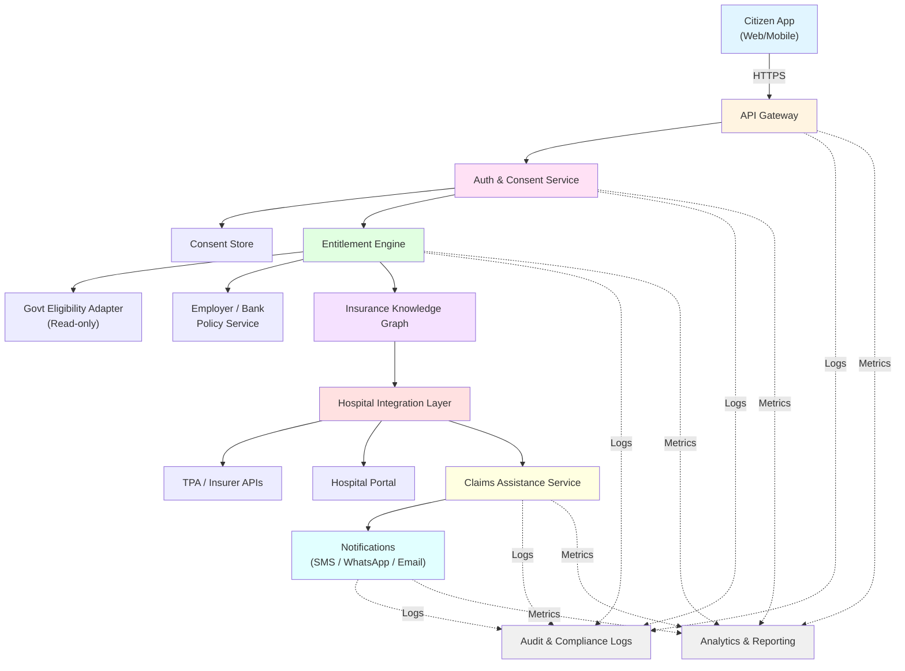

# System Architecture Diagram

## Component Descriptions

- **Citizen App (Web/Mobile)**: User-facing application for citizens to interact with the system
- **API Gateway**: Entry point that routes requests and handles common concerns
- **Auth & Consent Service**: Handles authentication and manages user consent
- **Consent Store**: Persistent storage for consent records
- **Entitlement Engine**: Core service that determines user entitlements and eligibility
- **Govt Eligibility Adapter**: Read-only adapter for government eligibility data
- **Employer / Bank Policy Service**: Service managing employer and bank policies
- **Insurance Knowledge Graph**: Knowledge base containing insurance information and relationships
- **Hospital Integration Layer**: Integration layer connecting to various hospital systems
- **TPA / Insurer APIs**: Third-party administrator and insurer API integrations
- **Hospital Portal**: Portal for hospital interactions
- **Claims Assistance Service**: Service that assists with claims processing
- **Notifications**: Multi-channel notification service (SMS, WhatsApp, Email)
- **Analytics & Reporting**: System for analytics and reporting
- **Audit & Compliance Logs**: Logging system for audit and compliance requirements

