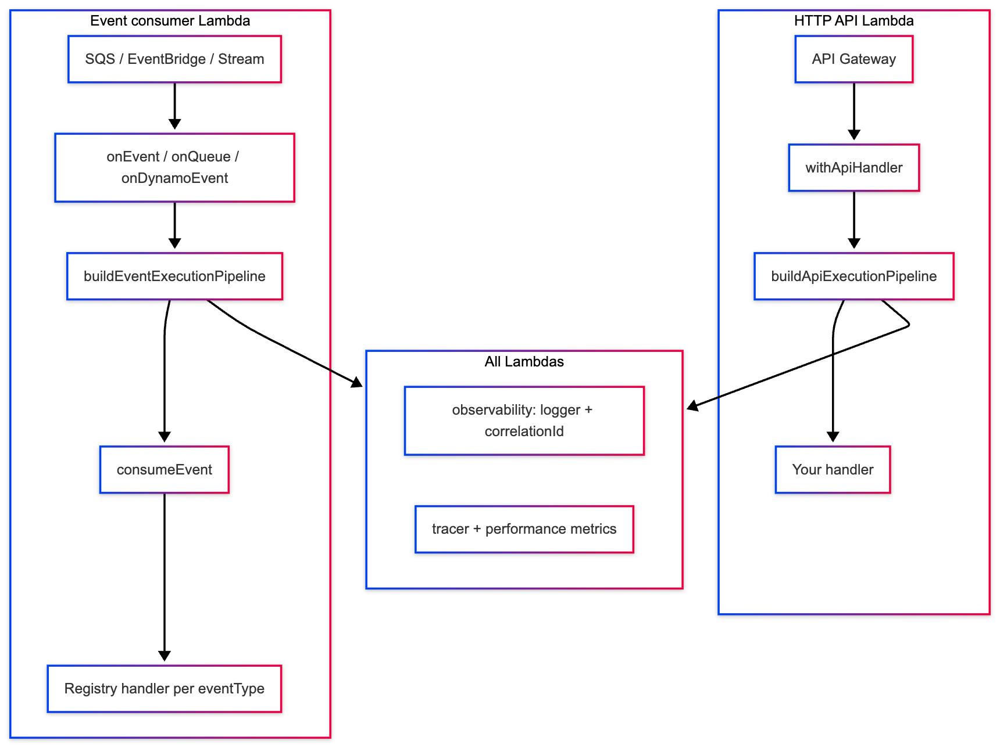

# @myvitalrx/platform-tools

One npm package with subpaths — **middleware**, **observability**, **event-platform**, and **fhir** — for building serverless APIs and event-driven Lambdas on AWS.

| Subpath | Role |
|---------|------|
| `@myvitalrx/platform-tools/observability` | Structured logging, correlation IDs, metrics, PII redaction |
| `@myvitalrx/platform-tools/middleware` | Lambda middleware pipelines (HTTP + async) |
| `@myvitalrx/platform-tools/fhir` | FHIR transformation, mapping, validation |
| `@myvitalrx/platform-tools/fhir/middleware` | `withApiHandler` FHIR projection (lazy-loaded by middleware) |
| `@myvitalrx/platform-tools/event-platform` | Canonical events, consumers, publish, idempotency, realtime |
| `@myvitalrx/platform-tools/event-platform/dx` | `configureEventPlatform`, `publishEvent` helpers |

Utils and FHIR are **bundled** (no separate `@api-hub/utils` or `@myvitalrx/fhir` install). Middleware lazy-loads `@myvitalrx/platform-tools/fhir/middleware` at runtime when handlers use the `fhir` option.

**Deep dives (monorepo docs):**

- [Middleware execution flow](../../docs/middleware/flow.md) — pipeline order, realtime, WebSocket, aggregation
- [Event-driven development guide](../../docs/engineering/EVENT_DRIVEN_DEVELOPMENT_GUIDE.md) — producers, consumers, idempotency, DLQ
- [Event-platform README](../../libs/event-platform/README.md) — transports, `BaseEvent`, handler entry points
- [Observability README](../../libs/observability/README.md) — logging, sampling, Lambda wrappers, metrics

---

## Install

```bash
pnpm add @myvitalrx/platform-tools
```

Do **not** install `@myvitalrx/observability` alongside `@myvitalrx/platform-tools/observability` in the same app (duplicate surface).

---

## Quick imports

```ts
import { createLogger, getLogger } from '@myvitalrx/platform-tools/observability';
import { withApiHandler, withLambdaHandler } from '@myvitalrx/platform-tools/middleware';
import { onEvent, onQueue, defineEvent, createDynamoStreamHandler } from '@myvitalrx/platform-tools/event-platform';
import { configureEventPlatform, publishEvent } from '@myvitalrx/platform-tools/event-platform/dx';
import { transformToFhirResponse } from '@myvitalrx/platform-tools/fhir';
```

---

## How the pieces fit together



**Rule of thumb**

- **HTTP** → middleware only (+ observability via pipeline). Idempotency = **domain conditional writes** in your repository, not middleware.
- **Async events** → event-platform for routing, schema, idempotency, retry/DLQ; middleware wraps the consumer with logging/tracing.
- **Publish** → event-platform (`defineEvent`, SNS/EventBridge adapters, or DX `publishEvent`).

---

## 1. Observability

Zero-config logging on first use; override via env or `configureObservability`.

```ts
import { getLogger, configureObservability } from '@myvitalrx/platform-tools/observability';

configureObservability({
  serviceName: 'order-service',
  logLevel: 'INFO',
  redactPII: true,
});

const logger = getLogger();
logger.info('order_created', { orderId: '123', message: 'Order persisted' });
```

**Environment (recommended)**

```bash
SERVICE_NAME=order-service
LOG_LEVEL=INFO
REDACT_PII=true
METRICS_NAMESPACE=ApiHub
```

For Lambda-specific wrappers, consumer metrics (`recordConsumerEventProcessed`, etc.), and sampling — see [libs/observability/README.md](../../libs/observability/README.md).

---

## 2. Middleware

### HTTP API (`withApiHandler`)

Uses `buildApiExecutionPipeline` — outer error handling, context, logger, tracer, optional schema validation, then your handler.

```ts
import { z } from 'zod';
import { withApiHandler } from '@myvitalrx/platform-tools/middleware';

const BodySchema = z.object({ orderId: z.string() });

export const handler = withApiHandler(
  {
    operation: 'order.create',
    bodySchema: BodySchema,
    // fhir: { resourceType: 'Patient' },  // bundled — no extra install
  },
  async (req) => {
    return { orderId: req.body.orderId };
  },
);
```

**Pipeline order (HTTP):** `httpApiErrorMiddleware` → context → invocation → logger → tracer → request parser → schema (optional) → performance → handler.

Details: [docs/middleware/flow.md § HTTP API](../../docs/middleware/flow.md).

### Async / generic Lambda (`withLambdaHandler`)

Same observability stack without API Gateway request parsing — use for SQS/EventBridge handlers you wire manually, or as a base before event-platform.

### Standard Lambda HTTP stack

```ts
import { createStandardLambdaHttpMiddlewares } from '@myvitalrx/platform-tools/middleware';
```

---

## 3. Event-platform

### Define an event

```ts
import { defineEvent } from '@myvitalrx/platform-tools/event-platform';
import { z } from 'zod';

const OrderCreatedPayload = z.object({ orderId: z.string() });

export const OrderCreatedSchema = defineEvent(OrderCreatedPayload, {
  eventType: 'Order.Created',
  eventVersion: '1.0.0',
  source: 'order-service',
  transport: 'eventbridge',
});
```

Canonical shape: `eventId`, `eventType`, `eventVersion`, `timestamp`, `source`, `idempotencyKey`, `payload`, `meta.correlationId`.

### Consume (preferred) — EventBridge

```ts
import { onEvent } from '@myvitalrx/platform-tools/event-platform';

export const handler = onEvent({
  operation: 'order.created.processed',
  events: [
    {
      schema: OrderCreatedSchema,
      handler: async (input) => {
        // Flattened payload + meta (not { payload, meta })
        const { orderId, meta } = input;
        await processOrder(orderId, meta.correlationId);
      },
    },
  ],
});
```

 

 

### Consume — SQS

```ts
import { onQueue } from '@myvitalrx/platform-tools/event-platform';

export const handler = onQueue({
  operation: 'order.created.processed',
  events: [{ schema: OrderCreatedSchema, handler: handleOrder }],
});
```

### Consume — DynamoDB Streams

```ts
import { createDynamoStreamHandler, onDynamoEvent } from '@myvitalrx/platform-tools/event-platform';
```

See [EVENT_PLATFORM_TRANSPORTS_GUIDE.md](../../docs/engineering/EVENT_PLATFORM_TRANSPORTS_GUIDE.md) and [libs/event-platform/README.md](../../libs/event-platform/README.md).

### Publish

| Approach | API |
|----------|-----|
| DX (EventBridge) | `configureEventPlatform` + `publishEvent` from `/event-platform/dx` |
| SNS topic | `createSnsPublishEvent` |
| Adapter | `EventBridgeAdapter`, `SqsAdapter` |

```ts
import { configureEventPlatform, publishEvent } from '@myvitalrx/platform-tools/event-platform/dx';

configureEventPlatform({ publishers: [/* ... */] });

await publishEvent(OrderCreatedSchema, { orderId: '123' });
```

### Realtime (WebSocket fan-out)

Enable on the consumer when you need live UI updates:

```ts
import { onEvent, createRealtimeAggregationPublisher } from '@myvitalrx/platform-tools/event-platform';

createEventHandler({
  operation: 'alert.created',
  realtime: {
    enabled: true,
    aggregate: true, // or false for direct socket publish
    resolver: myRecipientResolver,
    transformer: myTransformer,
  },
  consumer: {
    realtimeAggregationPublisher: createRealtimeAggregationPublisher({
      queueUrl: process.env.REALTIME_AGGREGATION_QUEUE_URL!,
    }),
  },
  events: [{ schema: AlertSchema, handler: handleAlert }],
});
```

Full sequences (socket destinations, DynamoDB connection table, aggregation SQS): [docs/middleware/flow.md](../../docs/middleware/flow.md).

**Env (socket):** `REALTIME_SOCKET_ENABLED`, `WEBSOCKET_API_ENDPOINT`, `REALTIME_CONNECTIONS_TABLE`

---

## Idempotency and errors

| Surface | Where dedupe lives |
|---------|------------------|
| HTTP APIs | Domain DynamoDB conditional writes (repositories) |
| Async consumers | `IdempotencyStrategy` in event-platform (`before` / `afterSuccess`) |
| HTTP errors | `httpApiErrorMiddleware` → structured API response |
| Async errors | `asyncErrorMiddleware` → log + rethrow; retry/DLQ in event-platform |

There is **no** `ensureIdempotent` HTTP middleware. See [IDEMPOTENCY_EVENT_PLATFORM_VS_MIDDLEWARE.md](../../docs/engineering/IDEMPOTENCY_EVENT_PLATFORM_VS_MIDDLEWARE.md) and [EVENT_DRIVEN_DEVELOPMENT_GUIDE.md §4](../../docs/engineering/EVENT_DRIVEN_DEVELOPMENT_GUIDE.md).

---

## End-to-end example (new service)

1. **Observability** — set `SERVICE_NAME`, use `getLogger()` in handlers.
2. **HTTP route** — `withApiHandler({ operation, bodySchema }, fn)`.
3. **Emit event** — `defineEvent` + `publishEvent` or SNS helper after write succeeds.
4. **Downstream consumer** — `onEvent({ operation, events: [{ schema, handler }] })` in another Lambda.
5. **Realtime (optional)** — `realtime: { enabled, resolver, transformer }` per [flow.md](../../docs/middleware/flow.md).

---

## Package layout (published)

```text
@myvitalrx/platform-tools
├── /observability     → bundled observability SDK (ESM + CJS)
├── /middleware      → Lambda pipelines (imports /observability)
├── /event-platform  → events engine (imports /middleware + /observability)
└── /event-platform/dx → publish/configure helpers
```

---

## Monorepo build

```bash
nx build observability event-platform middleware
pnpm --filter @myvitalrx/platform-tools build
```

---

## Publish to npm

```bash
export NPM_TOKEN=...   # repo-root .env — never commit
cd packages/platform-tools && npm publish --access public --userconfig=../../.npmrc
```

Restricted (`private`) scoped packages require a paid npm org plan (`E402`). This package is published **public** on the free tier.

```bash
pnpm run publish:platform-tools   # from repo root
```

---

## Dependency graph

```text
@myvitalrx/platform-tools/event-platform
  → @myvitalrx/platform-tools/middleware
  → @myvitalrx/platform-tools/observability
  → utils (bundled)

@myvitalrx/platform-tools/middleware
  → @myvitalrx/platform-tools/observability
  → @myvitalrx/platform-tools/fhir/middleware (lazy-loaded)
```
